# Mascot Gallery

Mascots are grouped by animal type. Click any card to view all poses.

## Beaver

-   **[Bailey the Beaver](mascots/ecology/index.md)**

    { width=200 }

    Ecology

## Cat

-   **[Catalyst the Cat](mascots/chemistry/index.md)**

    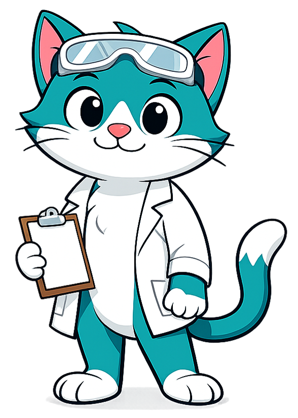{ width=200 }

    Chemistry

## Elephant

-   **[Bloom the Elephant](mascots/learning-sciences/index.md)**

    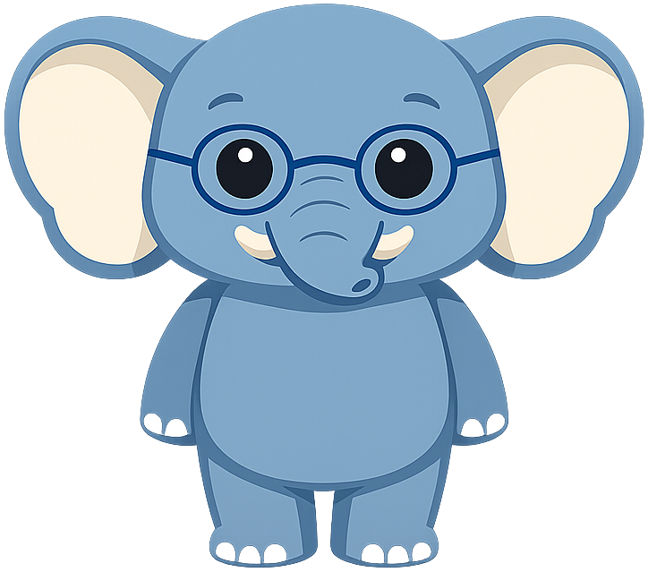{ width=200 }

    Learning Sciences

## Ferret

-   **[Fermi the Ferret](mascots/quantum-computing/index.md)**

    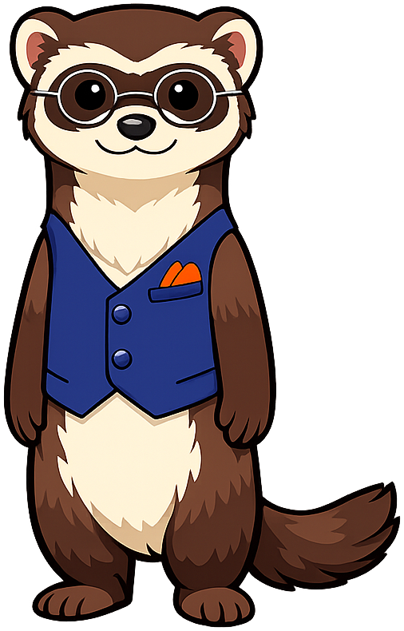{ width=200 }

    Quantum Computing

## Foxes

-   **[Ferris the Fox](mascots/economics-course/index.md)**

    { width=200 }

    Economics

-   **[Sentinel the Fox](mascots/cybersecurity/index.md)**

    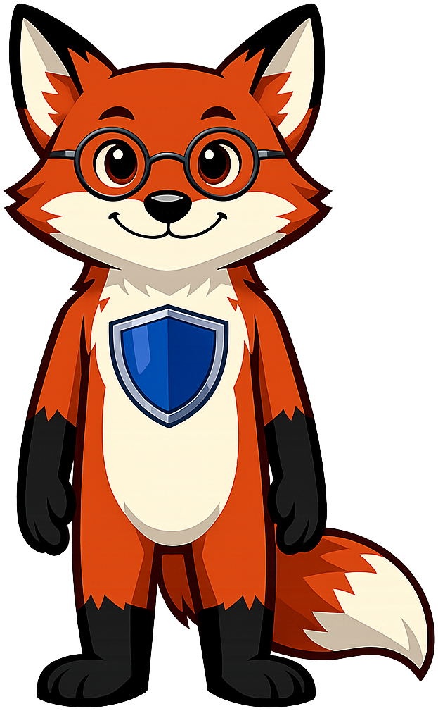{ width=200 }

    Cybersecurity

## Fruit Fly

-   **[Dottie the Drosophila](mascots/genetics/index.md)**

    { width=200 }

    Genetics

## Honey Bee

-   **[Buzz the Honey Bee](mascots/networking/index.md)**

    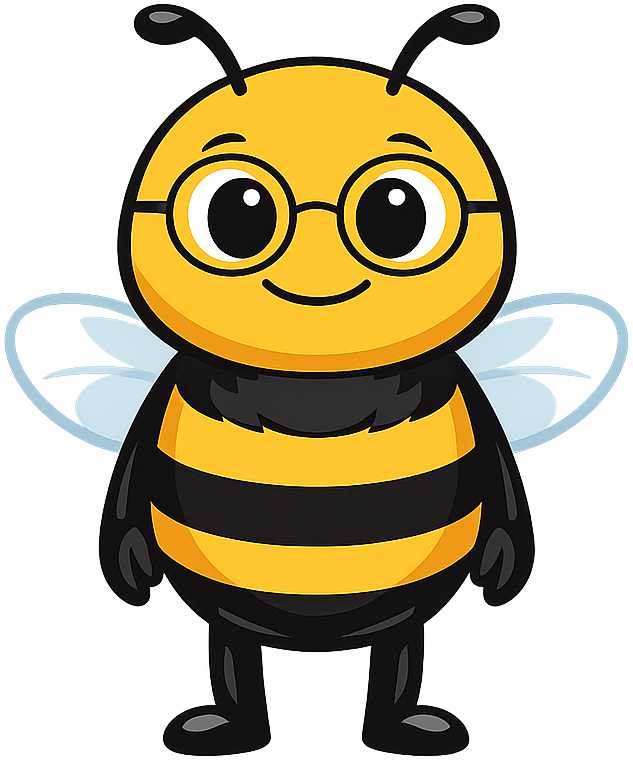{ width=200 }

    Networking

## Hummingbird

-   **[Iris the Hummingbird](mascots/information-systems/index.md)**

    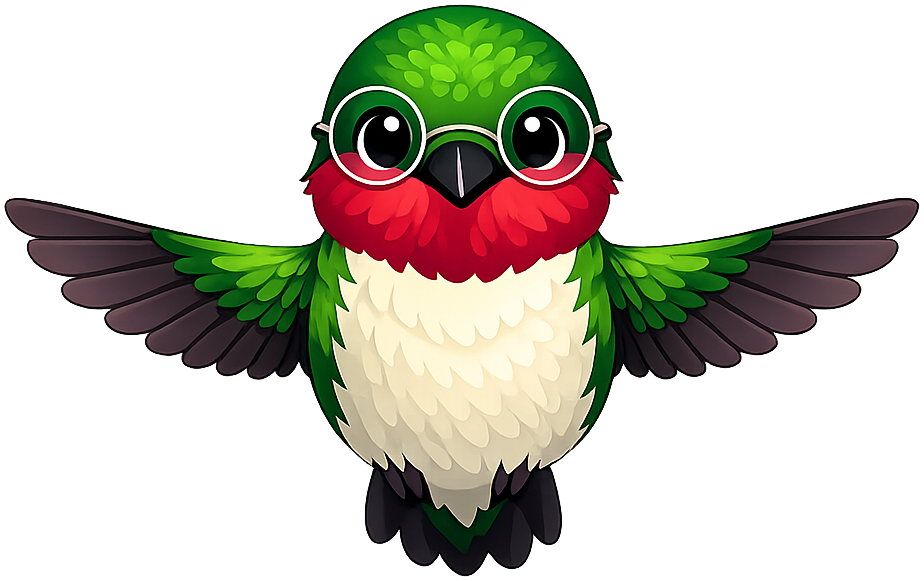{ width=200 }

    Information Systems

## Octopus

-   **[Olli the Octopus](mascots/bioinformatics/index.md)**

    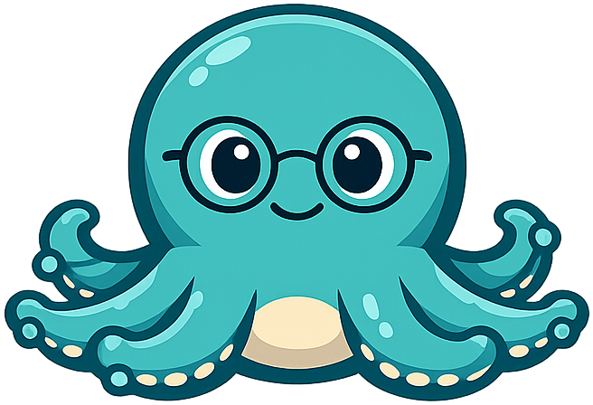{ width=200 }

    Bioinformatics

## Otter

-   **[Maka the River Otter](mascots/digital-citizenship/index.md)**

    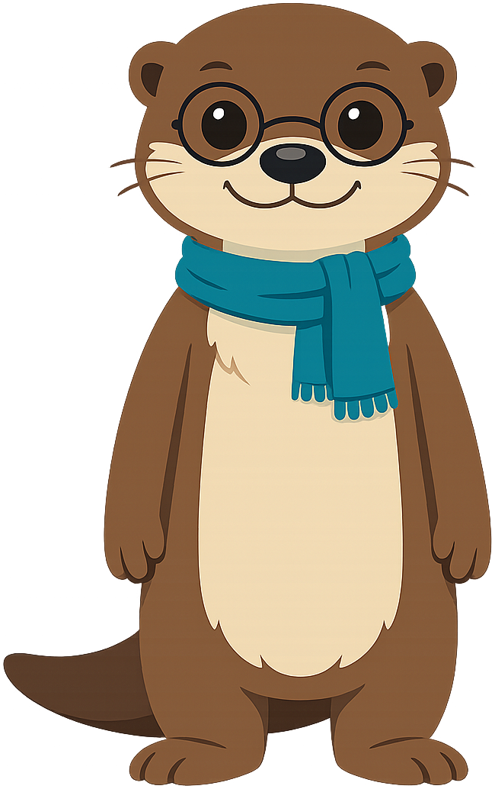{ width=200 }

    Digital Citizenship

## Owls

-   **[Axiom the Owl](mascots/intelligent-textbooks/index.md)**

    { width=200 }

    Intelligent Textbooks

-   **[Sofia the Owl](mascots/theory-of-knowledge/index.md)**

    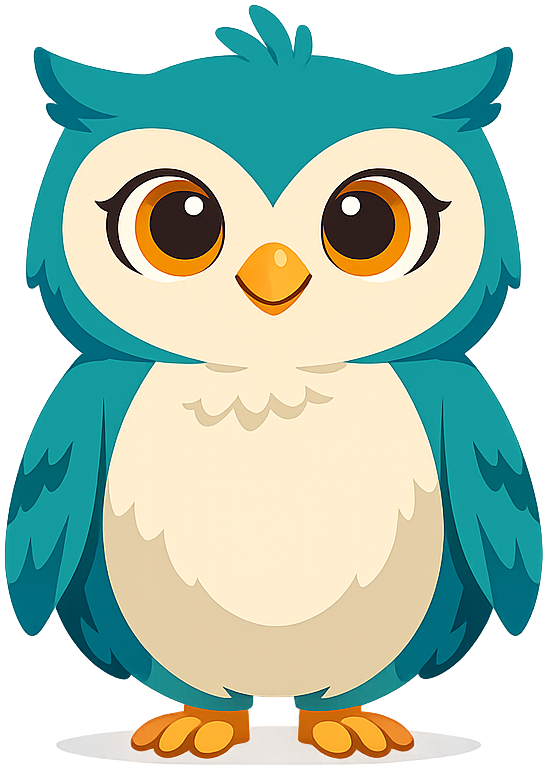{ width=200 }

    Theory of Knowledge

## Parrot

-   **[Polly the Parrot](mascots/prompt-class/index.md)**

    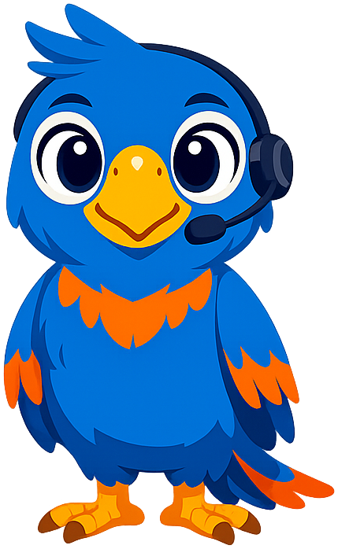{ width=200 }

    Prompt Engineering

## Peacock

-   **[Percy the Peacock](mascots/infographics/index.md)**

    { width=200 }

    Infographics

## Raccoons

-   **[Rex the Raccoon](mascots/blockchain/index.md)**

    { width=200 }

    Blockchain

-   **[Rick the Raccoon](mascots/functions/index.md)**

    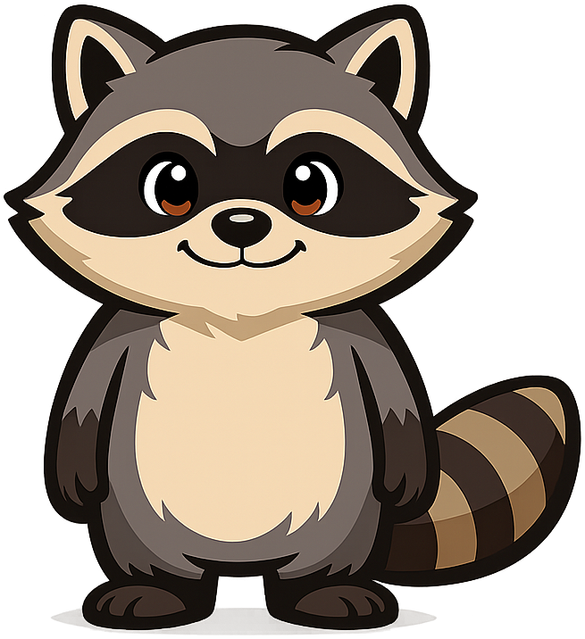{ width=200 }

    IB Math Functions

## Red Panda

-   **[Pemba the Red Panda](mascots/token-efficiency/index.md)**

    { width=200 }

    Token Efficiency

## Squirrels

-   **[Sylvia the Statistical Squirrel](mascots/statistics-course/index.md)**

    { width=200 }

    AP Statistics

-   **[Sylvia the Squirrel](mascots/personal-finance/index.md)**

    { width=200 }

    Personal Finance

## Tortoise

-   **[Chronos the Tortoise](mascots/ancient-history/index.md)**

    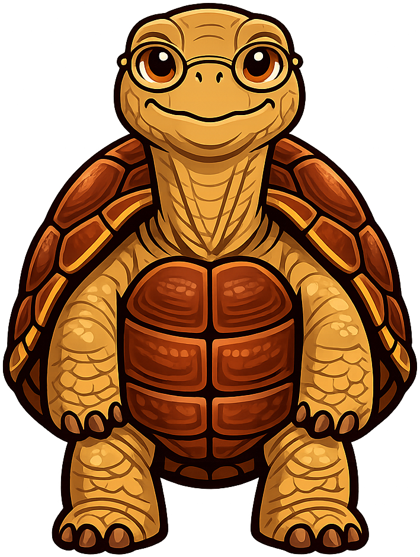{ width=200 }

    Ancient History

## Tree Frogs

-   **[Gregor the Tree Frog](mascots/biology/index.md)**

    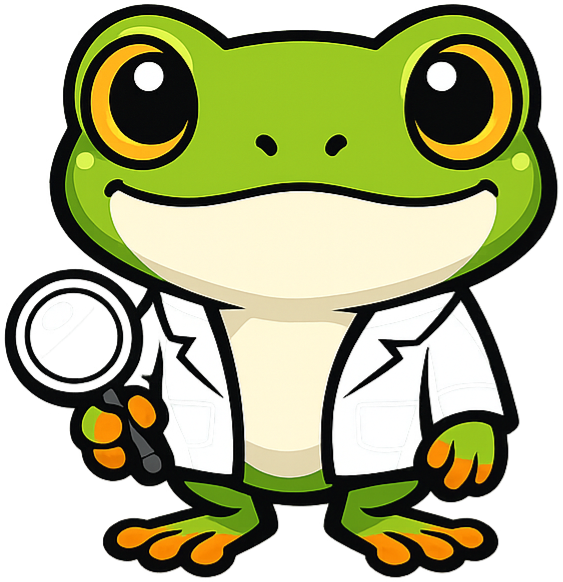{ width=200 }

    Biology

-   **[Mossby the Tree Frog](mascots/moss/index.md)**

    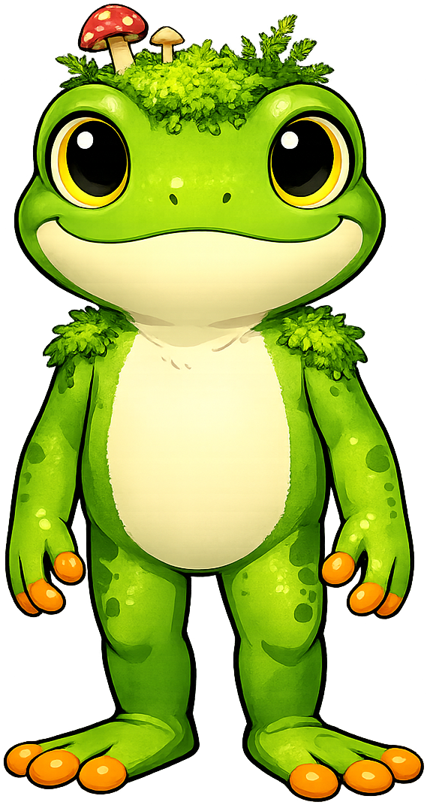{ width=200 }

    Moss (Bryophytes)

## Unicorn

-   **[Sparkle the Unicorn](mascots/unicorns/index.md)**

    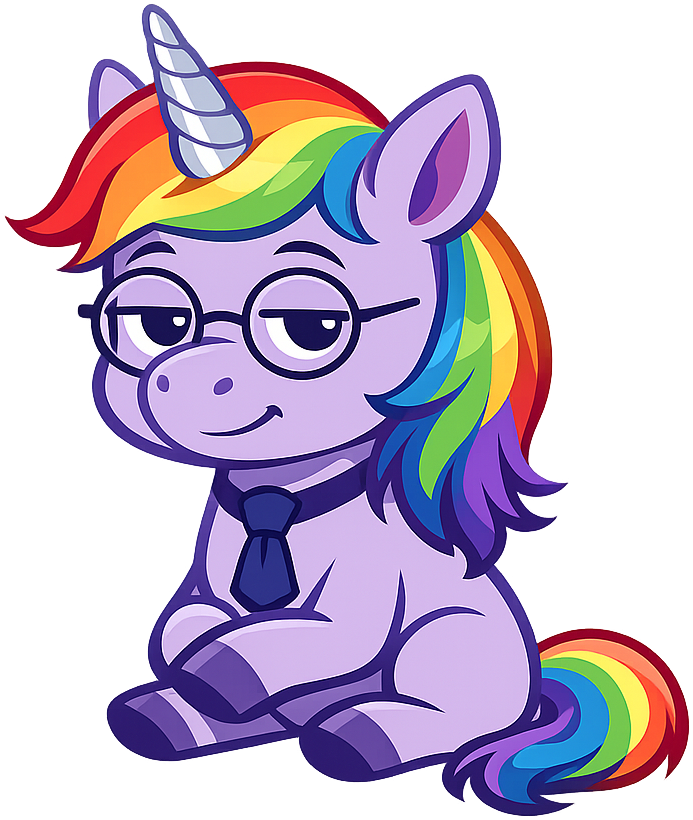{ width=200 }

    Unicorns

## Special Characters

Non-animal mascots chosen for symbolic or pedagogical reasons.

-   **[Tokie](mascots/Dementia/index.md)**

    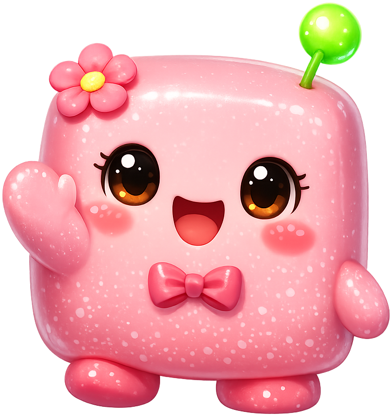{ width=200 }

    Dementia — abstract cube character

-   **[Delta the Explorer](mascots/calculus/index.md)**

    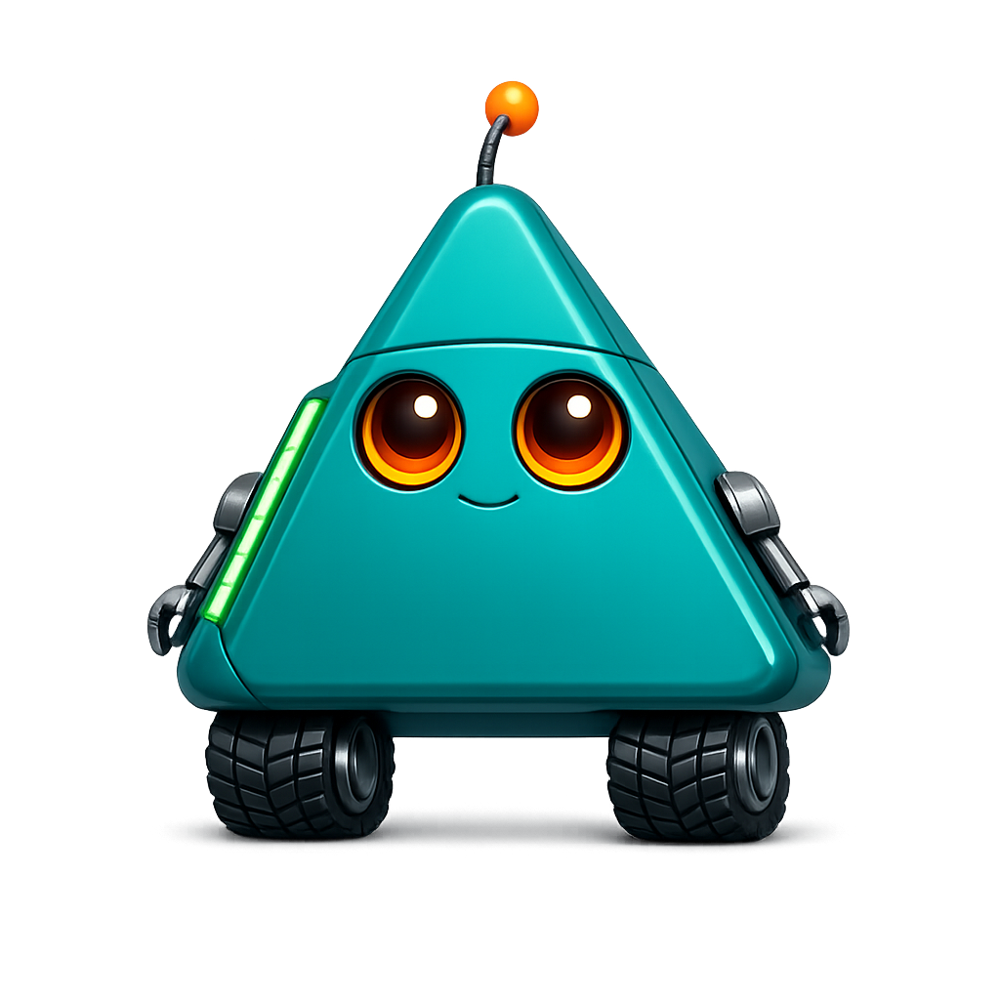{ width=200 }

    Calculus — hiker/explorer

-   **[Sparky the Lightbulb](mascots/circuits/index.md)**

    { width=200 }

    Circuits — incandescent lightbulb

-   **[Prema the Robot](mascots/pre-calc/index.md)**

    { width=200 }

    Pre-Calculus — friendly robot

