# Mascot Gallery

The following list is sorted by the title of the intelligent textbook
that contains the mascot.  Click any mascot below to view all of its poses.

<!-- begin:auto -->

-   **[3D Printing Course](mascots/3d-printing-course/index.md)**

    { width=220 }

    Benchy the Tugboat

-   **[Ai Persona Testing](mascots/ai-persona-testing/index.md)**

    { width=220 }

    Lens

-   **[AI Strategy for Education](mascots/ai-strategy-for-education/index.md)**

    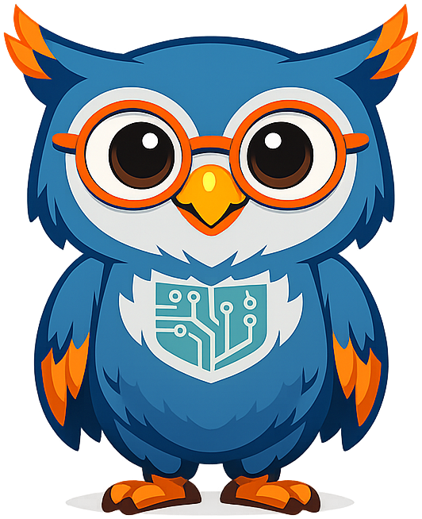{ width=220 }

    Sage the Owl

-   **[Ancient History](mascots/ancient-history/index.md)**

    { width=220 }

    Ancient History

-   **[Armadillo](mascots/armadillo/index.md)**

    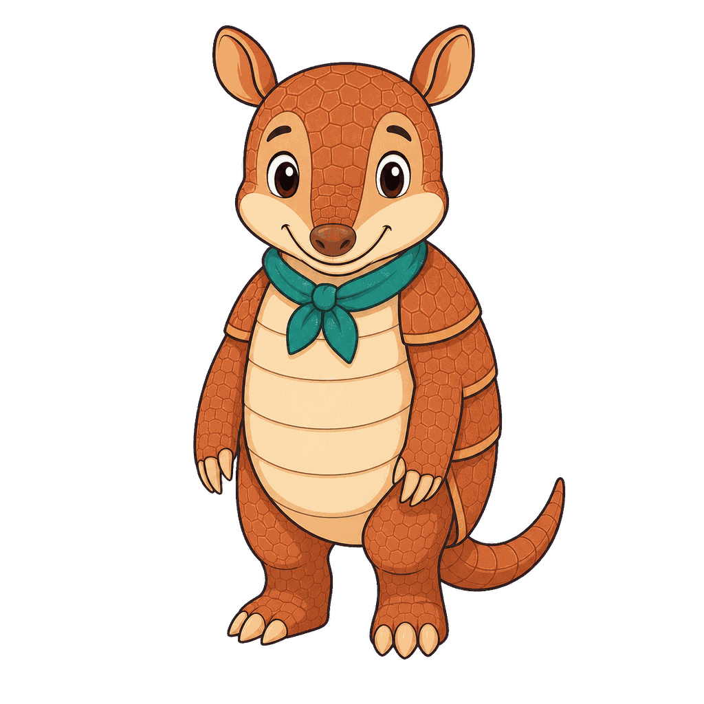{ width=220 }

    Armadillo

-   **[ASL Book](mascots/asl-book/index.md)**

    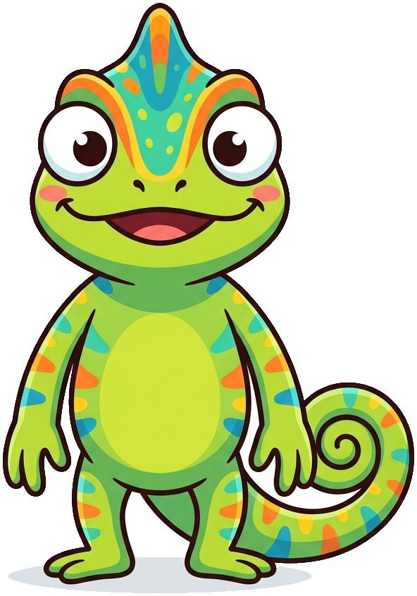{ width=220 }

    Mimi the Chameleon

-   **[ATAM](mascots/atam/index.md)**

    { width=220 }

    Vista the Giraffe

-   **[Bioinformatics](mascots/bioinformatics/index.md)**

    { width=220 }

    Olli the Octopus

-   **[Biology](mascots/biology/index.md)**

    { width=220 }

    Gregor the Tree Frog

-   **[Blockchain](mascots/blockchain/index.md)**

    { width=220 }

    Rex the Raccoon

-   **[Business](mascots/business/index.md)**

    { width=220 }

    Quinn the Dolphin

-   **[Butterfly](mascots/butterfly/index.md)**

    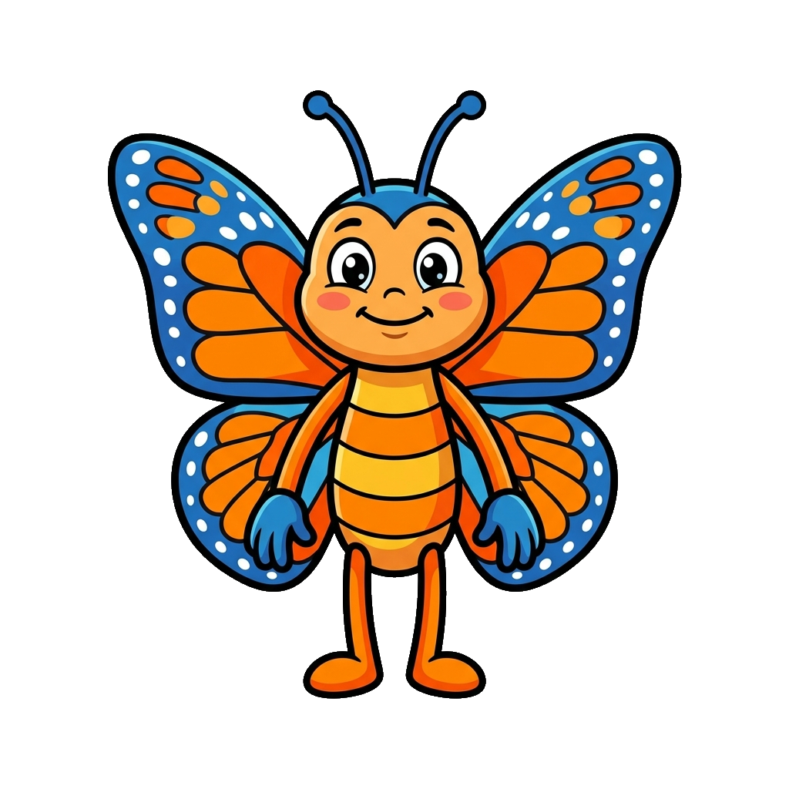{ width=220 }

    Butterfly

-   **[Calculus](mascots/calculus/index.md)**

    { width=220 }

    Delta the Slope-Walking Explorer

-   **[Chemistry](mascots/chemistry/index.md)**

    { width=220 }

    Catalyst the Cat

-   **[Circuits](mascots/circuits/index.md)**

    { width=220 }

    Circuits

-   **[Context Graph](mascots/context-graph/index.md)**

    { width=220 }

    Nexus the Spider

-   **[Cybersecurity](mascots/cybersecurity/index.md)**

    { width=220 }

    Sentinel the Fox

-   **[Dementia](mascots/Dementia/index.md)**

    { width=220 }

    Tokie

-   **[Digital Citizenship](mascots/digital-citizenship/index.md)**

    { width=220 }

    Maka the River Otter

-   **[Duck](mascots/duck/index.md)**

    { width=220 }

    Duck

-   **[Ecology](mascots/ecology/index.md)**

    { width=220 }

    Bailey the Beaver

-   **[Economics Course](mascots/economics-course/index.md)**

    { width=220 }

    Ferris the Fox

-   **[English Language Arts](mascots/english-language-arts/index.md)**

    { width=220 }

    Pip the Bookworm

-   **[Flamingo](mascots/flamingo/index.md)**

    { width=220 }

    Flamingo

-   **[Food Science](mascots/food-science/index.md)**

    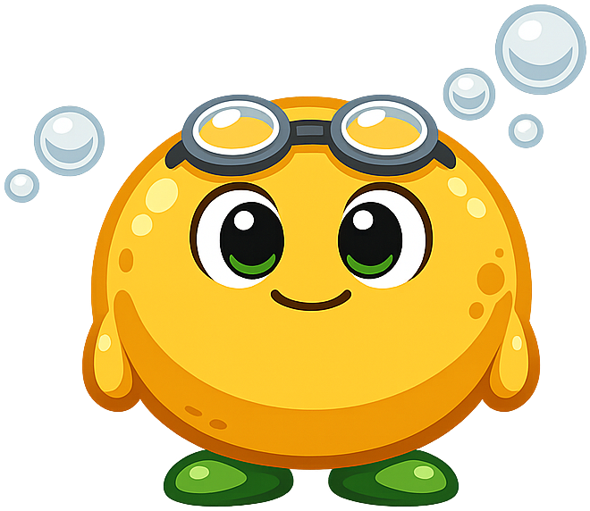{ width=220 }

    Zyme the Yeast Cell

-   **[Forensic Science](mascots/forensic-science/index.md)**

    { width=220 }

    Trace the Raccoon

-   **[Functions](mascots/functions/index.md)**

    { width=220 }

    Rick the Raccoon

-   **[Genetics](mascots/genetics/index.md)**

    { width=220 }

    Dottie the Drosophila

-   **[Health Education](mascots/health-education/index.md)**

    { width=220 }

    Health Education

-   **[Horse](mascots/horse/index.md)**

    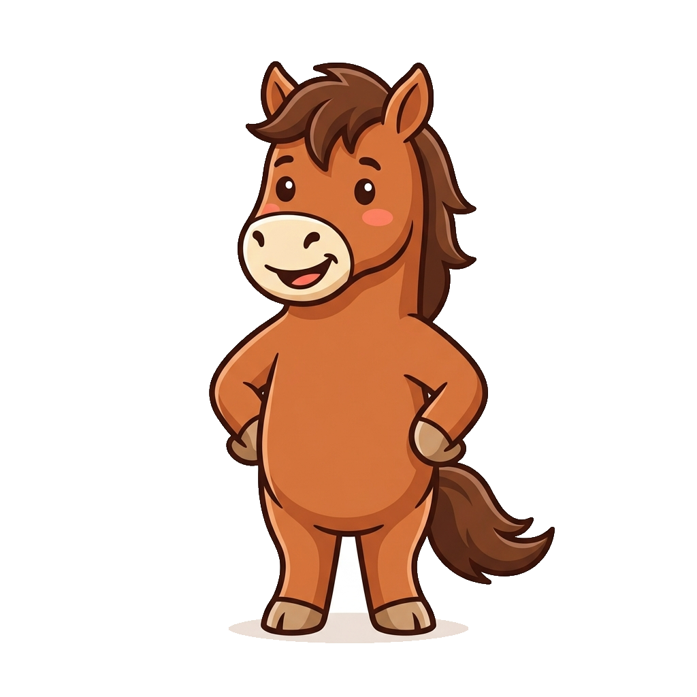{ width=220 }

    Horse

-   **[Hydroponics](mascots/hydroponics/index.md)**

    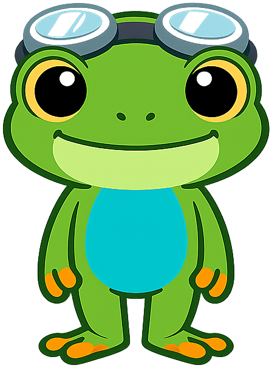{ width=220 }

    Cress the Tree Frog

-   **[Infographics](mascots/infographics/index.md)**

    { width=220 }

    Percy the Peacock

-   **[Information Systems](mascots/information-systems/index.md)**

    { width=220 }

    Information Systems

-   **[Intelligent Textbooks](mascots/intelligent-textbooks/index.md)**

    { width=220 }

    Axiom the Owl

-   **[Learning Graphs](mascots/learning-graphs/index.md)**

    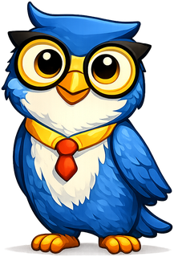{ width=220 }

    Axiom the Owl

-   **[Learning MicroPython](mascots/learning-micropython/index.md)**

    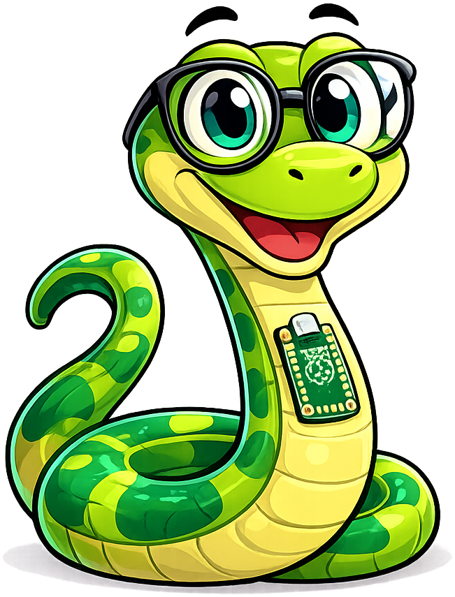{ width=220 }

    Monty the MicroPython Snake

-   **[Learning Python](mascots/learning-python/index.md)**

    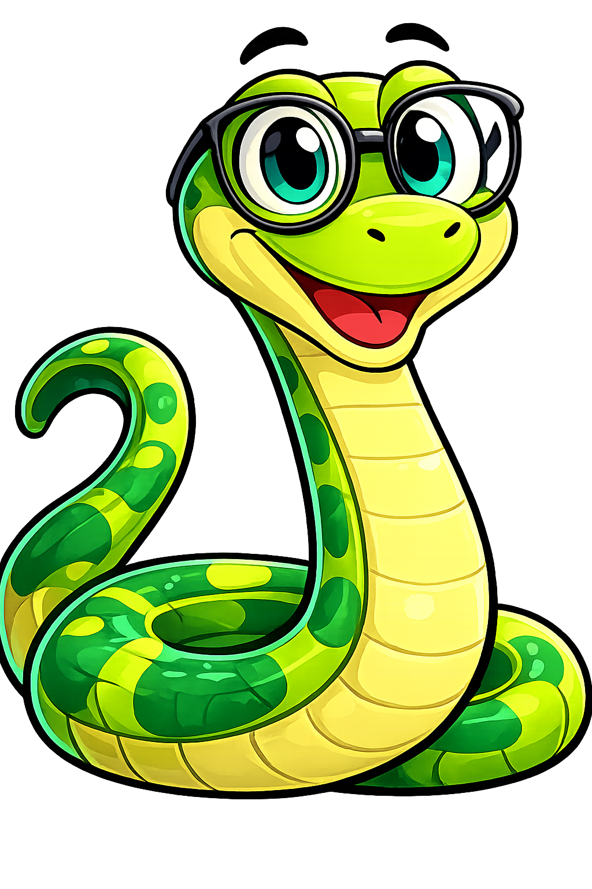{ width=220 }

    Monty the Python

-   **[Learning Record Store](mascots/learning-record-store/index.md)**

    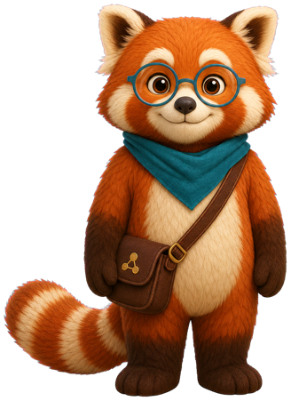{ width=220 }

    Rowan the Red Panda

-   **[Learning Sciences](mascots/learning-sciences/index.md)**

    { width=220 }

    Bloom the Elephant

-   **[Mini Mba For Startups](mascots/mini-mba-for-startups/index.md)**

    { width=220 }

    Rune the Raven

-   **[Moss](mascots/moss/index.md)**

    { width=220 }

    Mossby the Tree Frog

-   **[Moving Rainbow](mascots/moving-rainbow/index.md)**

    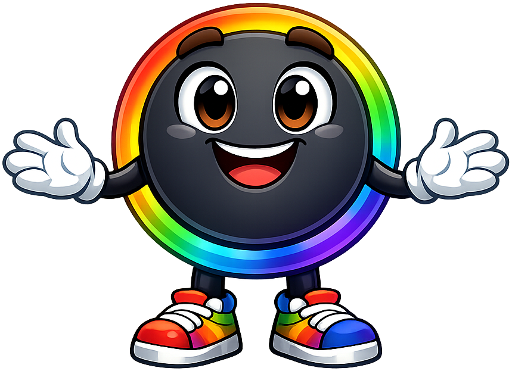{ width=220 }

    Pixel the Addressable LED

-   **[Networking](mascots/networking/index.md)**

    { width=220 }

    Networking

-   **[Personal Finance](mascots/personal-finance/index.md)**

    { width=220 }

    Sylvia the Squirrel

-   **[Pre Calc](mascots/pre-calc/index.md)**

    { width=220 }

    Prema

-   **[Prompt Class](mascots/prompt-class/index.md)**

    { width=220 }

    Polly the Parrot

-   **[Psychology](mascots/psychology/index.md)**

    { width=220 }

    Psy the Owl

-   **[Introduction to Public Health](mascots/public-health/index.md)**

    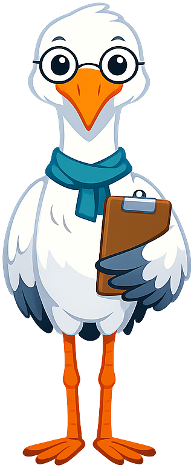{ width=220 }

    Sage the Crane

-   **[Quantum Computing](mascots/quantum-computing/index.md)**

    { width=220 }

    Fermi the Ferret

-   **[Selecting the Right Database](mascots/right-database/index.md)**

    { width=220 }

    Dex the Robot

-   **[Semiconductor Physics Course](mascots/semiconductor-physics-course/index.md)**

    { width=220 }

    Nova the Electron Sprite

-   **[Statistics Course](mascots/statistics-course/index.md)**

    { width=220 }

    Sylvia the Statistical Squirrel

-   **[STEM Robots](mascots/stem-robots/index.md)**

    { width=220 }

    Sparky the Robot

-   **[Theory Of Knowledge](mascots/theory-of-knowledge/index.md)**

    { width=220 }

    Sofia the Owl

-   **[Tiger](mascots/tiger/index.md)**

    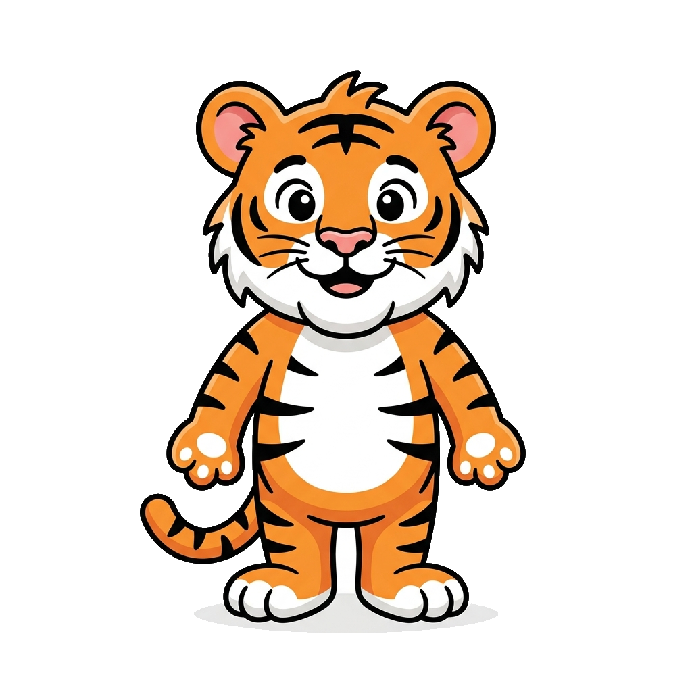{ width=220 }

    Tiger

-   **[Token Efficiency](mascots/token-efficiency/index.md)**

    { width=220 }

    Pemba the Red Panda

-   **[Unicorns](mascots/unicorns/index.md)**

    { width=220 }

    Sparkle the Unicorn

-   **[U.S. Government](mascots/us-government/index.md)**

    { width=220 }

    Lex the Bald Eagle

-   **[U.S. History](mascots/us-history/index.md)**

    { width=220 }

    Liberty the Bald Eagle

-   **[xAPI Course](mascots/xapi-course/index.md)**

    { width=220 }

    Xavi the Octopus

<!-- end:auto -->
