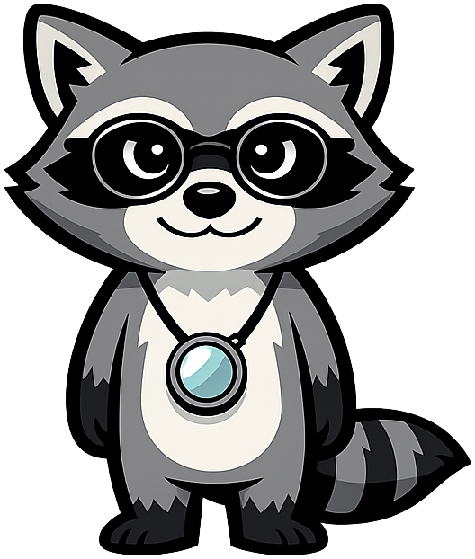
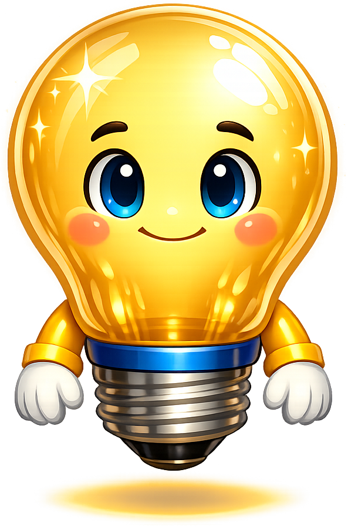
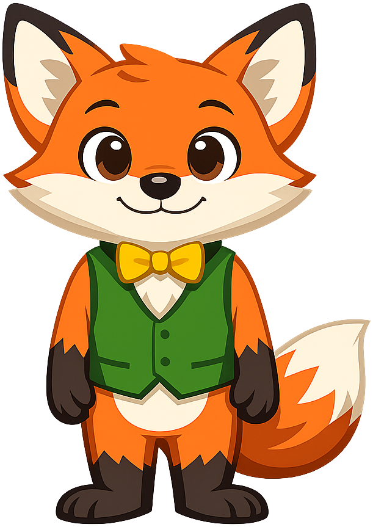
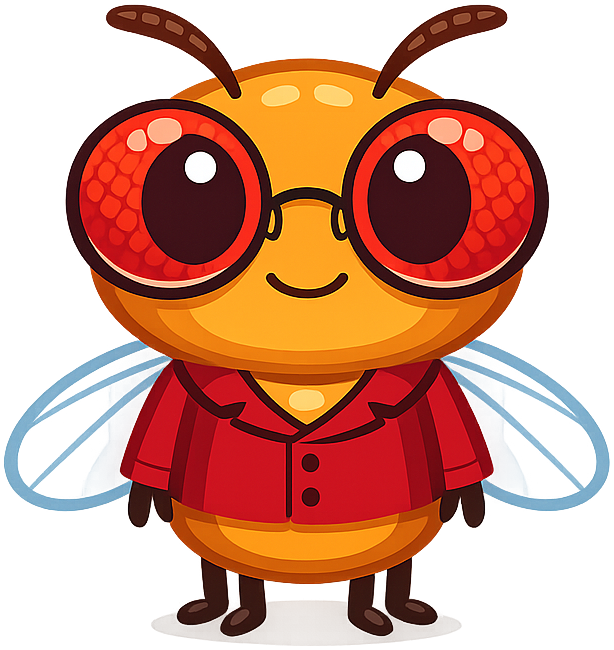
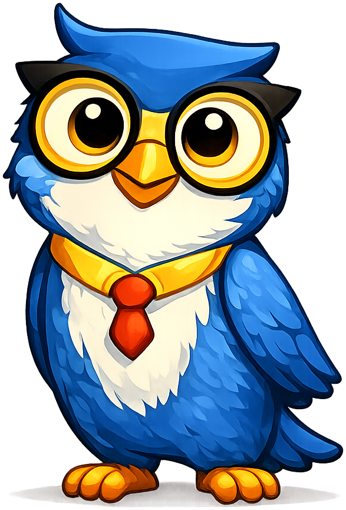
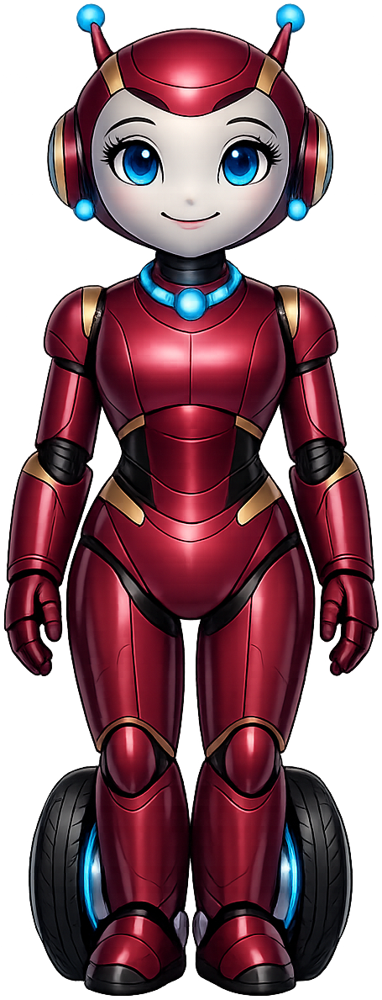
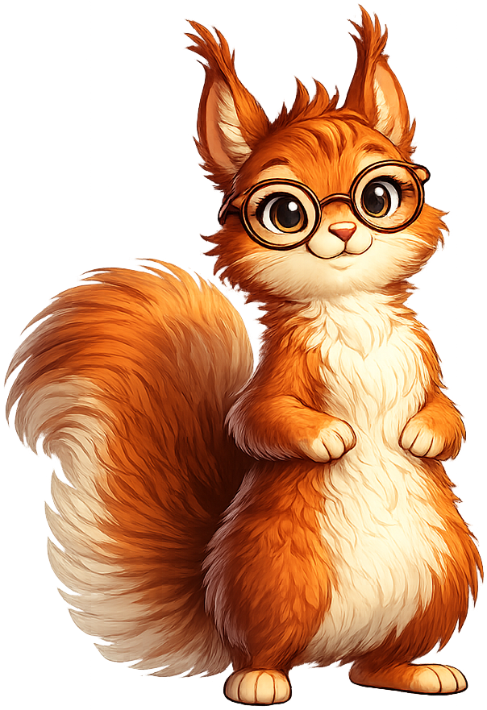
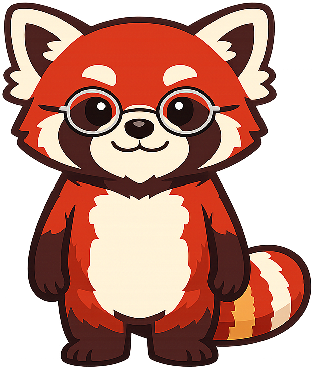

---
hide:
  - navigation
  - toc
---

# Mascot Montage

  <!-- Row 1: 8 mascots -->
  

  

  

  

  

  

  

  

  <!-- Row 2: 3 mascots, title (spans 2), 3 mascots -->
  

  

  

  
Book Mascots

  

  

  

  <!-- Row 3: 8 mascots -->
  

  

  

  

  

  

  

  

A single wide-landscape composition of all 22 mascots from our intelligent textbook
collection, framed around the **Book Mascots** title. Click any mascot to view its
full pose collection. Suitable for use as a cover image, banner, or social-media
share card. To export, take a screenshot of the montage area or open the page on
a wide display and capture it at the desired resolution.
