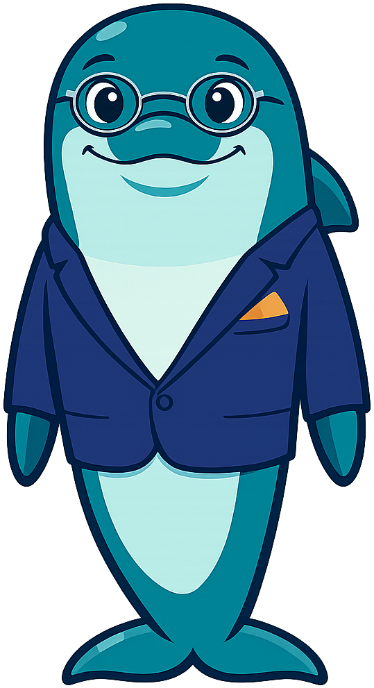
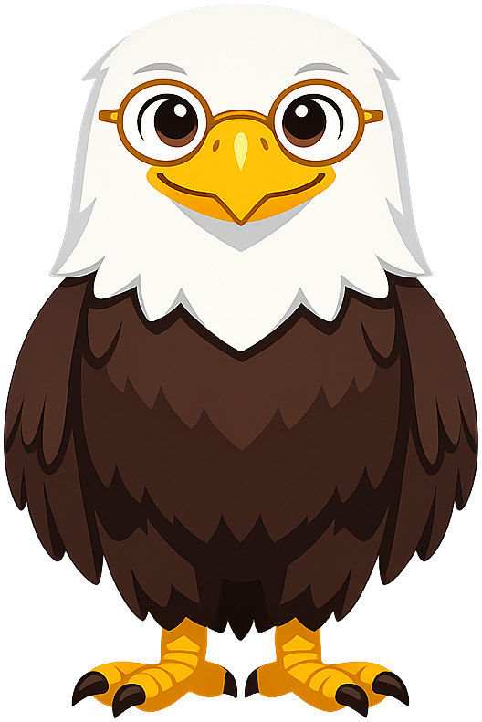
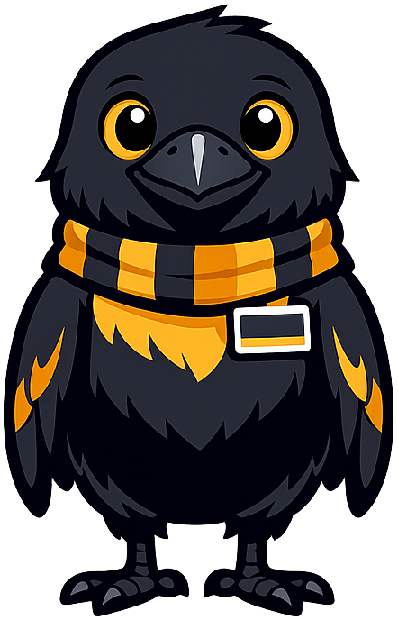
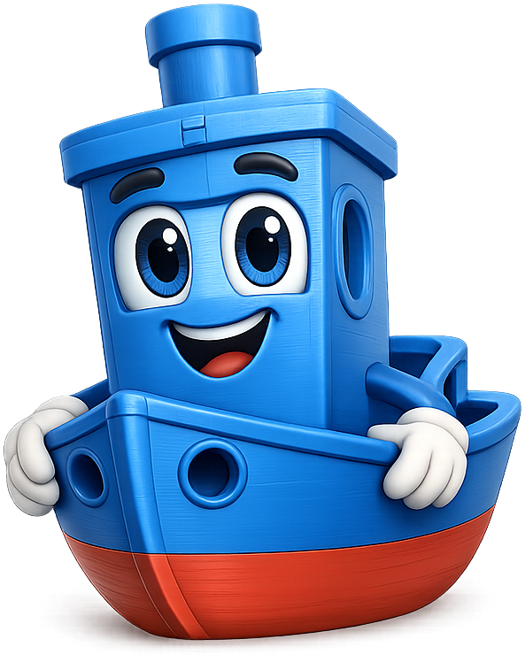

# Mascot Species Directory

A directory of animal species, robot styles, and other character forms that work well as textbook mascots, sorted alphabetically. Each entry includes a short description of the species' character traits and the kinds of textbooks or learning topics where it would shine. Where this gallery already has a working example, the mascot is shown beneath the entry as a clickable card.

This directory is structured in two parts: real animal species first (where most of the field-tested examples live), followed by a short [Non-Animal Mascots](#non-animal-mascots) section for robots, objects, and mythical forms.

## Armadillo

Armored, solitary, and quietly resilient, the armadillo is a fun mascot for cybersecurity defense, geology and paleontology (those ancient relatives!), or desert ecology. Its rolled-up posture is also a charming visual metaphor for self-protection and recovery.

## Bear

A warm, sturdy, and protective figure with a "wise old friend" feel. The bear conveys patience, strength, and curiosity. Excellent for textbooks on history, philosophy, or any introductory survey course where students need a reassuring guide who has "seen it all." Also a strong fit for environmental science, forestry, or outdoor education.

## Beaver

Industrious, structurally minded, and famously a keystone species that re-engineers an entire landscape one stick at a time, the beaver is an excellent mascot for ecology, hydrology, civil and environmental engineering, or any subject where the incremental construction of a system reshapes the surrounding world. Beavers also work well for topics about patient long-term effort that compounds visibly over years.

-   { width=200 }

    **[Bailey the Beaver](mascots/ecology/index.md)** — Ecology

## Bee

Industrious, organized, and a powerful symbol of collective intelligence, the bee is excellent for project-based learning, agriculture and pollination, distributed systems, or the science of communication (the famous waggle dance). Also pairs naturally with hexagonal design themes.

-   { width=200 }

    **[Buzz the Honey Bee](mascots/networking/index.md)** — Networking

## Butterfly

A timeless symbol of transformation and growth, the butterfly is ideal for developmental psychology, change-management texts, lifecycle biology, growth-mindset books, or any subject focused on metamorphosis from beginner to expert.

## Capybara

The world's most chill rodent, the capybara has become an internet darling for its calm demeanor and ability to befriend any other species. A wonderful mascot for cooperation studies, conflict resolution, social-emotional learning, or wetland ecology. Carries strong "everyone is welcome here" energy.

## Cat

Independent, observant, and famously curious, the cat is a strong mascot for chemistry (think Schrödinger), animal behavior, scientific research methods, or any subject where the disciplinary virtue is patient observation followed by sudden decisive action. The cat's nine-lives reputation also pairs well with experimental subjects that involve failure, recovery, and retry.

-   { width=200 }

    **[Catalyst the Cat](mascots/chemistry/index.md)** — Chemistry

## Chipmunk

Quick, organized (those carefully cached acorns!), and cheerful, the chipmunk is great for personal finance (saving for the future), library and information science, organizational behavior, or note-taking and study-skills books.

## Deer

Graceful, alert, and gentle, the deer is well suited for forestry, mindfulness, poetry and literature, or any subject where attentiveness and quiet observation are virtues. Pairs nicely with watercolor or hand-drawn illustration styles.

## Dog

Loyal, encouraging, and endlessly enthusiastic, the dog is the ultimate "you can do it" companion. Perfect for beginner-friendly textbooks across any discipline, especially programming for kids, foreign language basics, or fitness and habit-building guides.

## Dolphin

Intelligent, social, and joyful, the dolphin is a top-tier mascot for communication studies, marine biology, sonar and acoustics, or any subject emphasizing pattern recognition and language. Its playful leaping makes it a natural for textbooks that want to feel energetic and forward-moving.

-   { width=200 }

    **[Quinn the Dolphin](mascots/business/index.md)** — Business Fundamentals

## Duck

Calm on the surface, paddling furiously underneath — the duck is a perfect metaphor for many academic subjects. Great for project management, software debugging (rubber-duck debugging!), wetland ecology, or migration and movement studies.

## Eagle

Sharp-eyed, soaring, and aspirational, the eagle is a strong mascot for civics, leadership, scouting and outdoor education, optics and vision science, or any text that wants to convey high standards and broad perspective.

-   { width=200 }

    **[Lex the Bald Eagle](mascots/us-government/index.md)** — U.S. Government

-   { width=200 }

    **[Liberty the Bald Eagle](mascots/us-history/index.md)** — U.S. History

## Elephant

Long-memoried, socially complex, and patient on time scales most species cannot match, the elephant is a top-tier mascot for learning sciences, memory and cognition, anthropology, or any subject where what an organism *remembers* matters more than what it perceives in the moment. Elephants also model the herd-based, multigenerational knowledge transfer that the discipline of education is fundamentally about.

-   { width=200 }

    **[Bloom the Elephant](mascots/learning-sciences/index.md)** — Learning Sciences

## Ferret

Quick, persistent, and famously a tunnel-driven hunter, the ferret is a charming mascot for quantum mechanics (Fermi as namesake!), particle physics, subterranean ecology, or any subject requiring narrow, persistent burrowing through a problem until the prey is found.

-   { width=200 }

    **[Fermi the Ferret](mascots/quantum-computing/index.md)** — Quantum Computing

## Flamingo

Graceful, balanced (often on one leg!), and unmistakably pink, the flamingo is a fun mascot for biochemistry (carotenoids!), balance and yoga, fashion and color theory, or wetland ecology. Carries a friendly, slightly whimsical tone.

## Fox

Sharp, vigilant, and the canonical symbol of cleverness across many cultures (Reynard, kitsune, Aesop's fables), the fox is a strong mascot for cybersecurity, economics, strategic thinking, game theory, or any subject where the disciplinary virtue is reading adversarial behavior and acting on incomplete information. Use a friendly stylization to keep the tone encouraging rather than predatory.

-   { width=200 }

    **[Sentinel the Fox](mascots/cybersecurity/index.md)** — Cybersecurity

-   { width=200 }

    **[Ferris the Fox](mascots/economics-course/index.md)** — Economics

## Frog

Amphibious, adaptive, and a classic specimen in any biology classroom, the frog — especially the tree frog — is an excellent mascot for biology, comparative anatomy, life-cycle studies, and wetland or rainforest ecology. Tree frogs project a calm, observant attentiveness from their perch that works particularly well as a steady learning companion across long-form material.

-   { width=200 }

    **[Gregor the Tree Frog](mascots/biology/index.md)** — Biology

-   { width=200 }

    **[Mossby the Tree Frog](mascots/moss/index.md)** — Moss

## Giraffe

Tall, gentle, and able to see far horizons, the giraffe is a wonderful mascot for vision-and-strategy topics: leadership, business strategy, futures thinking, astronomy, or any subject where stepping back to see the big picture is essential. Also fits anatomy and physiology with that famously long neck.

## Hamster

Fluffy, energetic, and famously cheek-stuffing, the hamster is a charming mascot for nutrition, time management ("hamster wheel" jokes), or beginner science kits aimed at younger learners. It signals warmth and approachability.

## Hedgehog

Small, prickly on the outside but soft on the inside, the hedgehog is endearing and slightly nerdy. A fantastic mascot for cybersecurity-adjacent topics like personal privacy, defensive coding, or introverted-friendly subjects like solo research methods, library science, or independent study guides.

## Hippopotamus

Surprisingly fast despite the bulky shape, the hippo offers a great "don't underestimate me" mascot. Good for African studies, river and aquatic ecology, structural engineering, or texts that want a sturdy, dependable feel with a hint of humor.

## Horse

Strong, graceful, and historically tied to human progress, the horse is well suited for history textbooks, transportation engineering, agricultural science, or kinesiology. The horse also has strong associations with horsepower, making it fun for physics and mechanical engineering.

## Hummingbird

Tiny, energetic, and capable of remarkable precision in flight, the hummingbird is ideal for performance optimization, flight mechanics, pollination biology, or any subject emphasizing efficiency, agility, and rapid iteration.

-   { width=200 }

    **[Iris the Hummingbird](mascots/information-systems/index.md)** — Information Systems

## Kangaroo

Energetic, family-focused (think the pouch), and forward-jumping, the kangaroo works well for child development, embedded systems ("nested" pouches), Australian studies, or any topic about leaping forward in skill development.

## Koala

A laid-back, tree-hugging mascot with a sleepy but attentive demeanor. Koalas project calmness, making them ideal for stress-management topics, sleep science, mental health, or any subject where students benefit from a "take it easy, you've got this" tone. Also fitting for Australian studies or eucalyptus and plant biology.

## Ladybug

Tiny, lucky, and beloved, the ladybug is a charming mascot for early-childhood readers, integrated pest management, garden ecology, or quality-assurance and software-testing books (where "bugs" are the central topic).

## Lemur

Wide-eyed, agile, and exotic, the lemur brings a touch of wonder. Ideal for Madagascar and biodiversity topics, evolutionary biology, niche ecology, or any subject that wants a slightly unusual but instantly likable mascot.

## Lion

Confident, courageous, and a natural leader, the lion is great for civic education, leadership development, public speaking, debate, or law. The lion can feel formal, so pair with a warm color palette and friendly facial expression to keep it approachable.

## Llama

Soft, sociable, and famously expressive (with a hint of sass), the llama is an excellent mascot for Andean studies, fiber arts, pack-and-carry topics like backpacking and load balancing in computing, or modern AI/ML textbooks where "llama" has additional cultural resonance.

## Meerkat

Watchful, social, and famously cooperative ("a meerkat manor"), this mascot is perfect for community studies, network science, observability and monitoring in software, or any subject emphasizing teamwork and shared lookout.

## Monkey

Playful, social, and dexterous, the monkey is a great mascot for tool-use and engineering topics, primatology, evolutionary biology, or the literal "monkey see, monkey do" subject of imitation learning. Use with care to keep depictions respectful and friendly.

## Moose

Imposing yet good-natured, the moose has a goofy charm that breaks the ice. Excellent for Canadian or Nordic studies, large-systems engineering, climate and boreal ecology, or any subject where the mascot's size is played for friendly humor.

## Mouse

Tiny, clever, and resourceful, the mouse is a classic mascot for computing (think computer mice), laboratory science, urban ecology, or any topic that celebrates cleverness over size. A natural choice for introductory texts where the mascot is "small and learning alongside you."

## Octopus

Famously distributed-intelligent — roughly two-thirds of an octopus's neurons live in its eight arms, each of which can sense, decide, and act semi-independently — the octopus is a top-tier mascot for parallel computing, distributed systems, learning analytics, bioinformatics, or any subject where the central insight is "many small streams, integrated into one record." Few real species so cleanly embody a load-bearing engineering concept.

-   { width=200 }

    **[Olli the Octopus](mascots/bioinformatics/index.md)** — Bioinformatics

-   { width=200 }

    **[Xavi the Octopus](mascots/xapi-course/index.md)** — xAPI Course

## Otter

Playful, social, and at home in two environments (water and land), the otter is an excellent mascot for digital citizenship, social-emotional learning, hybrid systems, or the ecology of riparian zones. River otters in particular project warmth and approachability, suiting them to topics where the tone needs to feel friendly without going saccharine.

-   { width=200 }

    **[Maka the River Otter](mascots/digital-citizenship/index.md)** — Digital Citizenship

## Owl

Wise, watchful, and the canonical Western symbol of scholarship (the owl of Athena, the owl of Minerva), the owl is one of the strongest possible mascots for general learning, philosophy, theory of knowledge, logic, mathematics, or any meta-disciplinary text about how reasoning itself works. Pairs naturally with academic regalia, scrolls, reading glasses, and library imagery.

-   { width=200 }

    **[Axiom the Owl](mascots/intelligent-textbooks/index.md)** — Intelligent Textbooks

-   { width=200 }

    **[Sofia the Owl](mascots/theory-of-knowledge/index.md)** — Theory of Knowledge

## Panda

A gentle, slow-moving, and instantly lovable mascot with broad cross-cultural appeal. The panda's contemplative nature pairs well with subjects that reward patience: meditation, mindfulness, language learning (especially Mandarin), or comparative literature. Its black-and-white markings also make it a natural fit for design, contrast theory, or binary topics in computer science.

## Parrot

Colorful, talkative, and famously imitative, the parrot is a natural for language learning, public speaking, music and pitch training, or any topic involving repetition, mimicry, and verbal pattern recognition.

-   { width=200 }

    **[Polly the Parrot](mascots/prompt-class/index.md)** — Prompt Engineering

## Peacock

Visually spectacular and famously a display animal, the peacock is the natural mascot for infographics, data visualization, design and branding, ornithology, or any subject where the act of *showing* is itself the point. The eye-patterns on the tail also lend themselves to topics about pattern recognition, repetition, and visual rhythm.

-   { width=200 }

    **[Percy the Peacock](mascots/infographics/index.md)** — Infographics

## Penguin

Formal-looking yet playful, the penguin works hard in tough conditions and thrives in a community. Ideal for teamwork-focused topics, climate science, polar studies, fluid dynamics, or any STEM subject where collaboration and resilience are themes. Also a beloved Linux and open-source mascot for systems programming texts.

## Pig

Surprisingly intelligent, social, and clean (despite the stereotype), the pig is a delightful mascot for agricultural science, microeconomics (piggy banks!), food systems, or any subject that wants a cheerful, down-to-earth personality. Pigs also work well for behavioral psychology given their problem-solving abilities.

## Platypus

Wonderfully weird — egg-laying, duck-billed, and beaver-tailed — the platypus is the ideal mascot for interdisciplinary studies, taxonomy puzzles, edge cases, or any topic that celebrates "doesn't fit in one box" thinking. Great for design thinking and innovation books.

## Polar Bear

Strong, solitary, and increasingly a symbol of climate awareness, the polar bear is excellent for climate science, Arctic studies, thermoregulation and physiology, or sustainability-focused textbooks.

## Rabbit

Quick, alert, and curious — the rabbit is a classic learning companion with a long literary tradition. Great for early-reader textbooks, probability and statistics (think hopping between options), genetics (Mendelian ratios), or any topic involving rapid iteration and exploration.

## Raccoon

Dexterous, curious, and famously a problem-solver (those clever paws!), the raccoon is a strong mascot for software engineering and functional programming, blockchain and cryptography, urban ecology, or any subject where the disciplinary virtue is opportunistic creativity and clever manipulation of the environment.

-   { width=200 }

    **[Rex the Raccoon](mascots/blockchain/index.md)** — Blockchain

-   { width=200 }

    **[Rick the Raccoon](mascots/functions/index.md)** — Functions

## Raven

Among the most cognitively capable birds — caching food, planning ahead, reading social cues, and even deceiving rivals — the raven is an excellent mascot for entrepreneurship, strategy and planning, mythology and folklore (Odin's Huginn and Muninn carry thought and memory), or any subject involving long-horizon foresight and theory of mind.

-   { width=200 }

    **[Rune the Raven](mascots/mini-mba-for-startups/index.md)** — Ole Cup Entrepreneurship

## Red Panda

Quietly charismatic, arboreal, and famously a low-footprint specialist (their bamboo diet would not sustain a larger carnivore), the red panda is a charming mascot for token efficiency and computational frugality, Himalayan ecology, sustainable design, or any subject built around the message "do more with less." Note: despite the shared common name, red pandas and giant pandas are unrelated species.

-   { width=200 }

    **[Pemba the Red Panda](mascots/token-efficiency/index.md)** — Token Efficiency

## Robin

Cheerful, seasonal, and a herald of new beginnings, the robin is a sweet mascot for spring-themed early-learner texts, gardening, ornithology, or starter guides where the message is "this is the start of something good."

## Seahorse

Graceful, unique (the males give birth!), and gentle, the seahorse is a wonderful mascot for marine biology, gender studies, parenting and child development, or any subject that highlights surprising natural design.

## Seal

Playful, social, and at home in two worlds (water and land), the seal is a delightful mascot for amphibious/hybrid topics, cryptography (think "seals" of authenticity!), marine biology, or any subject involving transitions between environments.

## Sheep

Gentle, communal, and gloriously soft, the sheep makes a comforting mascot for early-childhood education, textile arts, agricultural studies, or topics involving herd behavior, network effects, and social dynamics.

## Sloth

Slow, smiling, and unbothered, the sloth is an unexpectedly perfect mascot for stress-relief topics, mindfulness, sustainable pace ("slow productivity"), rainforest ecology, or any subject where the reader needs permission to slow down and absorb the material.

## Snail

Slow, patient, and carrying its home wherever it goes, the snail is a delightful mascot for portable/mobile computing, minimalism, contemplative practices, or any topic that values bringing your essentials with you.

## Spider

Web-building, network-aware, and structurally fundamental to ecology, the spider is an excellent mascot for knowledge graphs, network science, context graphs, and any subject where the central insight is that meaning comes from the *structure of connections* rather than from isolated nodes. The web itself is the canonical natural-world graph.

-   { width=200 }

    **[Nexus the Spider](mascots/context-graph/index.md)** — Context Graph

## Squirrel

Industrious, forward-thinking (those carefully cached acorns!), and quick on the move, the squirrel is an excellent mascot for personal finance, statistics and probability, urban ecology, or any subject involving the management of scarcity and uncertainty over time. Closely related to the chipmunk but with a more public, tree-climbing personality that suits front-of-classroom roles.

-   { width=200 }

    **[Sylvia the Squirrel](mascots/personal-finance/index.md)** — Personal Finance

-   { width=200 }

    **[Sylvia the Statistical Squirrel](mascots/statistics-course/index.md)** — AP Statistics

## Starfish

Regenerative, radial, and quietly resilient, the starfish is a strong mascot for resilience and recovery topics, regenerative design, decentralized organizations ("The Starfish and the Spider"), or marine biology.

## Swan

Elegant, graceful, and famously associated with transformation ("ugly duckling" to swan), the swan is an excellent mascot for arts education, ballet and movement, growth-mindset texts, or developmental psychology.

## Tiger

Bold, focused, and disciplined, the tiger is an excellent mascot for performance-oriented subjects: athletics, martial arts, music practice, or competitive math. Tigers carry strong cultural symbolism in many parts of Asia, making them a good fit for cross-cultural curricula.

## Tortoise

Closely related to the turtle but with a more terrestrial, philosophical bearing — think Aesop's fable. Ideal for ethics, classical studies, logic, or any text where careful, deliberate reasoning matters more than speed.

-   { width=200 }

    **[Chronos the Tortoise](mascots/ancient-history/index.md)** — Ancient History

## Toucan

Bold-billed, vivid, and tropically cheerful, the toucan brings instant energy and color. Excellent for graphic design, branding, tropical ecology, or any textbook that wants to feel vibrant and visually expressive.

## Turtle

Steady, methodical, and protected by a shell of accumulated knowledge, the turtle is the patron mascot of "slow and steady wins the race." Excellent for long-form study guides, exam-prep books, project management, or anything emphasizing incremental progress and persistence.

## Walrus

Whiskered, blubbery, and unexpectedly charming, the walrus brings a folksy, almost grandfatherly warmth. Good for marine mammal studies, oceanography, Arctic culture and history, or topics that benefit from a "wise elder" voice.

## Whale

Massive, ancient, and graceful, the whale projects depth and wisdom. Perfect for textbooks on oceanography, big-picture systems thinking, large-scale data ("big data"), philosophy of science, or any subject where the scope of inquiry is vast and humbling.

## Wolf

Loyal, intelligent, and pack-oriented, the wolf is a powerful mascot for team dynamics, organizational behavior, mythology and folklore, or wilderness survival. Use a friendlier, less menacing illustration style to keep the tone encouraging.

## Zebra

Striking, communal, and visually iconic, the zebra is a great mascot for design and visual communication, pattern recognition, typography, or African studies. The bold black-and-white stripes also make it memorable in print and on small icons.

## Non-Animal Mascots

The following gallery mascots take the form of inanimate objects, robots, or mythical creatures rather than real animal species. They are listed here for completeness — the same one-paragraph format applies — and they are reminders that subject-coupling beats animal-shaped cuteness when the subject calls for it.

### Abstract Character

A small rounded character with soft features and gentle expressions can be a strong mascot for sensitive subjects — mental health, dementia care, grief — where a specific real animal might carry unwanted symbolic associations. An abstract form lets readers project their own emotional response onto the character without an animal-specific overlay.

-   { width=200 }

    **[Tokie](mascots/Dementia/index.md)** — Understanding Dementia

### Explorer Figure

A small humanoid figure climbing or walking up and down a hill is a literal visualization of the derivative — the slope at a point — making it an unusually concrete mascot for calculus. The character is essentially a walking diagram, with the pose itself encoding the mathematical idea.

-   { width=200 }

    **[Delta the Slope-Walking Explorer](mascots/calculus/index.md)** — Calculus

### Lightbulb

A literal lightbulb — the canonical "load" in every introductory circuit diagram — is the ideal mascot for any electronics or circuits textbook. The character itself encodes the foundational concept under study, and pose-based expressions (glowing bright for celebration, dim for warnings) map naturally onto real circuit behavior.

-   { width=200 }

    **[Sparky the Lightbulb](mascots/circuits/index.md)** — Circuits

### Robot

A humanoid or wheeled robot is a flexible mascot for subjects where the artifact being studied could itself be the mascot — pre-calculus and other math, robotics, AI fundamentals, or any course where the act of *building* something intelligent is part of the curriculum. Robots also let illustrators escape the constraints of real animal anatomy when expressiveness is more important than realism.

-   { width=200 }

    **[Prema](mascots/pre-calc/index.md)** — Pre-Calculus

-   { width=200 }

    **[Dex the Robot](mascots/right-database/index.md)** — Selecting the Right Database

### Tugboat (3D-Print)

The original 3DBenchy is the most-printed object in the maker world, used as a universal calibration model for FDM 3D printers. As a mascot, an anthropomorphized Benchy is *self-referentially the subject* of a 3D-printing textbook: the character is itself an artifact of the discipline, and the visible layer lines on its surface quietly reinforce the topic in every pose.

-   { width=200 }

    **[Benchy the Tugboat](mascots/3d-printing-course/index.md)** — Introduction to 3D Printing

### Unicorn

Mythical, magical, and a strong symbol of rarity and exceptional achievement, the unicorn is a playful mascot for goal-setting books, children's content about ambition, or culture-and-literature texts about myth. Use with care to keep the tone genuinely encouraging rather than ironic.

-   { width=200 }

    **[Sparkle the Unicorn](mascots/unicorns/index.md)** — Unicorns

