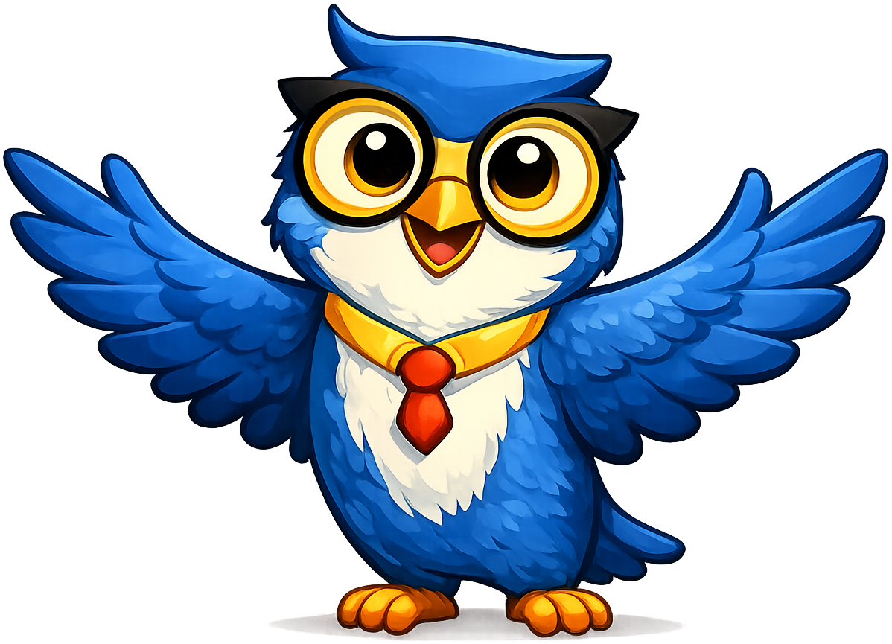
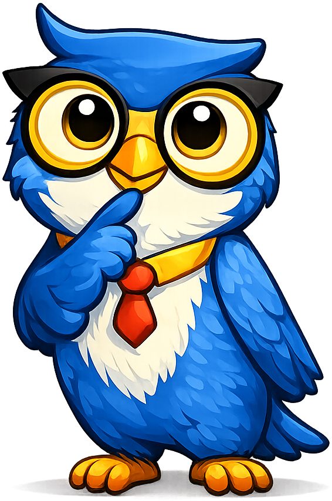
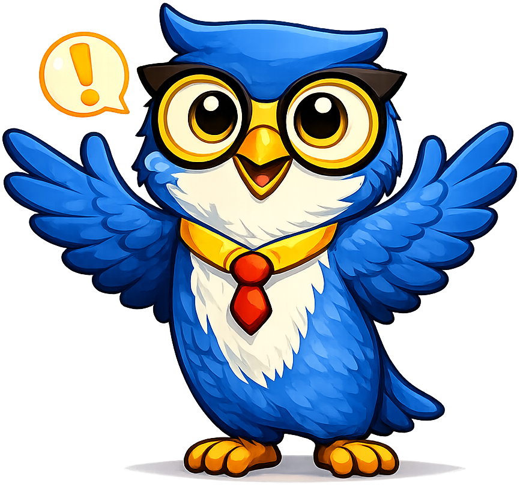

# Mascot Test Page

This page demonstrates how a mascot looks when embedded inline with text content — the way it would appear in a real chapter. The mascot used here is **Axiom the Owl** from the [Intelligent Textbooks](mascots/intelligent-textbooks/index.md) project.

Use this page to:

- Verify each pose renders cleanly against the site's light and dark themes.
- Check that there's no white halo around the character (a sign of a dirty alpha channel).
- Confirm padding is tight enough that text wraps comfortably next to the image.
- Get a feel for which poses to reach for in which moments of a chapter.

---

## Mascot Admonitions

The six themed admonition classes defined in `mascot.css` (`mascot-welcome`, `mascot-thinking`, `mascot-tip`, `mascot-warning`, `mascot-celebration`, `mascot-encourage`) pair a colored title bar with the floated mascot image. Use them anywhere a Material admonition would feel appropriate.

!!! mascot-welcome "Welcome to the chapter"
    
    Welcome to the chapter. The *welcome* pose belongs at the top of a new chapter or unit. Axiom is waving and looking the reader in the eye — a small, deliberate signal that we're starting fresh and that the reader is in good hands.

!!! mascot-thinking "Pause and reflect"
    
    The *thinking* pose tells the reader that the next paragraph is going to ask them to slow down. Use it before a worked example, before a "consider this" rhetorical question, or anywhere you want the student to stop skimming.

!!! mascot-tip "Axiom's tip"
    
    Use the *tip* pose for shortcuts, mnemonics, and "by the way" advice that helps the student but isn't strictly required to follow the main argument. Keep tips short — one or two sentences.

!!! mascot-warning "Axiom's warning"
    
    The *warning* pose flags a common mistake or a footgun the student is about to walk into. Always pair it with the *fix*, not just the danger — a warning without a remedy is just anxiety.

!!! mascot-celebration "You finished!"
    
    The *celebration* pose closes a chapter, a unit, or a particularly hard section. Don't waste it on small wins — if every paragraph ends with a celebration, the gesture is empty.

!!! mascot-encourage "You've got this"
    
    The *encouraging* pose belongs at the moment a student is most likely to give up: right before a hard problem, after a section that introduced a lot of new vocabulary, or at the start of a long worked example.

---

## Inline Poses

The same poses also work as inline images embedded directly in body text. Each image below is wrapped with a thin dashed blue border so you can see the exact transparent bounding box of the asset against the page background.

!!! note "Path gotcha — markdown vs. HTML images"
    The admonitions above use raw `` tags, which the browser resolves relative to the **served URL** (`/book-mascots/mascot-test/`). The inline images below use markdown `` syntax, which MkDocs rewrites relative to the **source `.md` file** (`docs/mascot-test.md`). That's why the HTML `` tags need `../mascots/intelligent-textbooks/…` while the markdown images use plain `mascots/intelligent-textbooks/…`. Mixing the two paths is the silent footgun — broken images on the rendered page even though the asset exists on disk.

### Welcome

{ width=160 align=left style="border: 1px dashed blue; padding: 4px;" }

**Welcome to the chapter.** The *welcome* pose belongs at the top of a new chapter or unit. Axiom is waving and looking the reader in the eye — a small, deliberate signal that we're starting fresh and that the reader is in good hands. Use this pose sparingly; if every section opens with a wave, the wave stops meaning anything.

---

### Neutral

{ width=160 align=right style="border: 1px dashed blue; padding: 4px;" }

**Default presence.** The *neutral* pose is the workhorse. It's what you embed next to a definition, an example, or a paragraph of explanation when you want a friendly face on the page but you don't want to add any extra emotional weight. Treat it as the textual equivalent of a comma — a small visual breath in a long stretch of prose.

---

### Thinking

{ width=160 align=left style="border: 1px dashed blue; padding: 4px;" }

**Pause and reflect.** The *thinking* pose tells the reader that the next paragraph is going to ask them to slow down. Use it before a worked example, before a "consider this" rhetorical question, or anywhere you want the student to stop skimming. Pair it with a question, not an answer.

---

### Tip

{ width=160 align=left style="border: 1px dashed blue; padding: 4px;" }

**A small shortcut.** Use the *tip* pose for shortcuts, mnemonics, and "by the way" advice that helps the student but isn't strictly required to follow the main argument. Keep tips short — one or two sentences.

---

### Encouraging

{ width=160 align=right style="border: 1px dashed blue; padding: 4px;" }

**You've got this.** The *encouraging* pose belongs at the moment a student is most likely to give up: right before a hard problem, after a section that introduced a lot of new vocabulary, or at the start of a long worked example. The job here is emotional, not informational — the prose around it should acknowledge that the next bit is hard, then promise that the effort is worth it.

---

### Warning

{ width=160 align=left style="border: 1px dashed blue; padding: 4px;" }

**Watch out.** The *warning* pose flags a common mistake or a footgun the student is about to walk into. Use it for off-by-one errors, misread definitions, sign mistakes, and the like. Always pair it with the *fix*, not just the danger — a warning without a remedy is just anxiety.

---

### Celebration

{ width=160 align=right style="border: 1px dashed blue; padding: 4px;" }

**You finished.** The *celebration* pose closes a chapter, a unit, or a particularly hard section. It rewards the reader for the work they just did. Don't waste it on small wins — if every paragraph ends with a celebration, the gesture is empty. Save it for real milestones.

---

### Explain (bonus pose)

{ width=160 align=left style="border: 1px dashed blue; padding: 4px;" }

Axiom has an extra *explain* pose that isn't in the standard seven-pose set. It works well next to a definition box or a "here's how this actually works" paragraph — a lecturing-but-friendly stance. Not every mascot has this; it's a nice-to-have when the character supports it.

---

## All poses at a glance

-   { width=140 style="border: 1px dashed blue; padding: 4px;" }

    **Welcome**

-   { width=140 style="border: 1px dashed blue; padding: 4px;" }

    **Neutral**

-   { width=140 style="border: 1px dashed blue; padding: 4px;" }

    **Thinking**

-   { width=140 style="border: 1px dashed blue; padding: 4px;" }

    **Tip**

-   { width=140 style="border: 1px dashed blue; padding: 4px;" }

    **Encouraging**

-   { width=140 style="border: 1px dashed blue; padding: 4px;" }

    **Warning**

-   { width=140 style="border: 1px dashed blue; padding: 4px;" }

    **Celebration**

-   { width=140 style="border: 1px dashed blue; padding: 4px;" }

    **Explain**

---

If any of the images above show a colored halo, a visible bounding box, or extra space between the character and the surrounding text, see [Mascot Image Quality](mascot-image-quality.md) for the trimming and transparency tools we use to fix it.
