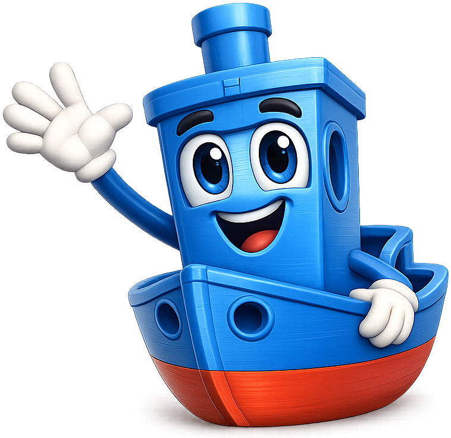
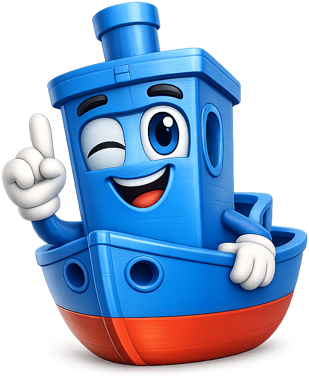
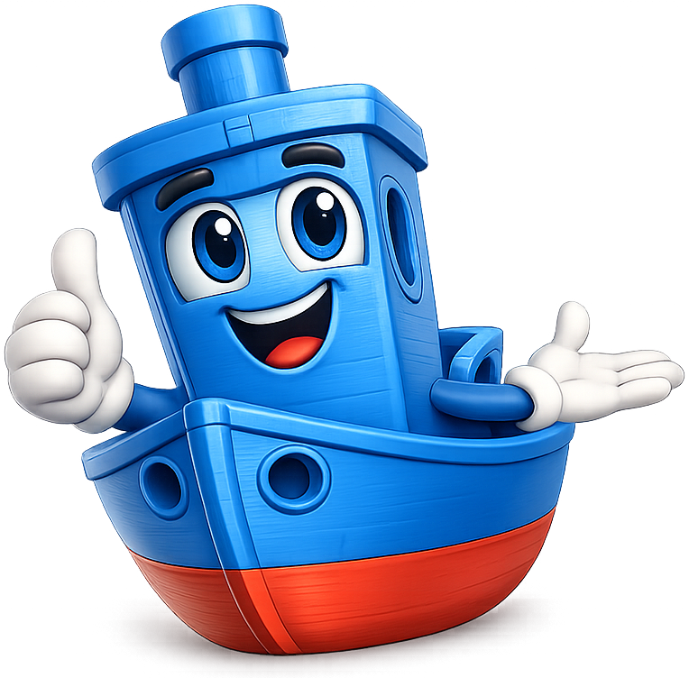
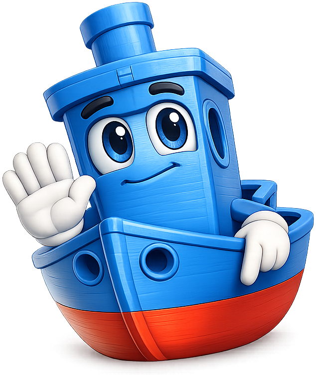
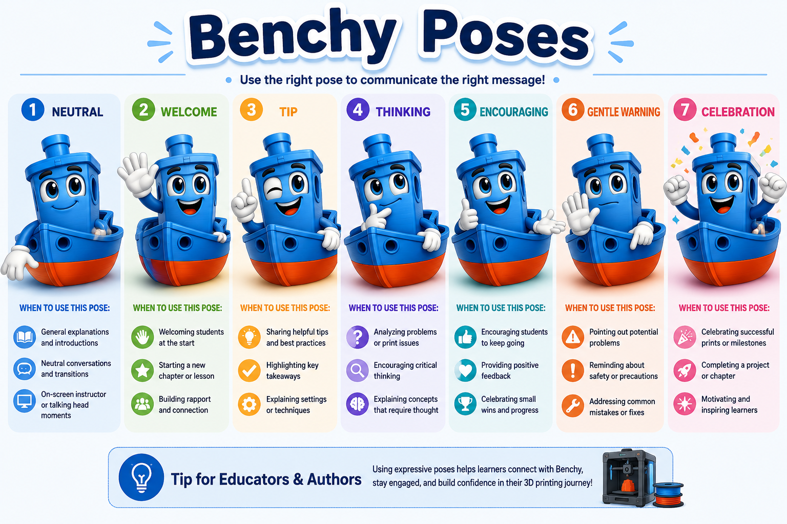

# 3D Printing Course

**Benchy the Tugboat** is the mascot for the [Introduction to 3D Printing](https://dmccreary.github.io/3d-printing-course/) textbook. The original 3DBenchy is the most printed object in the world — a small tugboat released in 2015 as a torture-test calibration model that exercises overhangs, bridges, fine detail, and surface finish in a single job, making it the universal benchmark by which the global maker community judges a new printer. The name *Benchy* is a direct contraction of *benchmark*, and the mascot keeps the visible FDM layer lines that signal "this character is itself a 3D print." Benchy was chosen because the mascot is self-referentially the subject of the textbook: a learner who recognizes Benchy already shares a vocabulary with every other 3D-printing practitioner, and the visible layer-line texture quietly reinforces what the book is teaching. The choice is exceptional because the mascot does not stand for the discipline by analogy — it literally is an artifact of the discipline, with name, form, and surface all carrying pedagogical weight.

All poses for the **3D Printing Course** mascot.

-   { width=300 }

    **Neutral**

-   { width=300 }

    **Welcome**

-   { width=300 }

    **Tip**

-   { width=300 }

    **Thinking**

-   { width=300 }

    **Encouraging**

-   { width=300 }

    **Warning**

-   { width=300 }

    **Celebration**

-   { width=300 }

    **Poses Infographic**

[← Back to gallery](../../list-mascots.md)
