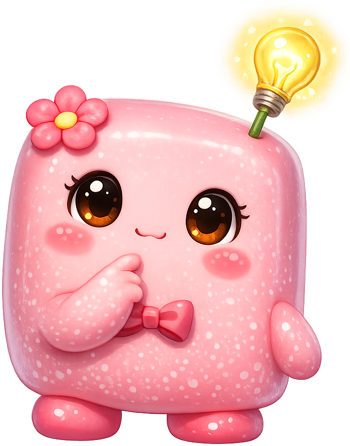
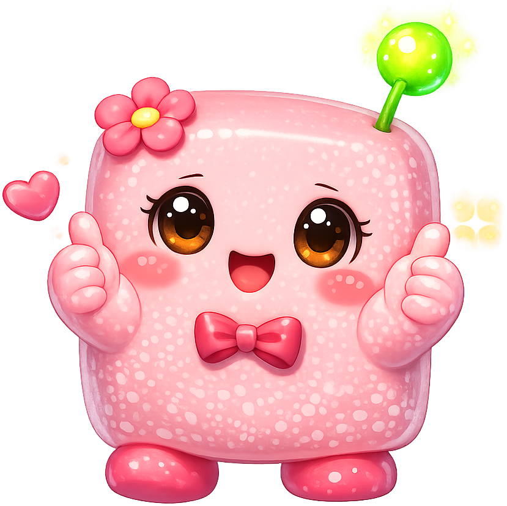
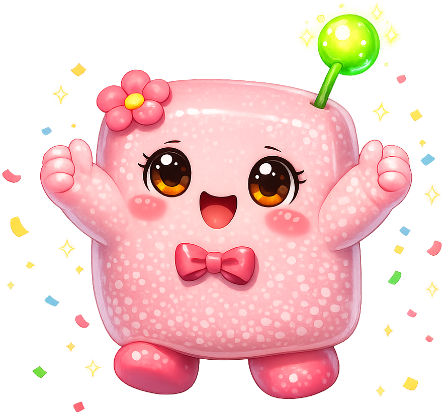

# Dementia

**Tokie** is the mascot for the [Understanding Dementia](https://rtanler.github.io/Dementia/) textbook. Tokie is a soft, pink, cube-shaped character with a flower and an antenna — a friendly, abstract figure rather than a realistic depiction of a person, which is a deliberate choice for a sensitive topic. Tokie was chosen because dementia education must hold gentle space for caregivers, families, and people living with memory loss, and an abstract character avoids the demographic and emotional baggage that a more realistic mascot would carry. The cube shape suggests a "memory token" — a discrete unit of memory that can be retrieved, lost, or held safely. The choice is good because the warmth of the character matches the warmth the subject demands.

All poses for the **Dementia** mascot.

-   { width=300 }

    **Neutral**

-   { width=300 }

    **Welcome**

-   { width=300 }

    **Tip**

-   { width=300 }

    **Thinking**

-   { width=300 }

    **Encouraging**

-   { width=300 }

    **Warning**

-   { width=300 }

    **Celebration**

[← Back to gallery](../../list-mascots.md)
