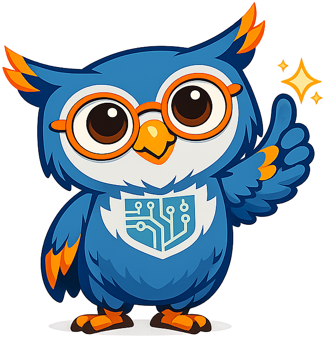

# AI Strategy for Education

**Sage the Owl** is the mascot for [AI Strategy for Education](https://dmccreary.github.io/ai-strategy-for-education/). Owls' forward-facing eyes and ability to survey their surroundings make Sage a useful symbol for deliberate observation before strategic action. The name Sage denotes both wisdom and a trusted adviser, fitting a guide who helps educators evaluate AI choices. Sage was chosen to reinforce the habit of aligning technology decisions with learning goals, policy, and institutional capacity. The combination of an advisory name and a watchful species makes this a strongly subject-coupled mascot rather than a decorative one.

All poses for the **AI Strategy for Education** mascot.

-   { width=300 }

    **Neutral**

-   { width=300 }

    **Welcome**

-   { width=300 }

    **Tip**

-   { width=300 }

    **Thinking**

-   { width=300 }

    **Encouraging**

-   { width=300 }

    **Warning**

-   { width=300 }

    **Celebration**

[← Back to gallery](../../list-mascots.md)
