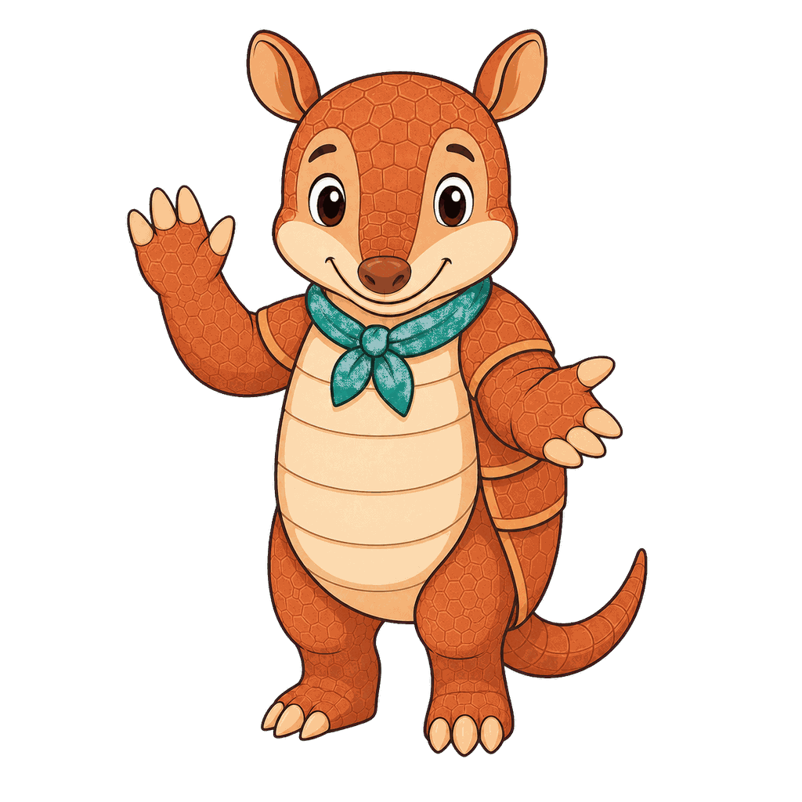
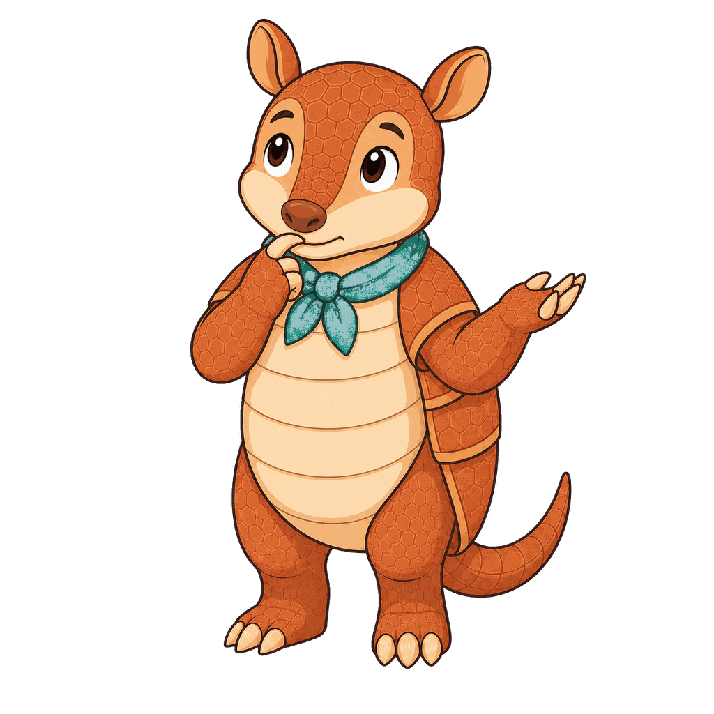
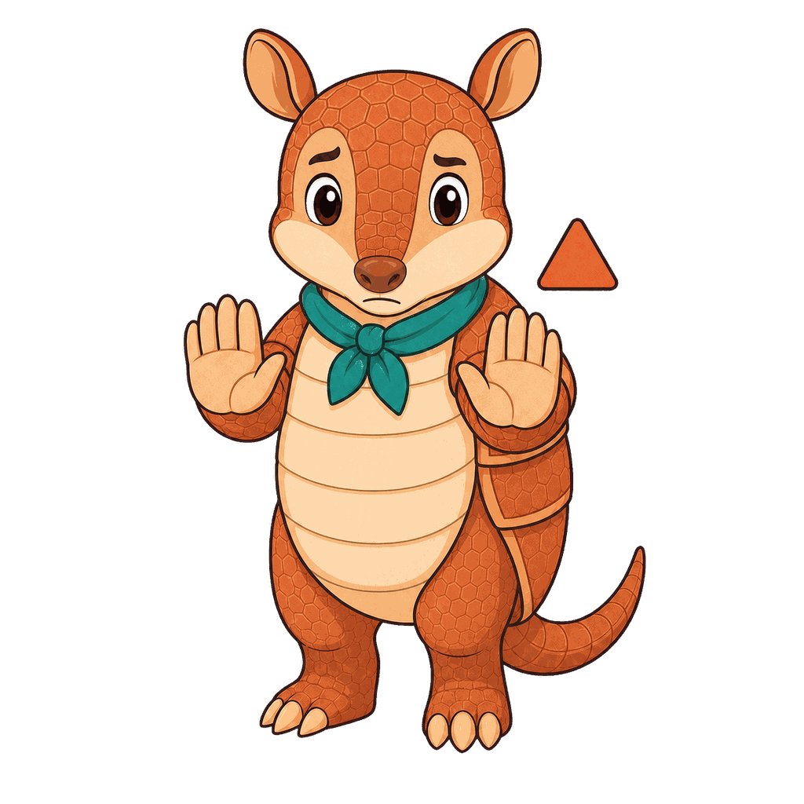

# Armadillo

**Armadillo** is a general-purpose mascot for the mascot gallery rather than a mascot tied to one textbook. Armadillos are known for their armored shells, which makes the character a clear symbol for preparation, resilience, and careful progress through difficult material. The name is intentionally literal: the animal itself carries the main metaphor, so the visual identity stays simple and memorable. Armadillo was chosen to model a calm learning stance - inspect the path, protect your reasoning, and keep moving in small steps. This is a useful general mascot because the species and silhouette both encode the same learning habit instead of merely decorating the page.

All poses for the **Armadillo** mascot.

-   { width=300 }

    **Neutral**

-   { width=300 }

    **Welcome**

-   { width=300 }

    **Tip**

-   { width=300 }

    **Thinking**

-   { width=300 }

    **Encouraging**

-   { width=300 }

    **Warning**

-   { width=300 }

    **Celebration**

[← Back to gallery](../../list-mascots.md)
