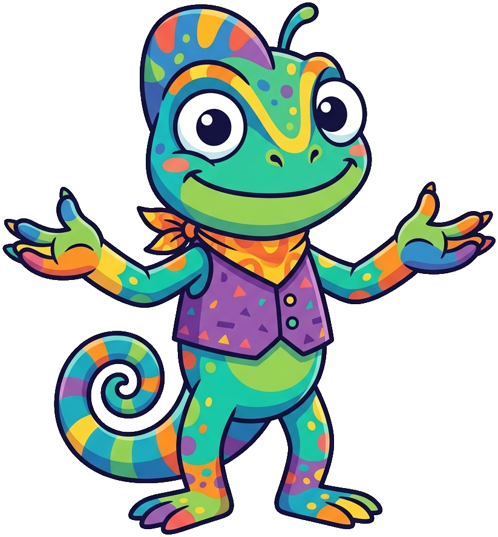
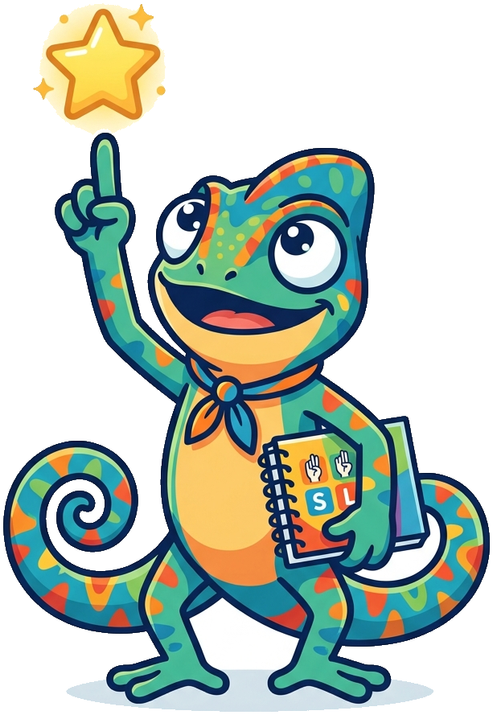
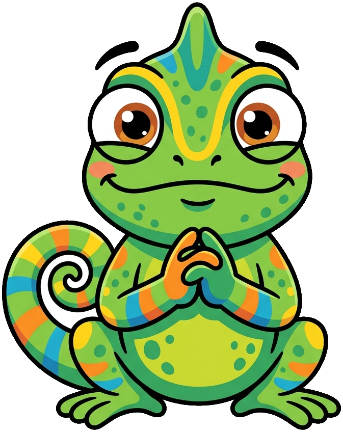
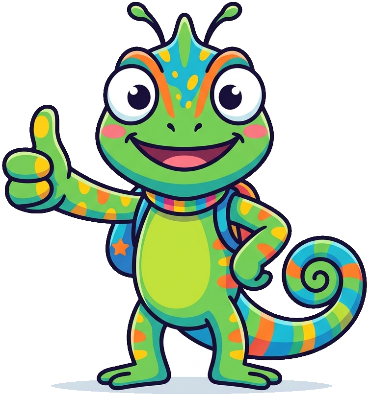
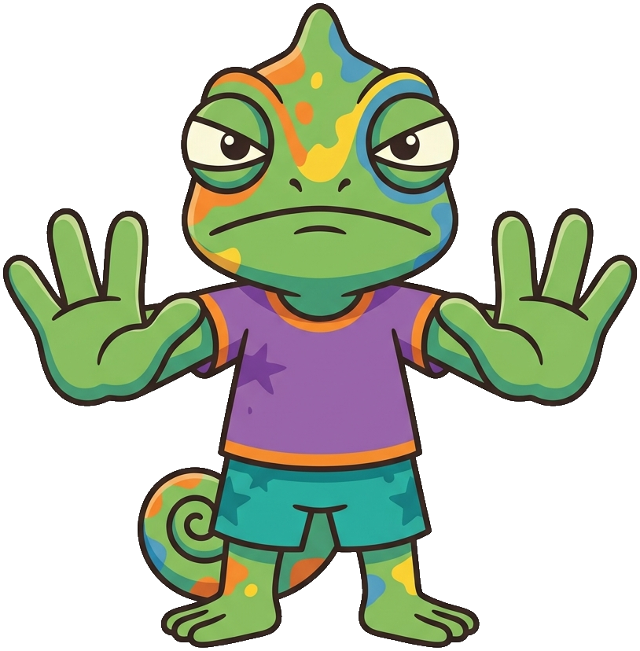
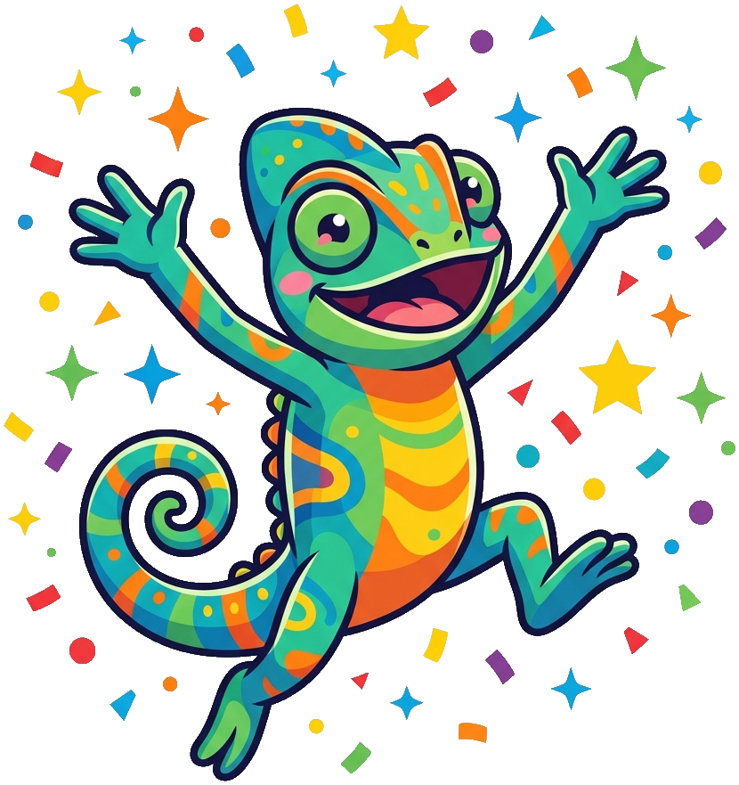

# ASL Book

**Mimi the Chameleon** is the mascot for the [ASL Book](https://Olufsonc-hub.github.io/asl-book/). Chameleons communicate visually through color, posture, and movement, providing a natural bridge to a language expressed through visible form and space. Mimi's repeated initial gives the name an easy signing-class rhythm even without a separate etymology. Mimi was chosen to remind learners to attend closely to facial expression, handshape, orientation, and other changing visual signals. Because the species itself models adaptive nonverbal communication, the mascot has a meaningful connection to the curriculum.

All poses for the **ASL Book** mascot.

-   { width=300 }

    **Neutral**

-   { width=300 }

    **Welcome**

-   { width=300 }

    **Tip**

-   { width=300 }

    **Thinking**

-   { width=300 }

    **Encouragement**

-   { width=300 }

    **Warning**

-   { width=300 }

    **Celebration**

[← Back to gallery](../../list-mascots.md)
