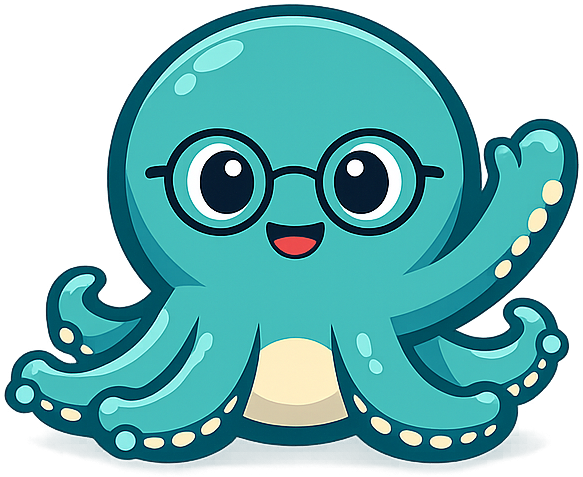
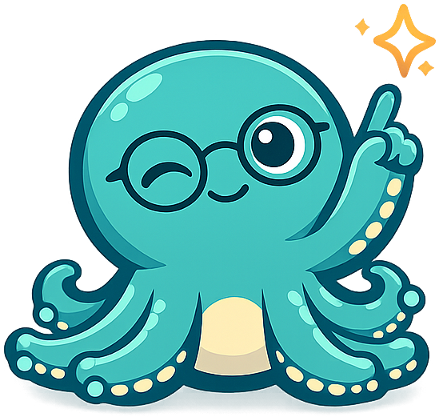
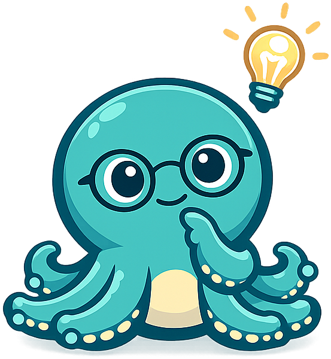
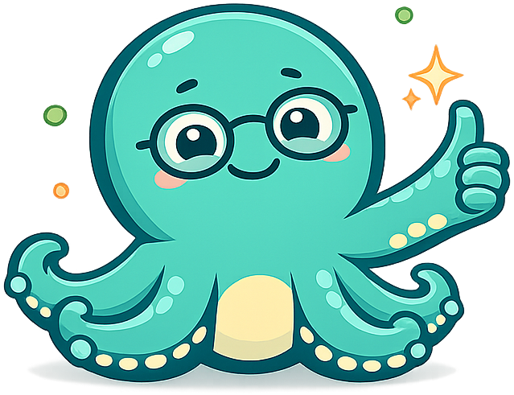
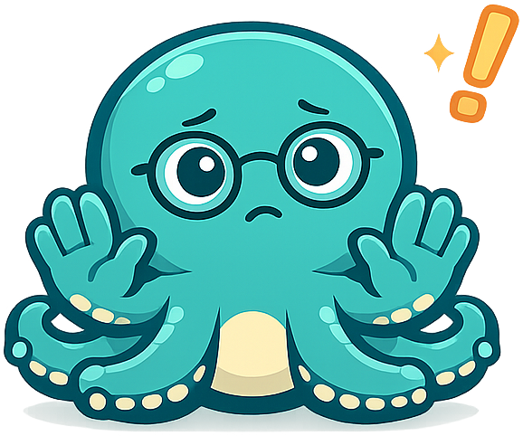
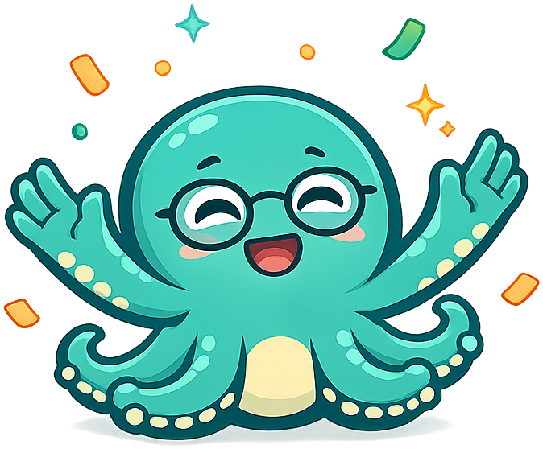

# Bioinformatics

**Olli the Octopus** is the mascot for the [Bioinformatics](https://dmccreary.github.io/bioinformatics/) textbook. Octopuses have a famously distributed nervous system — roughly two-thirds of their neurons live in their eight arms, which can solve problems independently of the central brain — making them a working biological metaphor for the parallel, branching pipelines that define modern bioinformatics. Olli was chosen because the species itself encodes a load-bearing idea in the curriculum: that processing genomic information is a many-streams-at-once activity, not a single linear operation. The choice is strong because a learner who internalizes Olli walks away with a free intuition for distributed computation on biological sequences, which is exactly the mental model the discipline most wants to install.

All poses for the **Bioinformatics** mascot.

-   { width=300 }

    **Neutral**

-   { width=300 }

    **Welcome**

-   { width=300 }

    **Tip**

-   { width=300 }

    **Thinking**

-   { width=300 }

    **Encouraging**

-   { width=300 }

    **Warning**

-   { width=300 }

    **Celebration**

[← Back to gallery](../../list-mascots.md)
