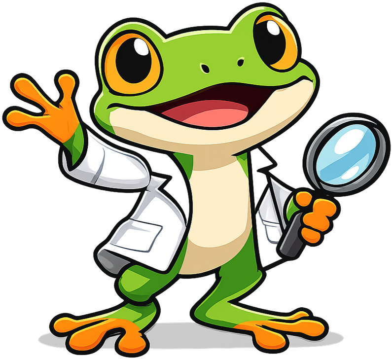
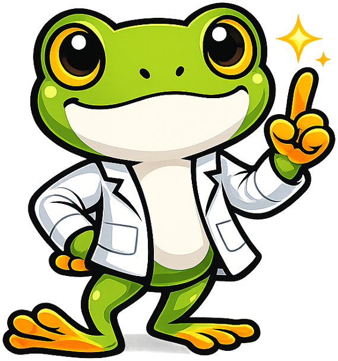
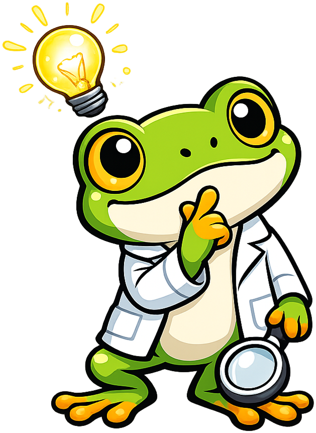
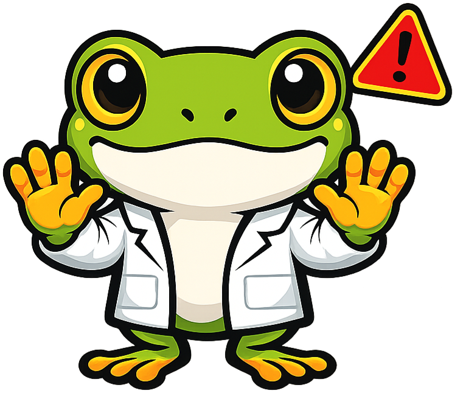
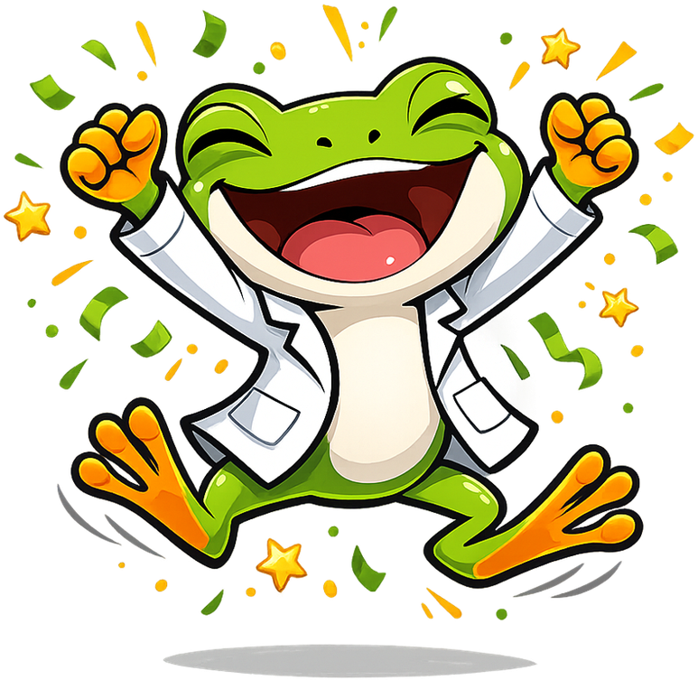
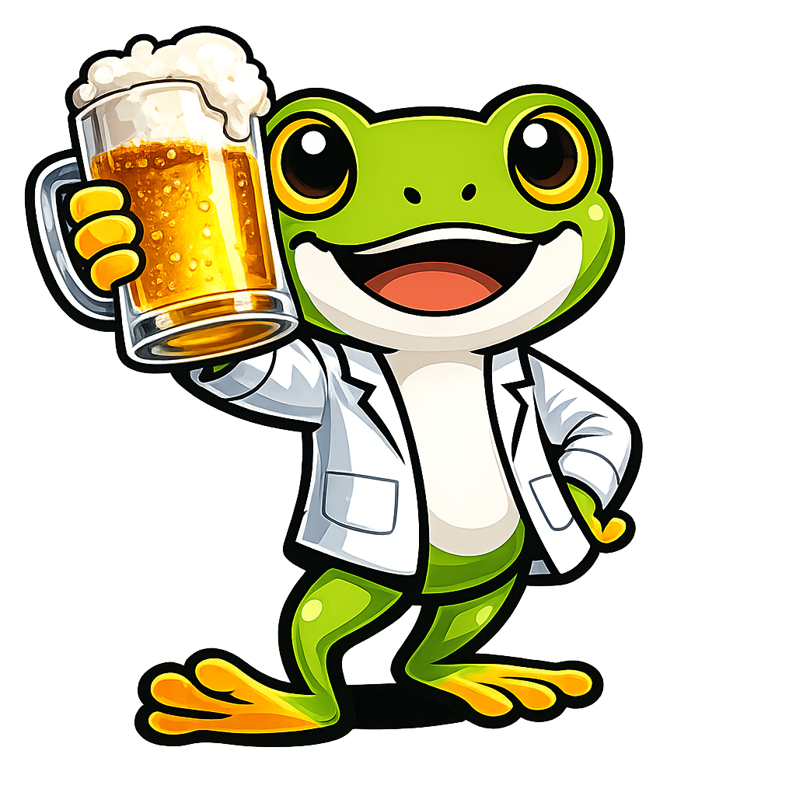

# Biology

**Gregor the Tree Frog** is the mascot for the [Biology](https://dmccreary.github.io/biology/) textbook. Tree frogs are quintessential biology subjects — their dramatic life cycle (egg → tadpole → adult) embodies metamorphosis, their permeable skin makes them sensitive bioindicators of ecosystem health, and they have anchored a century of laboratory teaching. The name *Gregor* nods to Gregor Mendel, the founder of modern genetics, while the bright green styling reads as friendly and curious to learners across age bands. Gregor is a strong choice because tree frogs touch nearly every major biology theme — cell biology, development, ecology, evolution, and physiology — making the mascot a flexible visual companion across the entire curriculum.

All poses for the **Biology** mascot.

-   { width=300 }

    **Neutral**

-   { width=300 }

    **Welcome**

-   { width=300 }

    **Tip**

-   { width=300 }

    **Thinking**

-   { width=300 }

    **Encouraging**

-   { width=300 }

    **Warning**

-   { width=300 }

    **Celebration**

-   { width=300 }

    **Beer**

[← Back to gallery](../../list-mascots.md)
