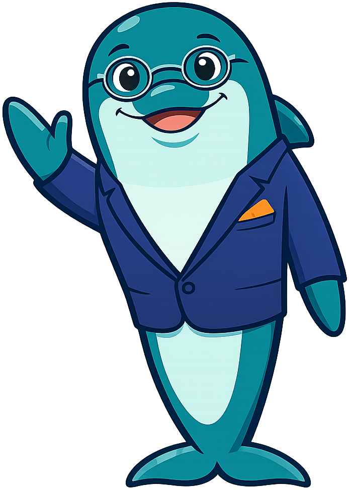
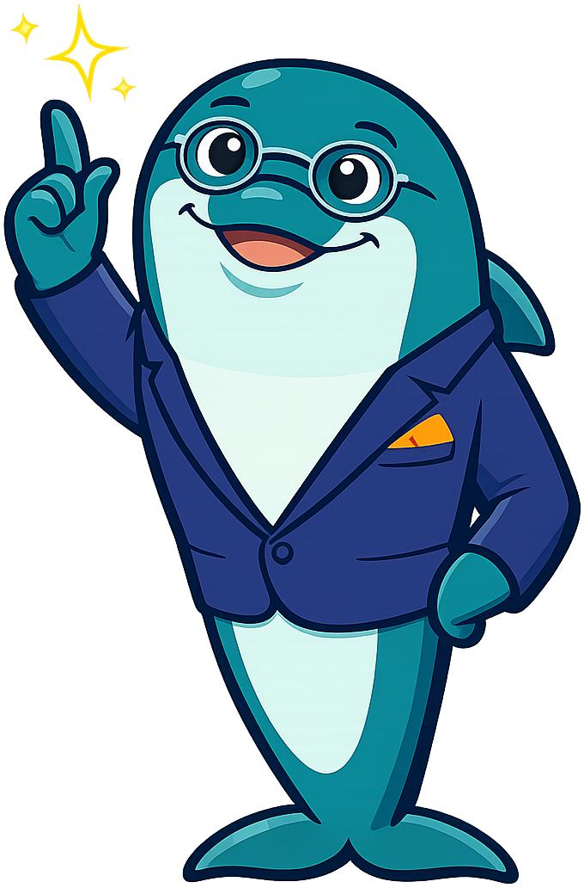
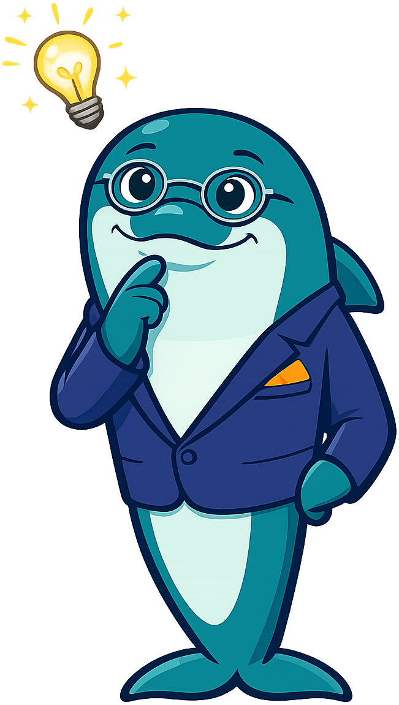
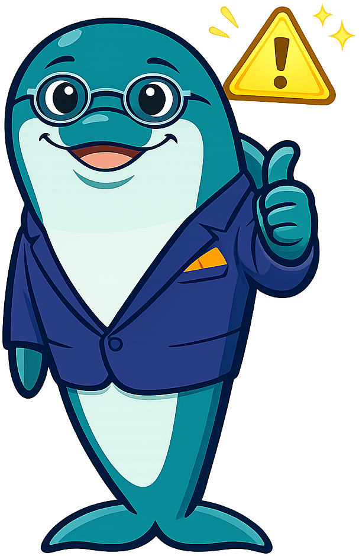
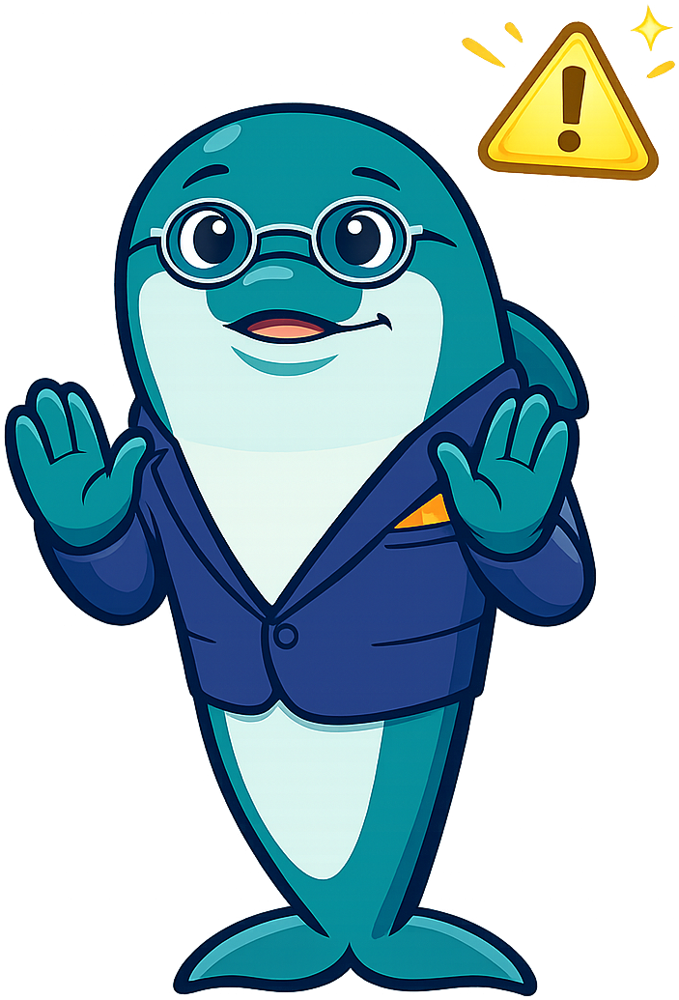
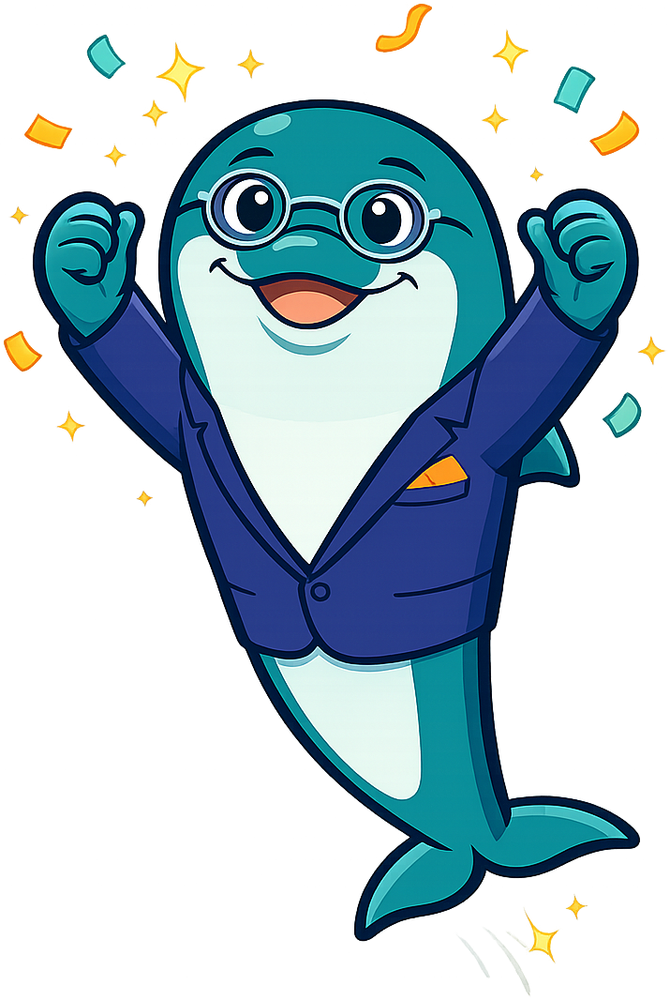

# Business

**Quinn the Dolphin** is the mascot for the [Business Fundamentals](https://dmccreary.github.io/business/) textbook. Dolphins are among the most cognitively sophisticated of the social predators — they coordinate in pods, share information through signature whistles, and run cooperative hunting strategies that adapt as the school of fish shifts — all of which map directly onto how firms operate inside markets. The name *Quinn* comes from the Irish *Cuinn*, meaning "wise" or "chief," which doubles the symbolism: a leader who works through the group rather than commanding from outside it. Quinn was chosen to model the disciplinary virtue that business is fundamentally a cooperative-strategic activity, not a solo optimization problem, and that good operators stay observant, collaborative, and willing to adjust their plan when conditions change. The choice is strong because both the species and the name encode load-bearing concepts in the curriculum — distributed intelligence and adaptive coordination — rather than offering only decorative charm.

All poses for the **Business** mascot.

-   { width=300 }

    **Neutral**

-   { width=300 }

    **Welcome**

-   { width=300 }

    **Tip**

-   { width=300 }

    **Thinking**

-   { width=300 }

    **Encouraging**

-   { width=300 }

    **Warning**

-   { width=300 }

    **Celebration**

[← Back to gallery](../../list-mascots.md)
