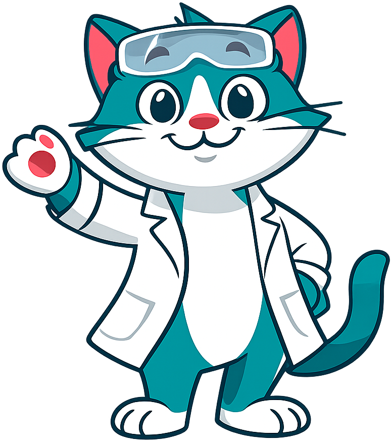
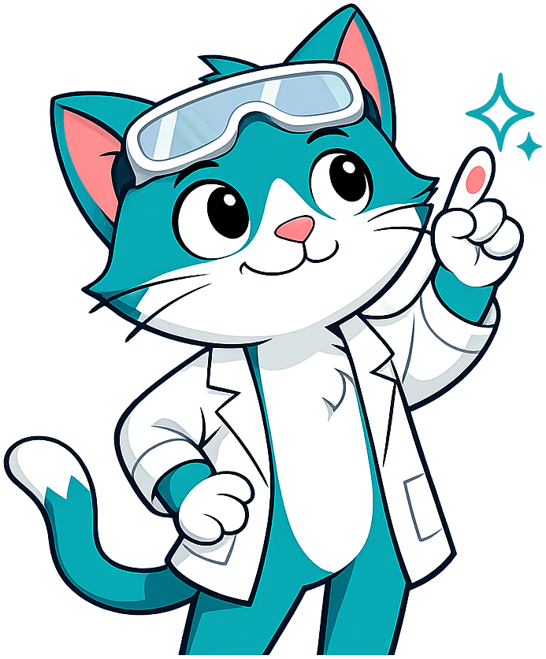
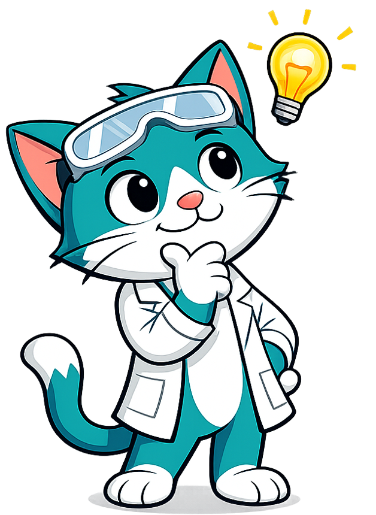
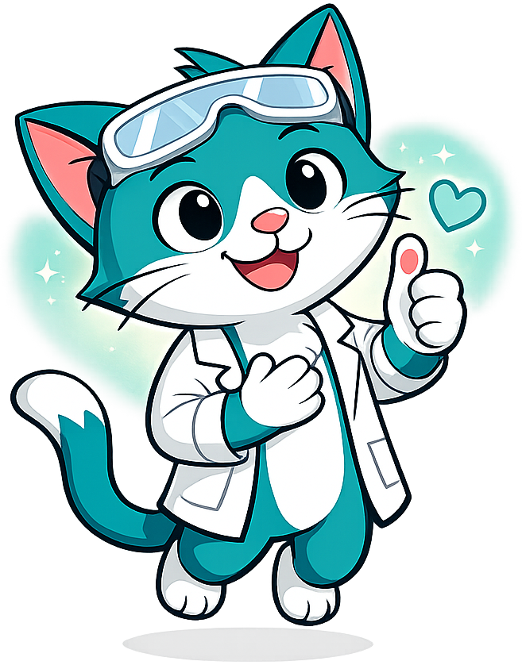
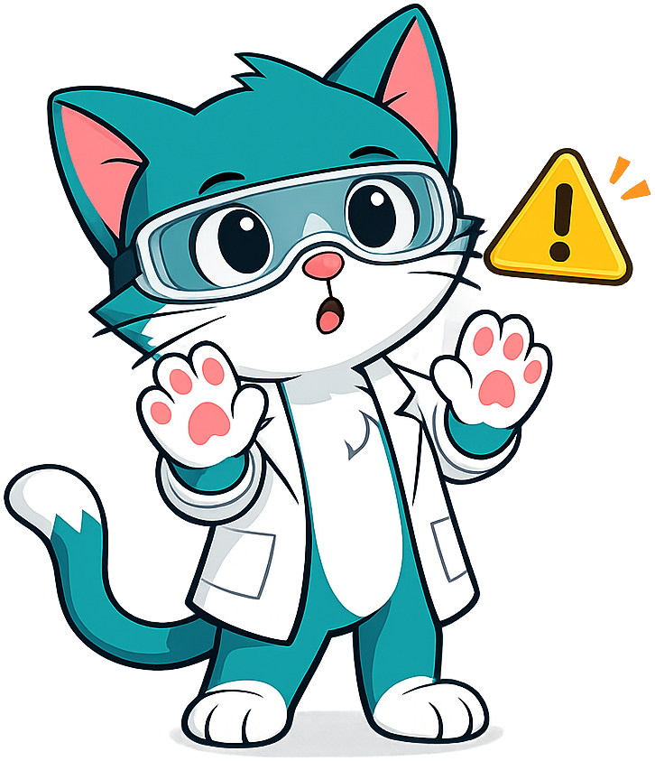
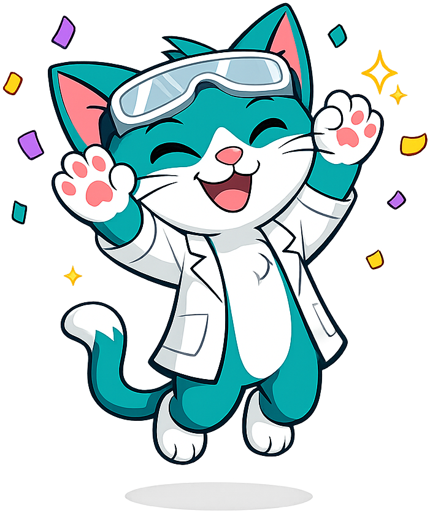

# Chemistry

**Catalyst the Cat** is the mascot for the [AP Chemistry](https://dmccreary.github.io/chemistry/) textbook, depicted as a teal lab cat in safety goggles and a white lab coat, holding a clipboard. The name is a working pun on the chemistry concept: a *catalyst* is a substance that accelerates a reaction without being consumed by it — exactly the role a well-designed mascot plays in a textbook, lowering the activation energy for the learner without itself being part of the content. Cats are also famously curious — they investigate any reaction, any spill, any unfamiliar smell — and curiosity is the trait that drives every breakthrough chemist from Lavoisier to Curie. The goggles and lab coat signal professional safety practice on first glance, while the clipboard implies systematic observation and record-keeping. The choice is exceptionally strong because the name itself is a chemistry lesson: students who internalize Catalyst learn the catalyst concept just by seeing the mascot.

All poses for the **Chemistry** mascot.

-   { width=300 }

    **Neutral**

-   { width=300 }

    **Welcome**

-   { width=300 }

    **Tip**

-   { width=300 }

    **Thinking**

-   { width=300 }

    **Encouraging**

-   { width=300 }

    **Warning**

-   { width=300 }

    **Celebration**

[← Back to gallery](../../list-mascots.md)
