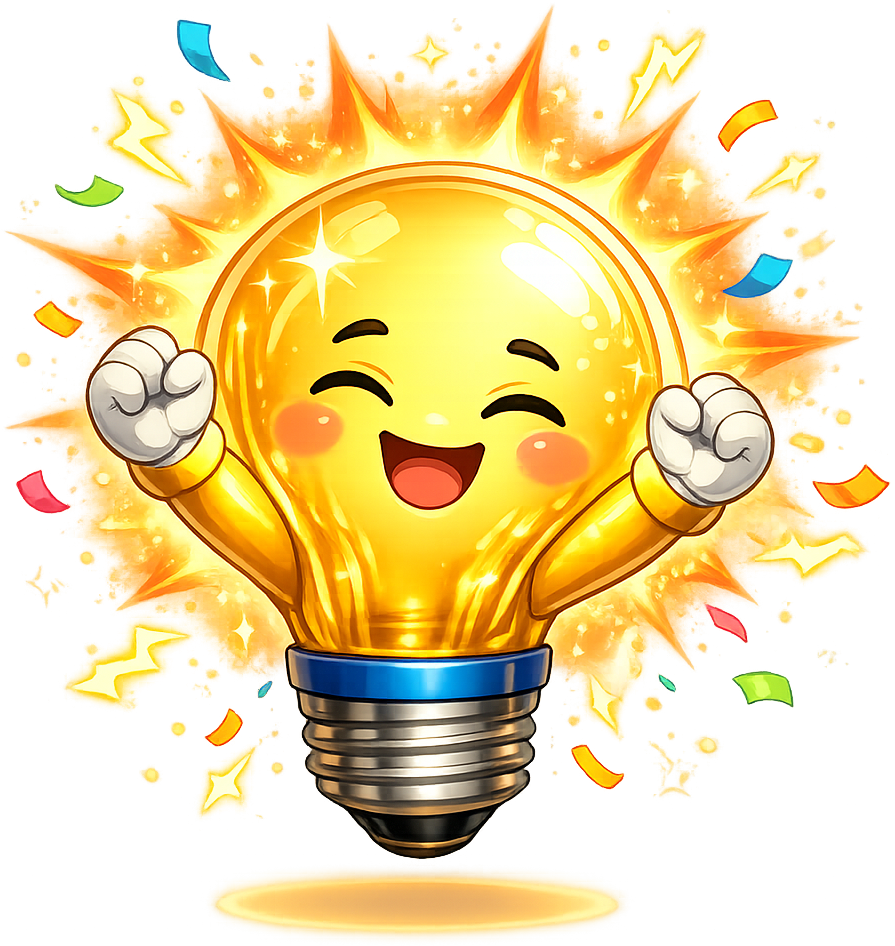
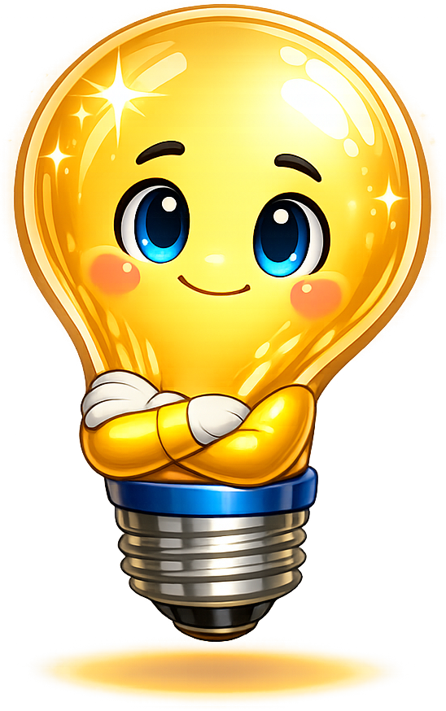
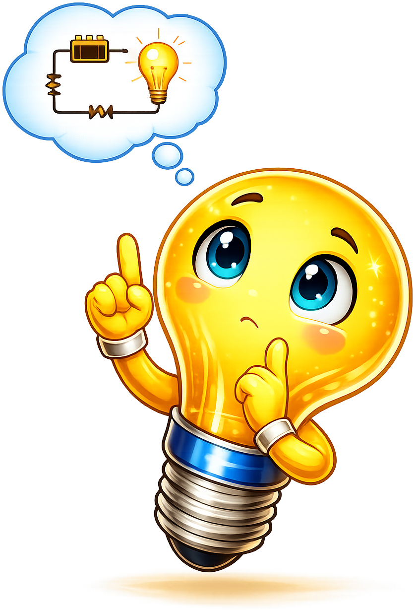
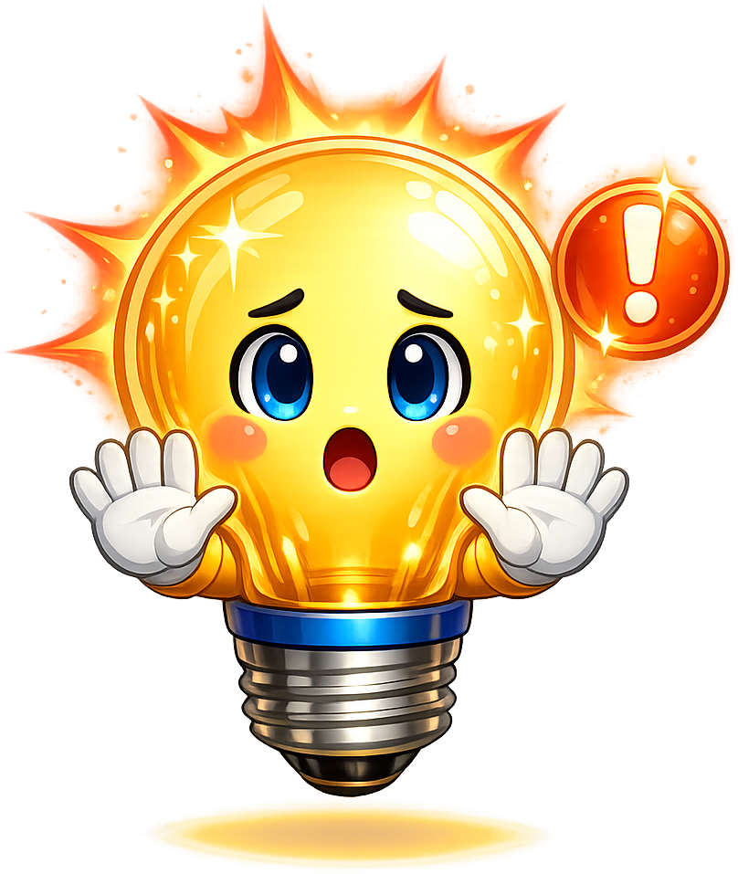

# Circuits

All poses for **Sparky** the mascot for the [Circuits](https://dmccreary.github.io/circuits/) textbook.

-   { width=300 }

    **Celebration**

-   { width=300 }

    **Encouraging**

-   { width=300 }

    **Neutral**

-   { width=300 }

    **Thinking**

-   { width=300 }

    **Tip**

-   { width=300 }

    **Welcome**

-   { width=300 }

    **V1**

-   { width=300 }

    **Thinking**

-   { width=300 }

    **Tip**

-   { width=300 }

    **Warning**

-   { width=300 }

    **Welcome**

[← Back to gallery](../../list-mascots.md)
