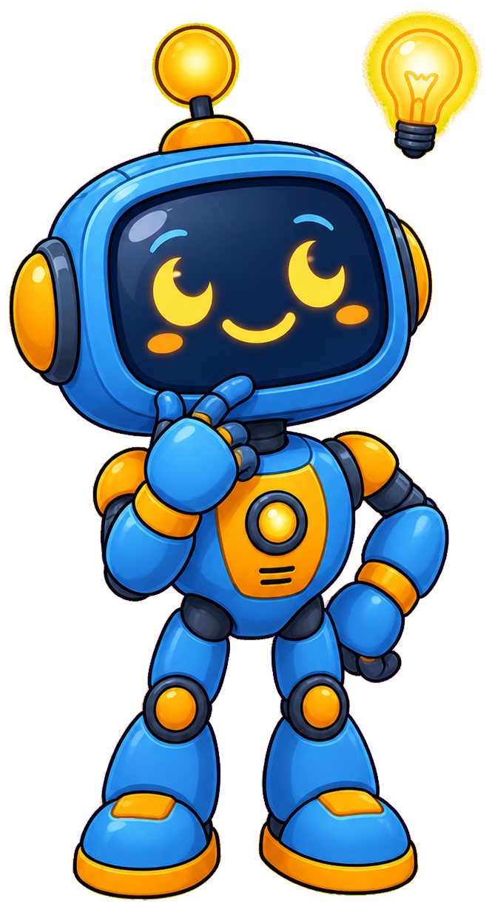

# Coding Club

**Circuit the Robot** is the mascot for [Coding Club](https://dmccreary.github.io/coding-club/), a guide to creating, organizing, promoting, and sustaining a school coding club. Circuit is a small desktop-helper robot, which nods to the physical-computing projects a coding club typically runs, and the name carries a second meaning beyond electronics — a circuit is also a closed loop of connected members, which is what a healthy club actually is. That dual reading, hardware term and community metaphor, is why Circuit was chosen over a purely decorative robot design: the book is as much about building a group of people as it is about building projects. The choice lands in the gallery's middle tier — the name is genuinely load-bearing for the club-as-network idea, but the connection is more associative than the tightest mascots in the collection, whose species is the literal mechanism being taught.

All poses for the **Coding Club** mascot.

-   { width=300 }

    **Neutral**

-   { width=300 }

    **Welcome**

-   { width=300 }

    **Tip**

-   { width=300 }

    **Thinking**

-   { width=300 }

    **Encouraging**

-   { width=300 }

    **Warning**

-   { width=300 }

    **Celebration**

[← Back to gallery](../../list-mascots.md)
