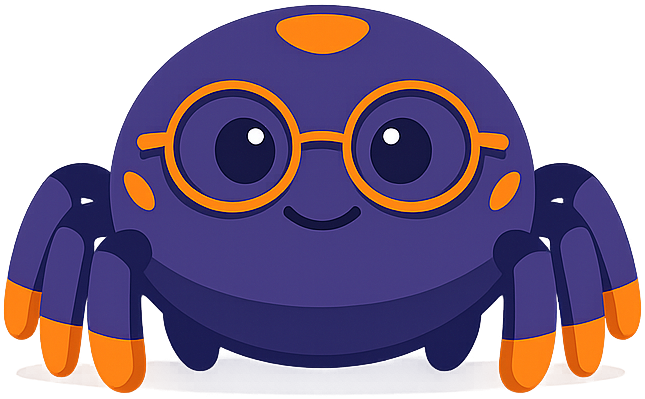
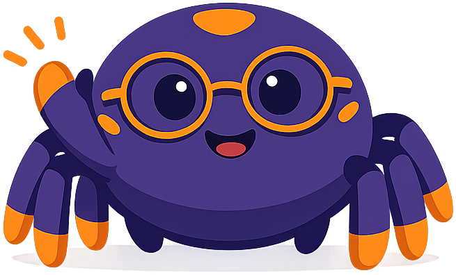

# Context Graph

**Nexus the Spider** is the mascot for the [Context Graph](https://dmccreary.github.io/context-graph/) textbook on enterprise AI and knowledge graphs. Spiders spend their lives building, maintaining, and traversing webs — networks of anchored nodes connected by load-bearing threads — which is precisely the structure a context graph imposes on an organization's data. The name *Nexus* comes from the Latin *nectere*, "to bind," and names a central connection point where many strands meet, doubling the spider's symbolism with a vocabulary word that already labels the concept. Nexus was chosen to install the intuition that meaning emerges from relationships rather than from isolated facts: a fly only becomes a meal when it is caught in the right part of the web. The choice is strong because both the creature and the name encode the same load-bearing idea — that knowledge is structure — rather than relying on cosmetic association.

All poses for the **Context Graph** mascot.

-   { width=300 }

    **Neutral**

-   { width=300 }

    **Welcome**

-   { width=300 }

    **Tip**

-   { width=300 }

    **Thinking**

-   { width=300 }

    **Encouraging**

-   { width=300 }

    **Warning**

-   { width=300 }

    **Celebration**

[← Back to gallery](../../list-mascots.md)
