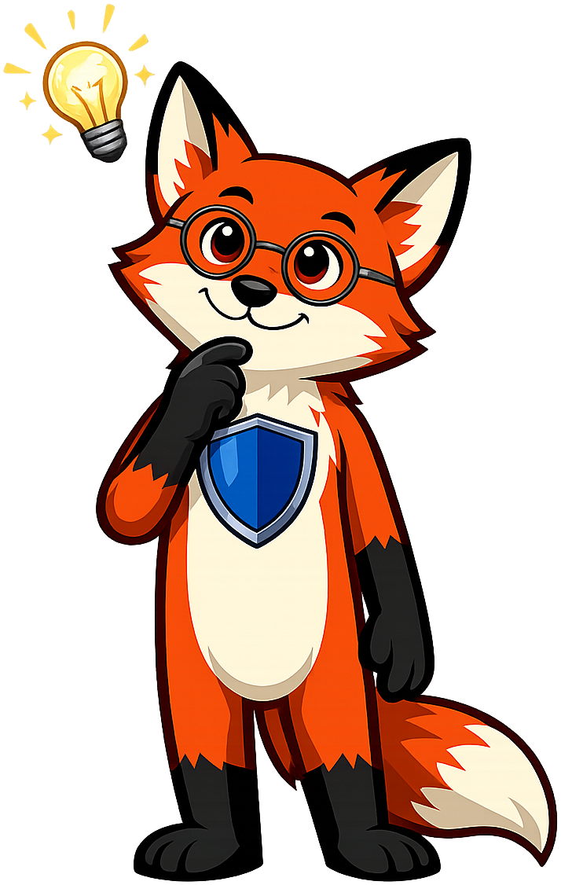
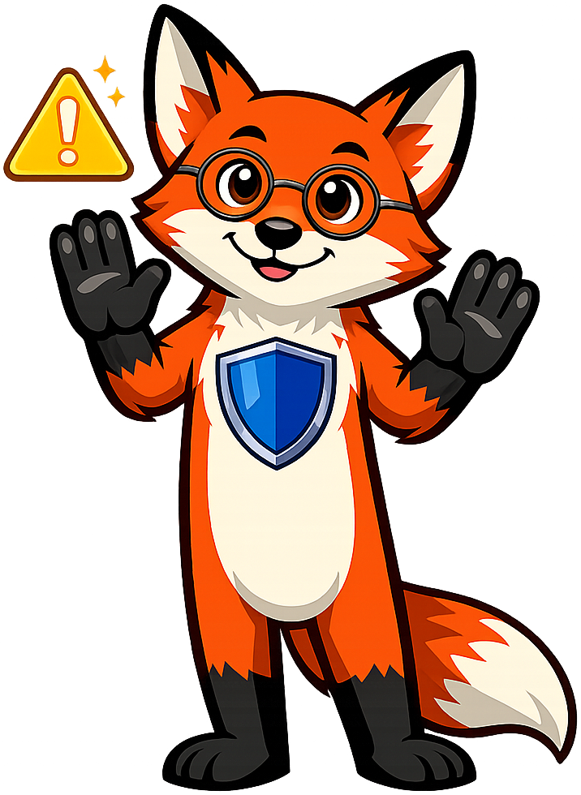

# Cybersecurity

**Sentinel the Fox** is the mascot for the [Cybersecurity](https://dmccreary.github.io/cybersecurity/) textbook. Foxes are the canonical symbol of cunning, vigilance, and pattern recognition across world cultures — traits that map exactly to the daily practice of a security professional. The name *Sentinel* makes the role explicit: a guard who watches the perimeter, recognizes anomalies, and knows that the most dangerous threats are the ones that try not to be seen. Sentinel was chosen because cybersecurity learners must adopt an adversarial mindset — thinking like both defender and attacker — and the fox is the rare animal symbol that represents both cleverness *and* protective instinct. The choice is strong because the mascot models the watchful, slightly skeptical posture the curriculum is trying to instill.

All poses for the **Cybersecurity** mascot.

-   { width=300 }

    **Neutral**

-   { width=300 }

    **Welcome**

-   { width=300 }

    **Tip**

-   { width=300 }

    **Thinking**

-   { width=300 }

    **Encouraging**

-   { width=300 }

    **Warning**

-   { width=300 }

    **Celebration**

[← Back to gallery](../../list-mascots.md)
