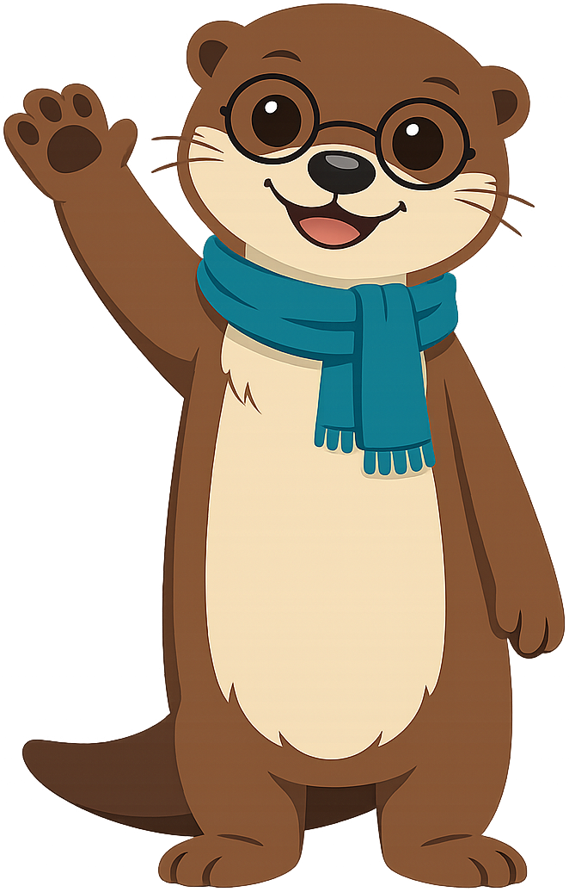
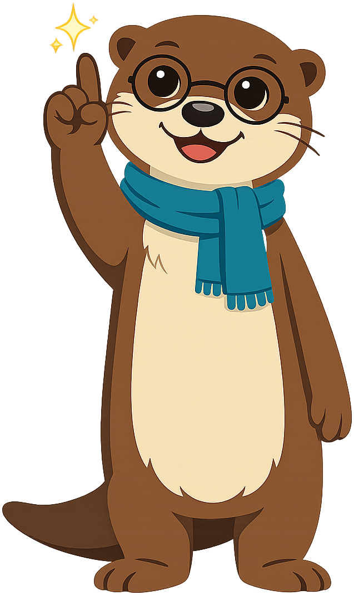
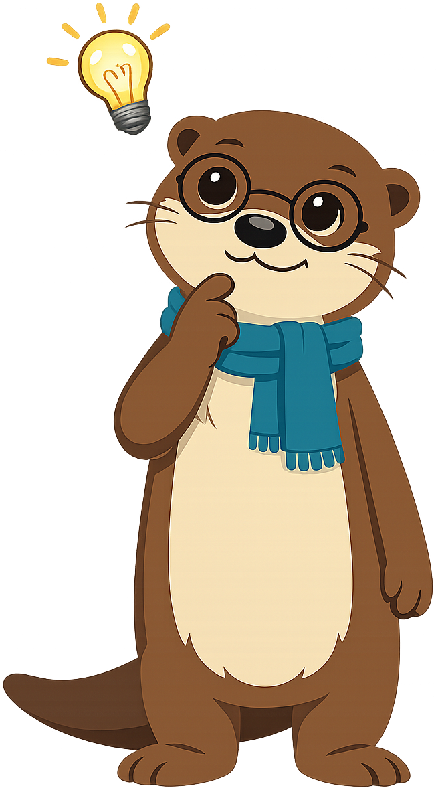
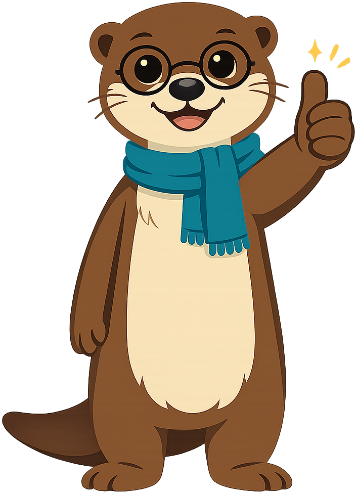
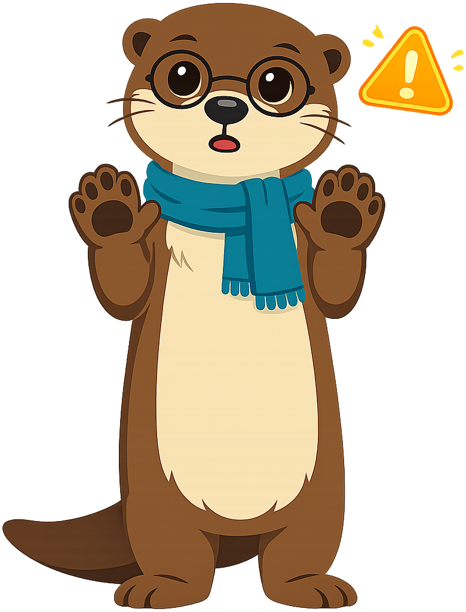
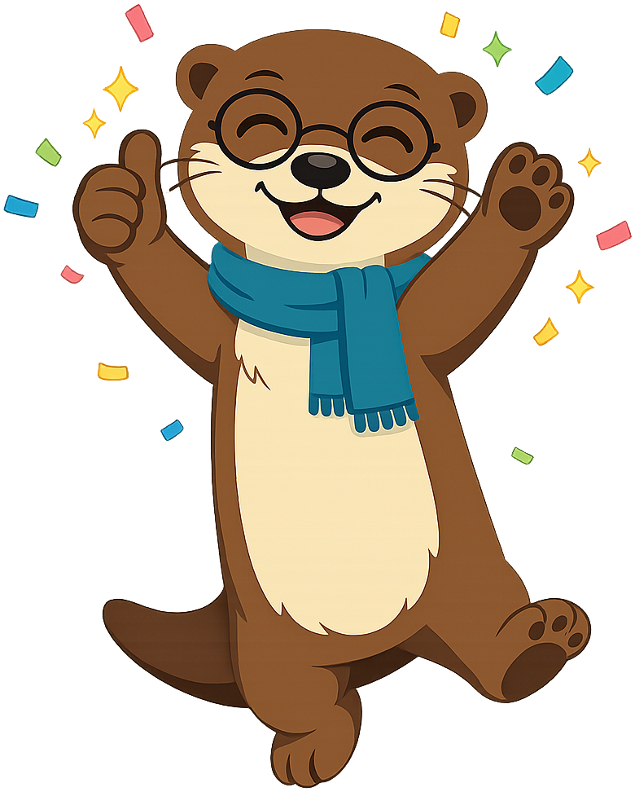

# Digital Citizenship

**Maka the River Otter** is the mascot for the [Digital Citizenship](https://dmccreary.github.io/digital-citizenship/) textbook. River otters are social, communicative animals who travel in groups, share food, and famously hold hands while sleeping so they don't drift apart — a charming visual metaphor for the connectedness and mutual care that digital citizenship asks of online communities. Maka was chosen because otters embody the "play hard, stay together, look out for each other" ethic that responsible online behavior requires. The choice is strong for adolescent learners specifically: otters read as sophisticated rather than babyish, but warm enough to model genuine friendship behaviors — exactly the audience digital-citizenship curricula most need to reach.

All poses for the **Digital Citizenship** mascot.

-   { width=300 }

    **Neutral**

-   { width=300 }

    **Welcome**

-   { width=300 }

    **Tip**

-   { width=300 }

    **Thinking**

-   { width=300 }

    **Encouraging**

-   { width=300 }

    **Warning**

-   { width=300 }

    **Celebration**

[← Back to gallery](../../list-mascots.md)
