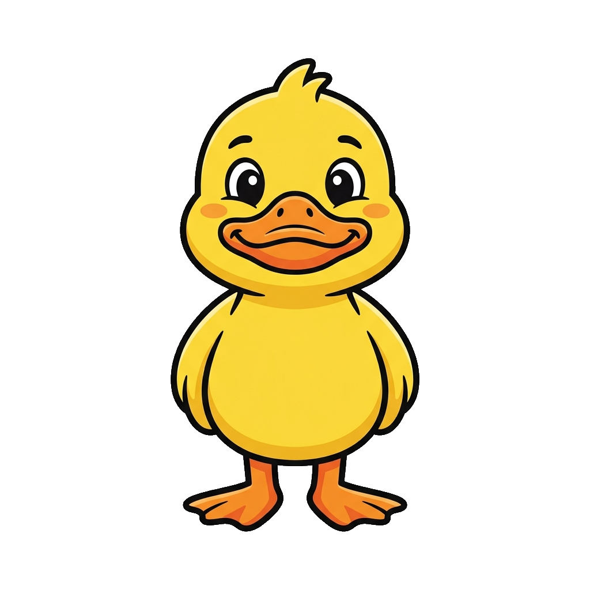
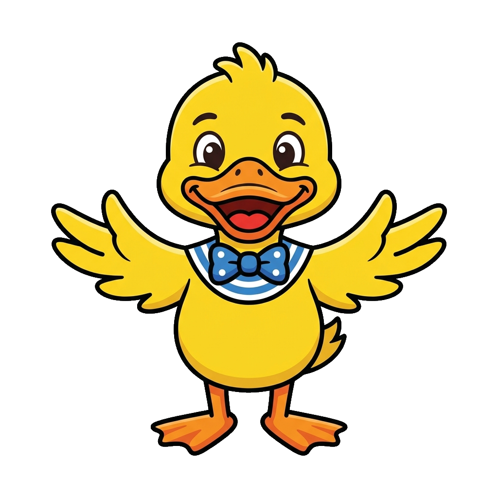
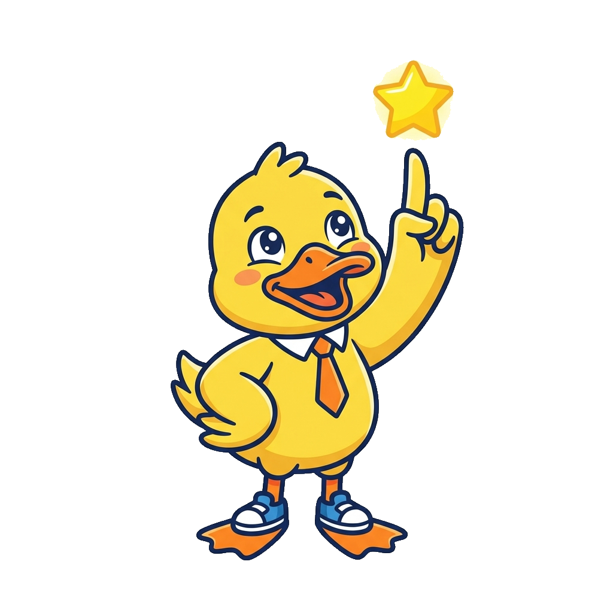
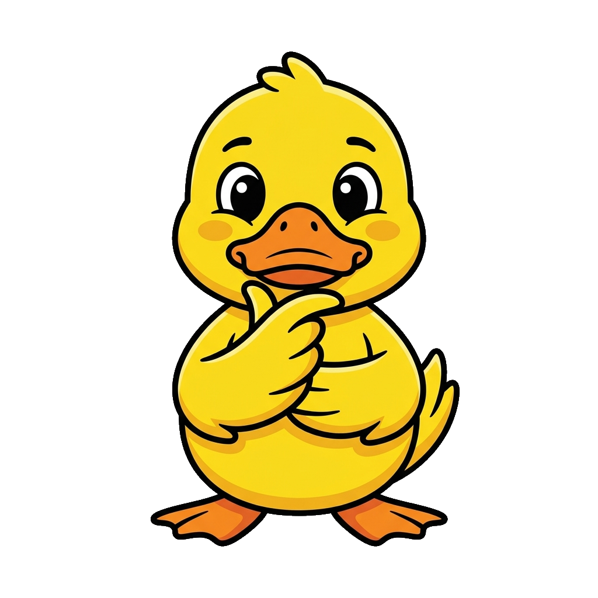
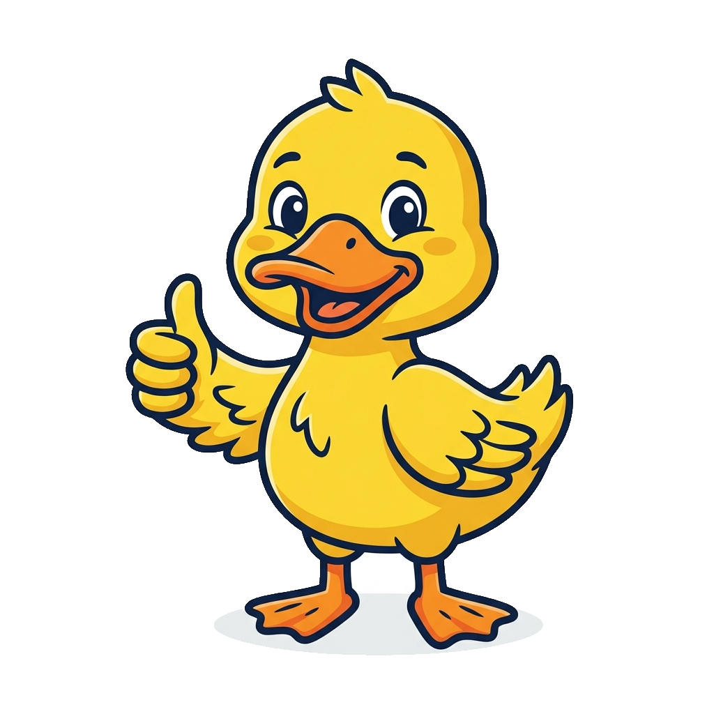
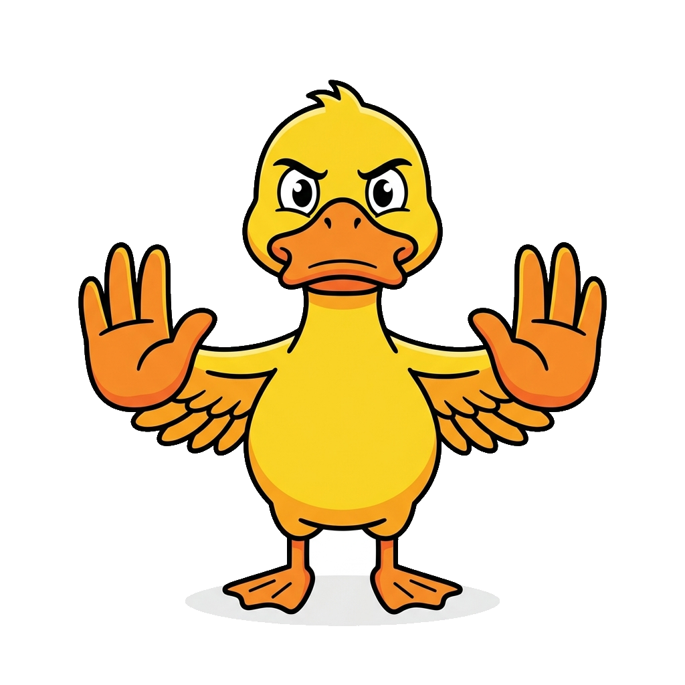
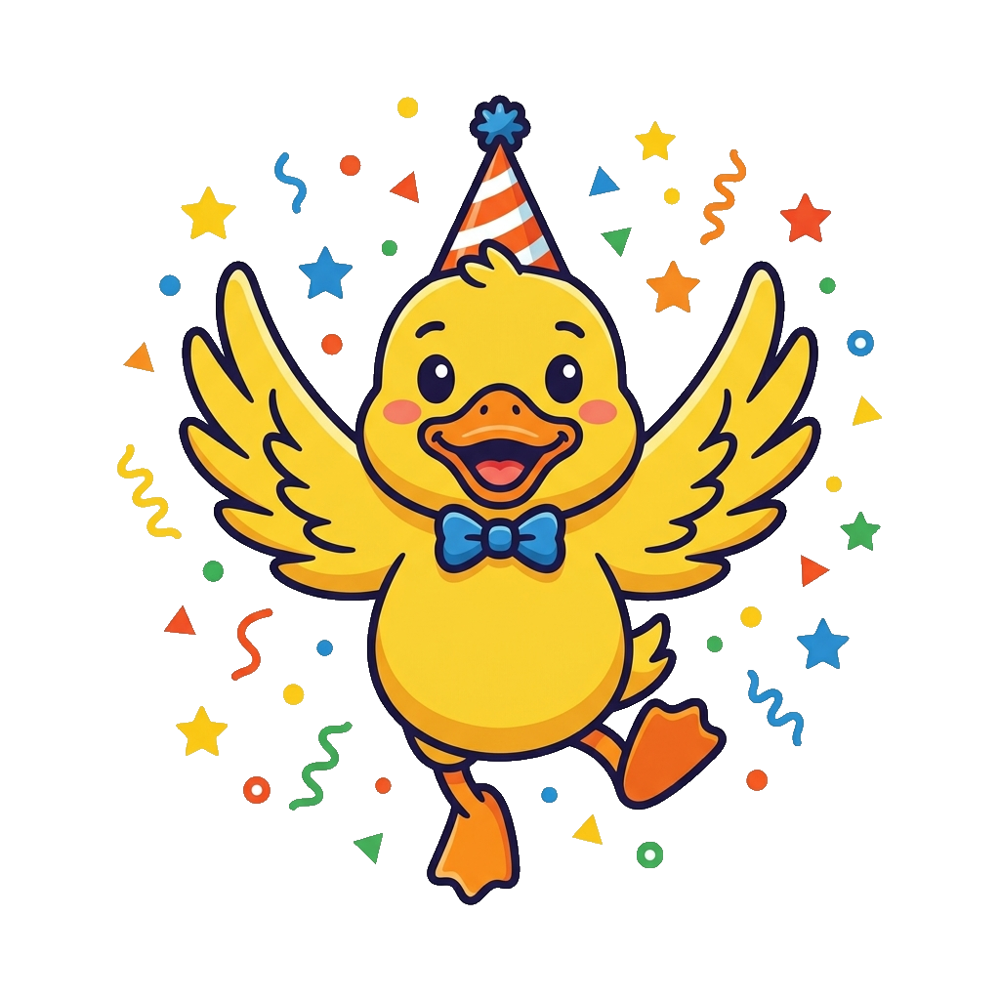

# Duck Mascot

**Duck** is a standalone mascot character not yet assigned to a specific textbook. Ducks are calm on the surface while paddling steadily underneath, a common shorthand for composure under effort, and their imprinting behavior — following the first steady guide they see — is a durable metaphor for onboarding and early learning. No course pairing has been decided yet, so this page exists to hold the pose set until a textbook claims the character.

All poses for the **Duck** mascot.

-   { width=300 }

    **Neutral**

-   { width=300 }

    **Welcome**

-   { width=300 }

    **Tip**

-   { width=300 }

    **Thinking**

-   { width=300 }

    **Encouraging**

-   { width=300 }

    **Warning**

-   { width=300 }

    **Celebration**

[← Back to gallery](../../list-mascots.md)
