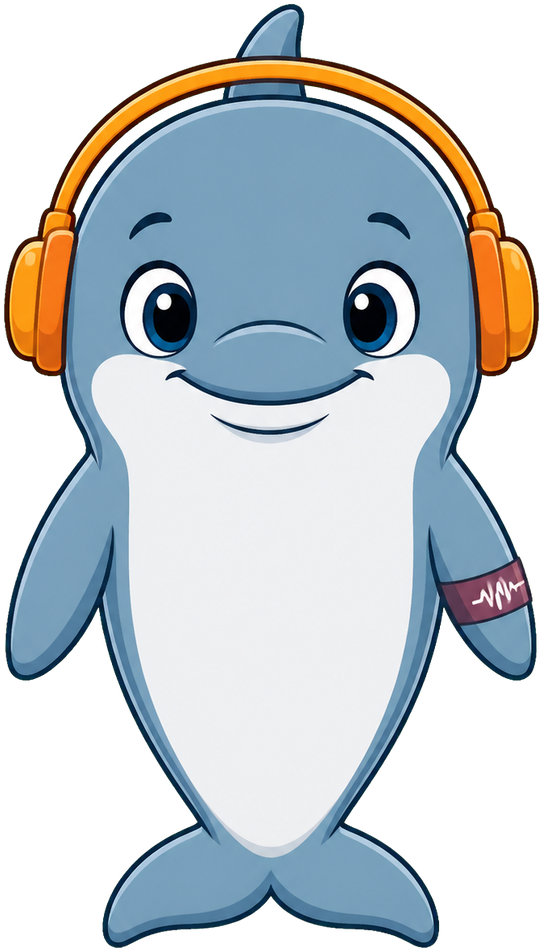
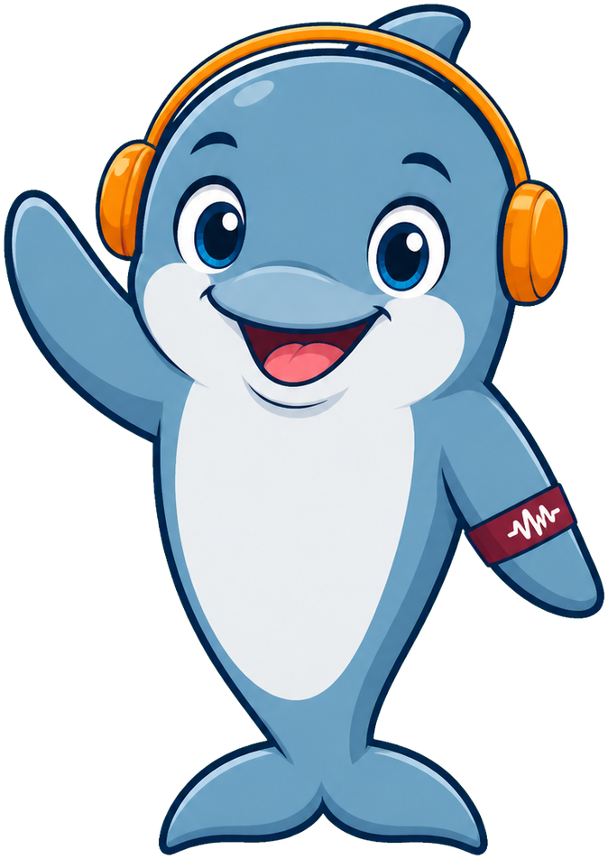
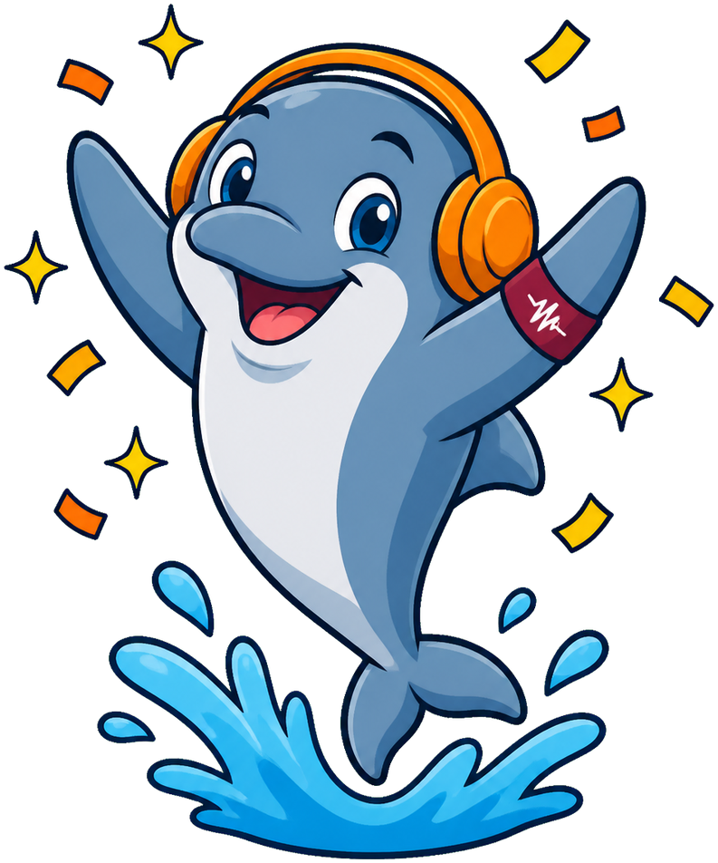

# Fft Benchmarking

**Echo the Dolphin** is the mascot for [Real-Time DSP on a $5 Microcontroller](https://dmccreary.github.io/fft-benchmarking/), a course on running Fast Fourier Transform-based signal processing on cheap embedded hardware. Dolphins navigate and hunt by echolocation — emitting a sound pulse and analyzing the returning frequencies to build a picture of their surroundings — which is a biological instance of the same frequency-domain analysis the FFT performs on a microcontroller. The name Echo names that mechanism directly: an echo is a reflected signal, and reading the reflected signal for information is the entire premise of digital signal processing. Echo was chosen so the mascot models the course's central idea for free — a student who understands why a dolphin uses echolocation already has an intuition for why an algorithm would decompose a sound wave into frequencies. That makes Echo one of the strongest mascots in the collection: species and name both encode the same load-bearing concept, the way Olli the Octopus does for parallel pipelines.

All poses for the **Fft Benchmarking** mascot.

-   { width=300 }

    **Neutral**

-   { width=300 }

    **Welcome**

-   { width=300 }

    **Tip**

-   { width=300 }

    **Thinking**

-   { width=300 }

    **Encouraging**

-   { width=300 }

    **Warning**

-   { width=300 }

    **Celebration**

[← Back to gallery](../../list-mascots.md)
