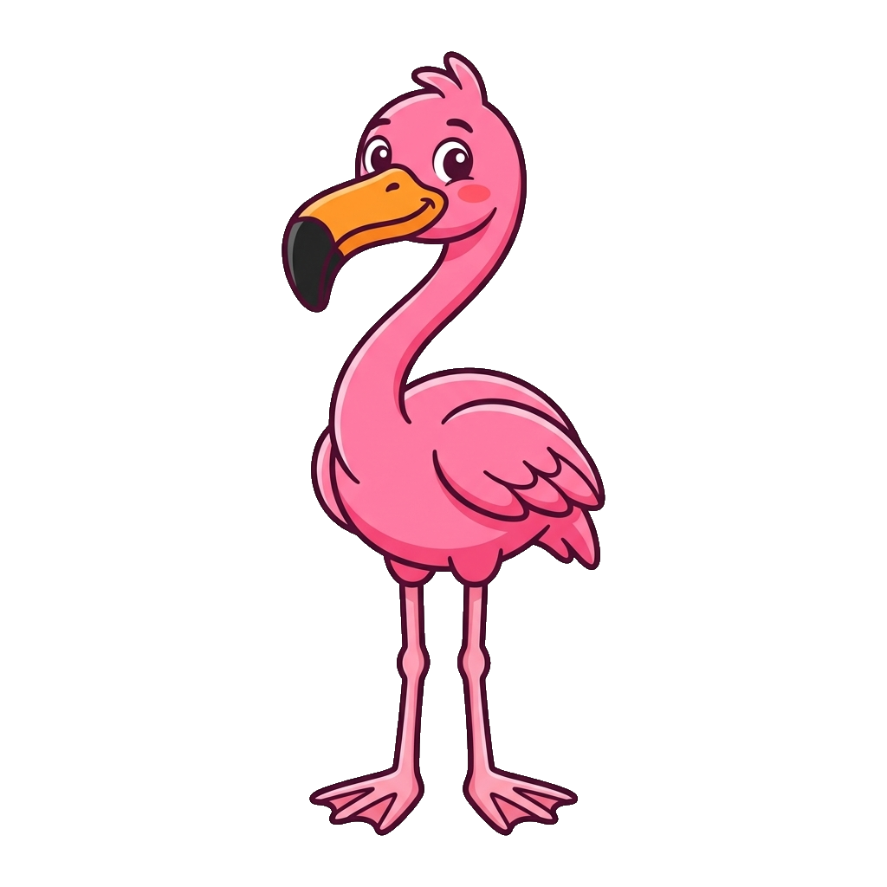
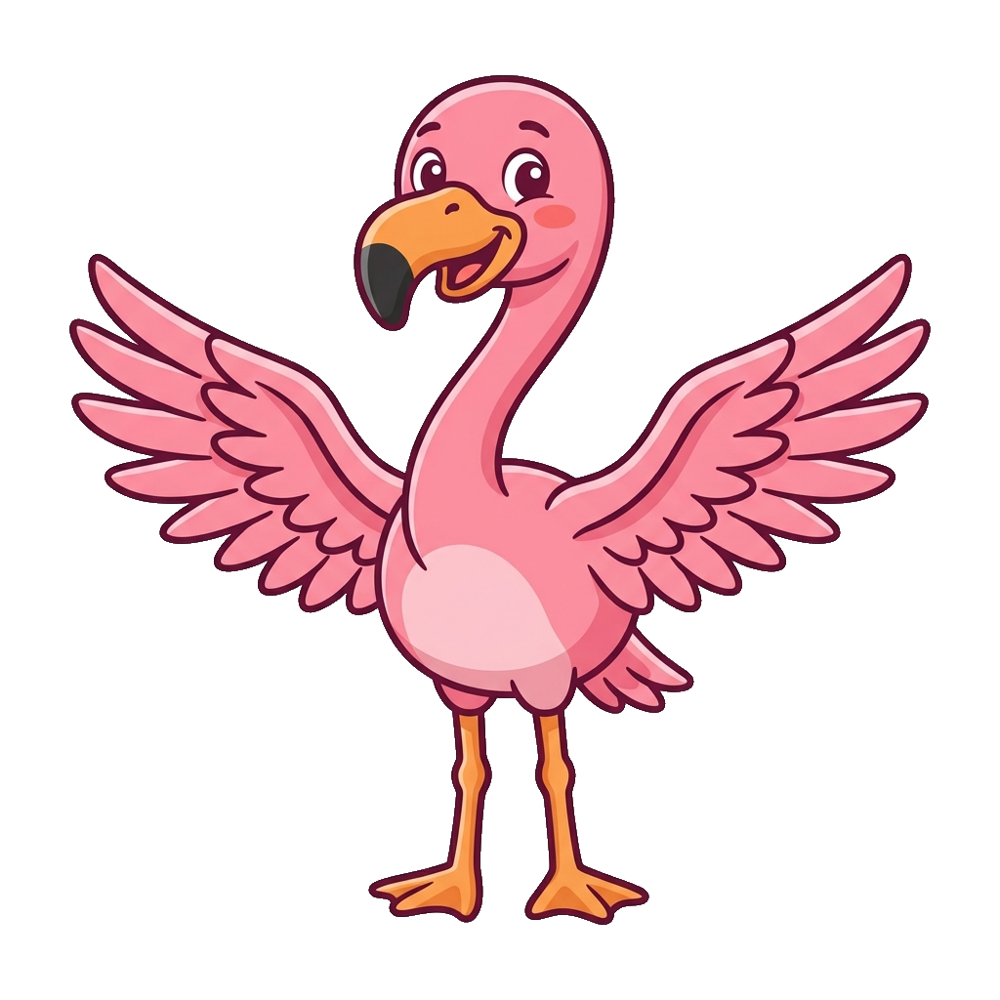
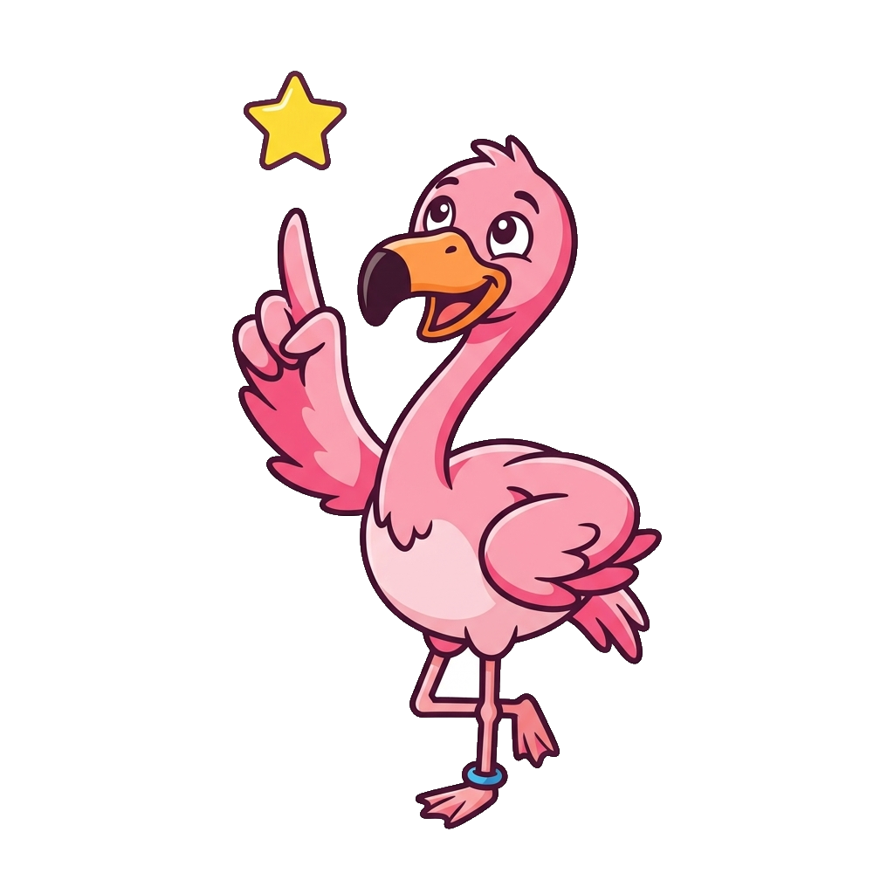
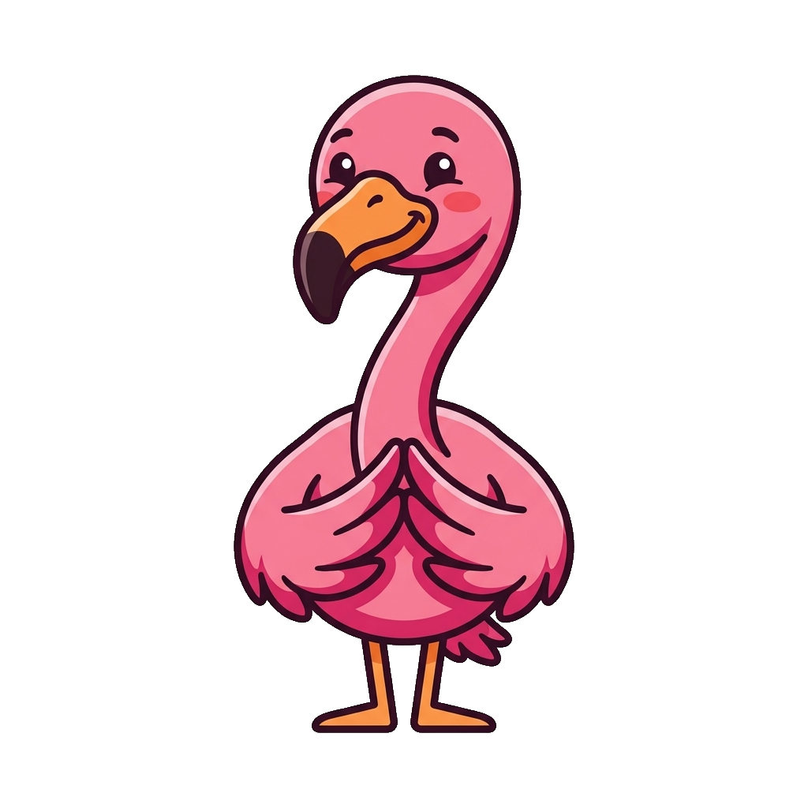
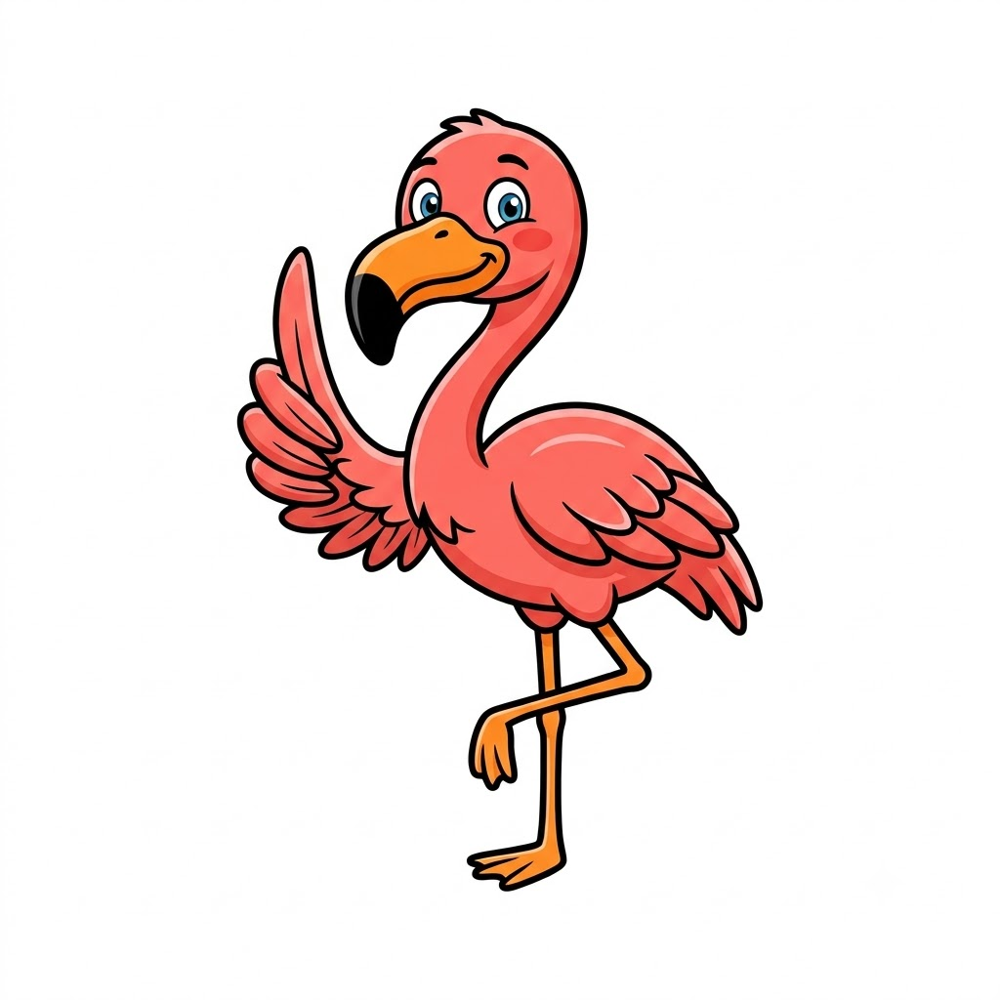
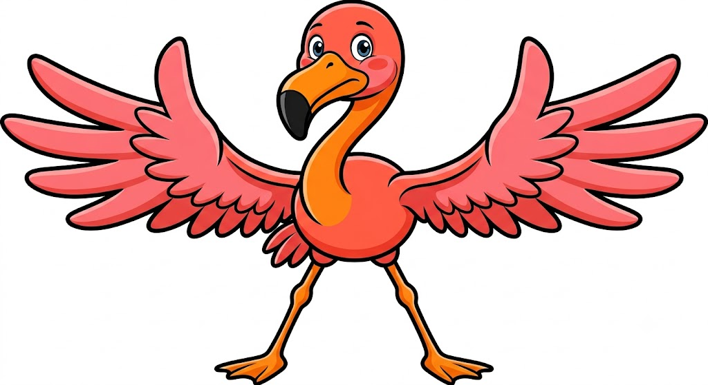

# Flamingo Mascot

**Flamingo** is a standalone mascot character not yet assigned to a specific textbook. Flamingos filter-feed by pumping water through comb-like structures in their bills to sort food from mud, and they stand balanced on one leg for hours at a time — traits that suggest metaphors for filtering signal from noise or maintaining stability under an unusual constraint. No course pairing has been decided yet, so this page exists to hold the pose set until a textbook claims the character.

All poses for the **Flamingo** mascot.

-   { width=300 }

    **Neutral**

-   { width=300 }

    **Welcome**

-   { width=300 }

    **Tip**

-   { width=300 }

    **Thinking**

-   { width=300 }

    **Encouraging**

-   { width=300 }

    **Warning**

-   { width=300 }

    **Celebration**

[← Back to gallery](../../list-mascots.md)
