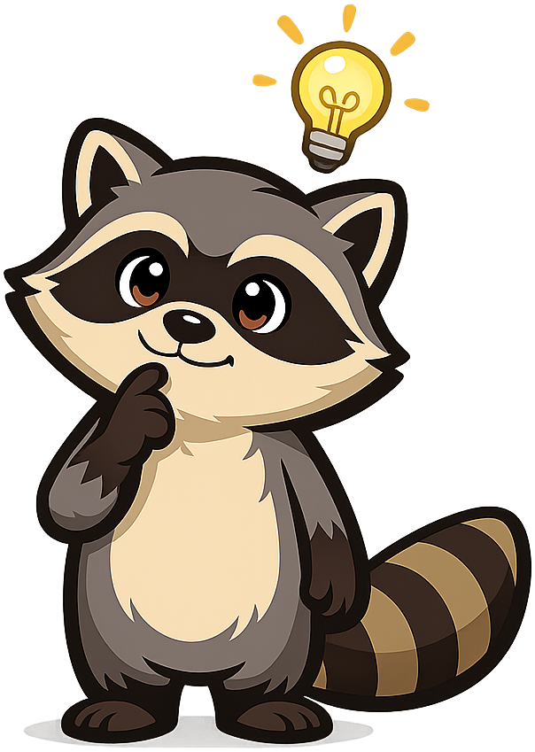

# Functions

**Rick the Raccoon** is the mascot for the [IB Mathematics Functions](https://dmccreary.github.io/functions/) textbook. Raccoons are tactile, hands-on problem solvers — their nimble paws and notorious puzzle-cracking abilities make them a fitting symbol for a course where students must repeatedly take an unfamiliar function apart, examine its pieces (domain, range, asymptotes, transformations), and reassemble them into understanding. Rick was chosen because the IB Mathematics curriculum demands a *manipulative* relationship with functions, not a passive one: students plot, transform, compose, and invert functions hundreds of times. The choice is good because the mascot models the right learning posture — patient, dexterous, willing to fiddle with a problem until it yields.

All poses for the **Functions** mascot.

-   { width=300 }

    **Neutral**

-   { width=300 }

    **Welcome**

-   { width=300 }

    **Tip**

-   { width=300 }

    **Thinking**

-   { width=300 }

    **Encouraging**

-   { width=300 }

    **Warning**

-   { width=300 }

    **Celebration**

[← Back to gallery](../../list-mascots.md)
