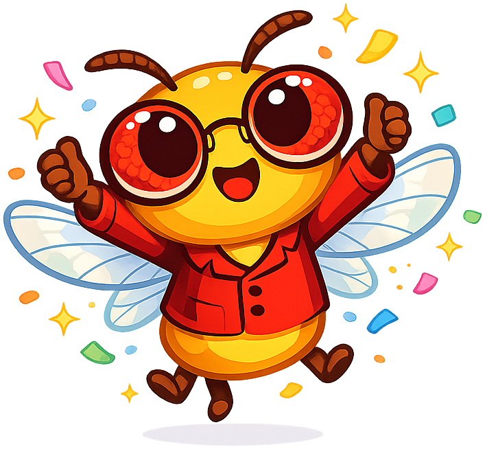
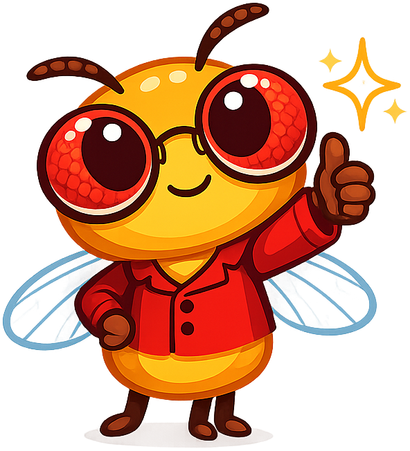
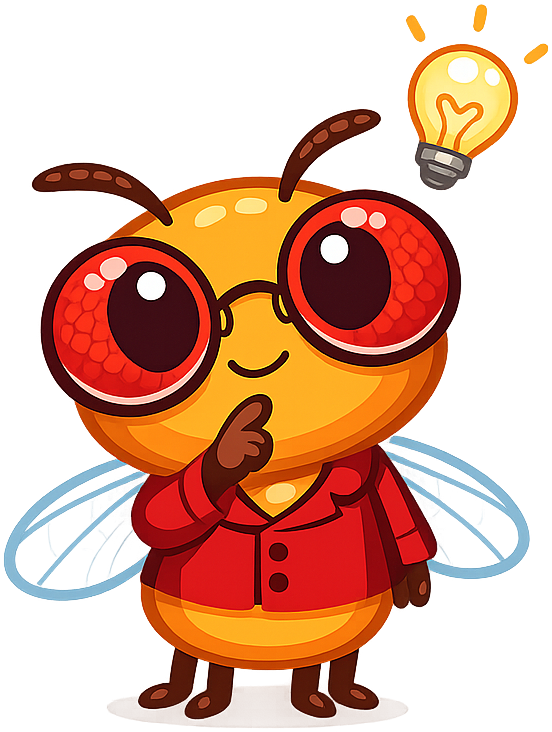
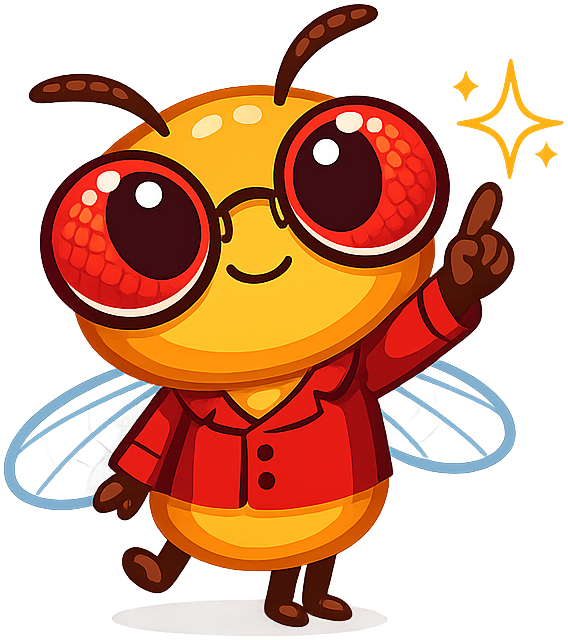
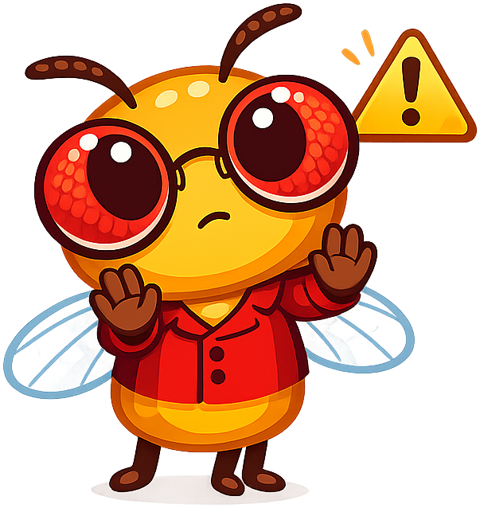
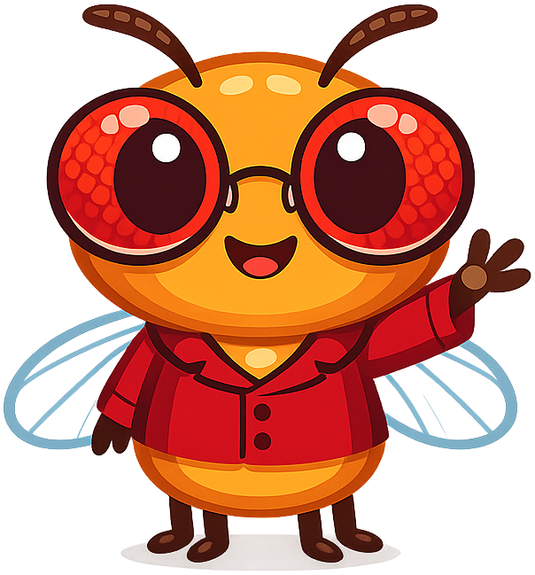

# Genetics

**Dottie the Drosophila** is the mascot for the [Genetics](https://dmccreary.github.io/genetics/) textbook. *Drosophila melanogaster*, the common fruit fly, is genetics' canonical model organism — Thomas Hunt Morgan's "Fly Room" at Columbia produced the first chromosome maps in the 1910s, and a century of genetic discovery (linkage, recombination, sex-linked inheritance, developmental genetics) has ridden on these tiny insects. Dottie was chosen because the species is a one-image history of the discipline; a learner who recognizes Dottie has already absorbed the central role of model organisms in genetics. The choice is exceptionally strong because the mascot is itself a piece of foundational curriculum — every textbook chapter on inheritance has a natural fruit-fly example waiting to be invoked.

All poses for the **Genetics** mascot.

-   { width=300 }

    **Celebration**

-   { width=300 }

    **Encouraging**

-   { width=300 }

    **Neutral**

-   { width=300 }

    **Thinking**

-   { width=300 }

    **Tip**

-   { width=300 }

    **Warning**

-   { width=300 }

    **Welcome**

[← Back to gallery](../../list-mascots.md)
