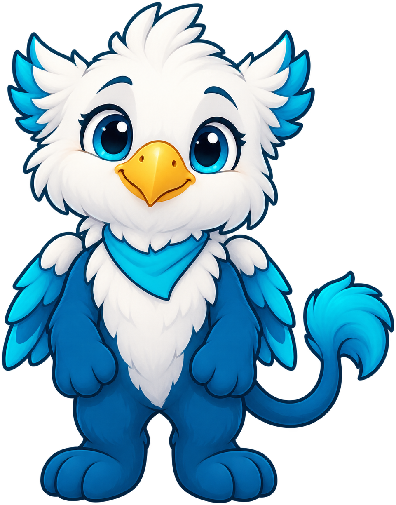
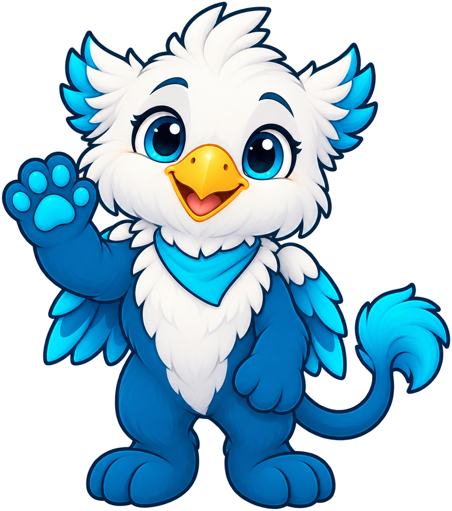
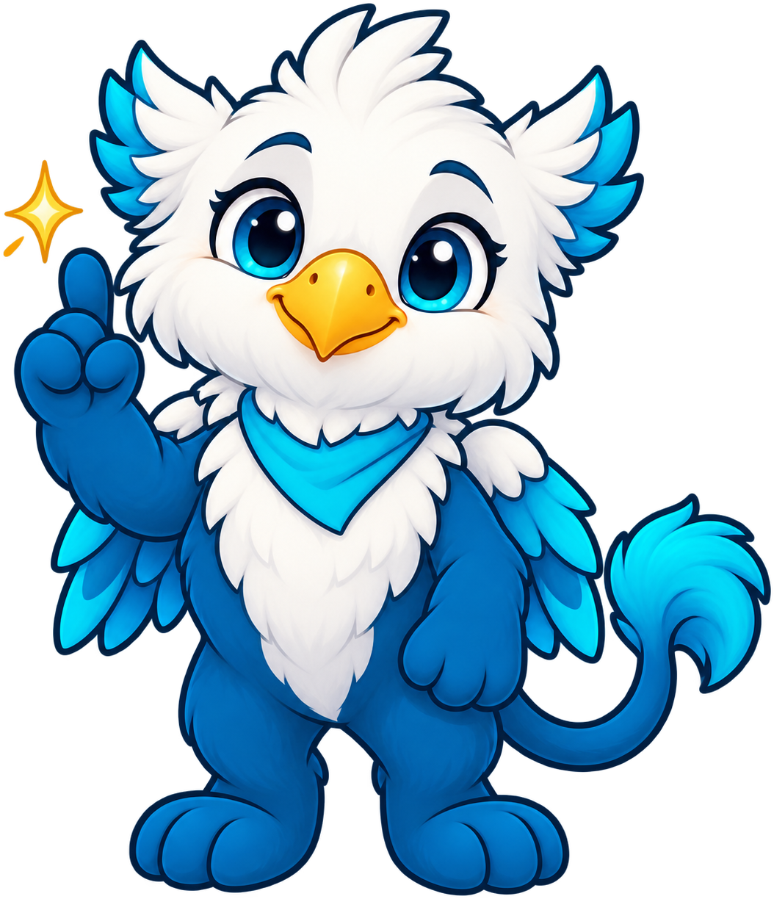
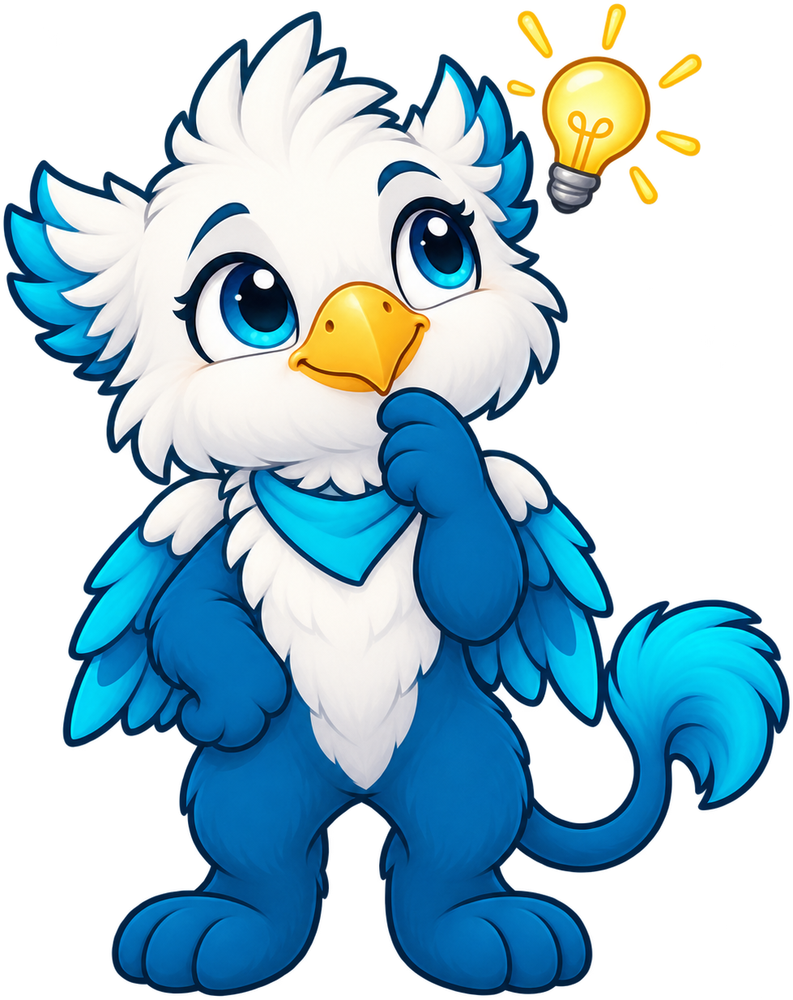
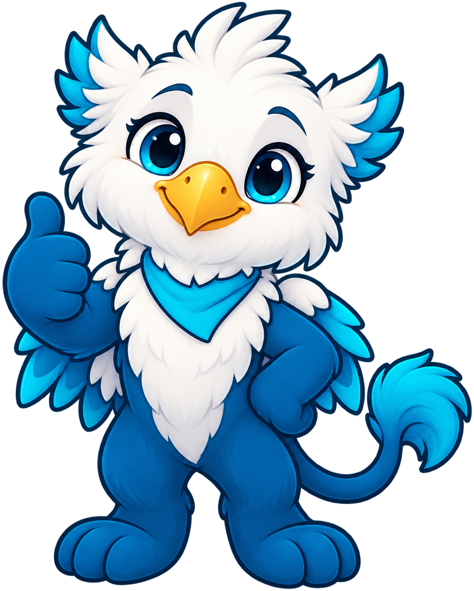
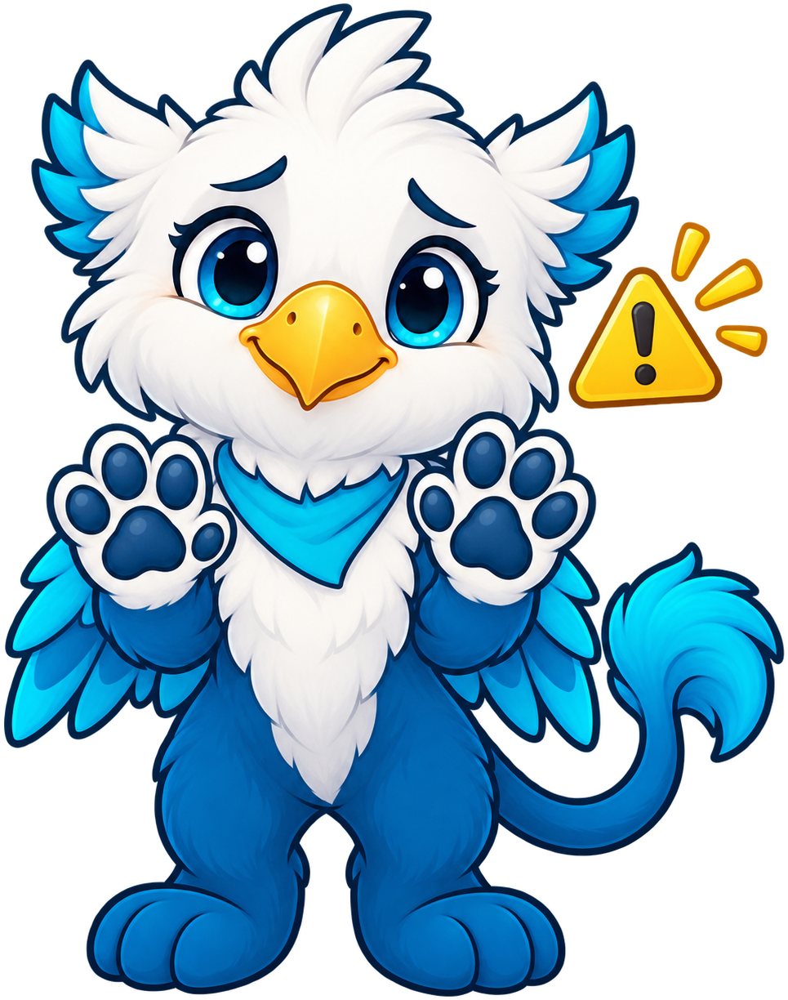
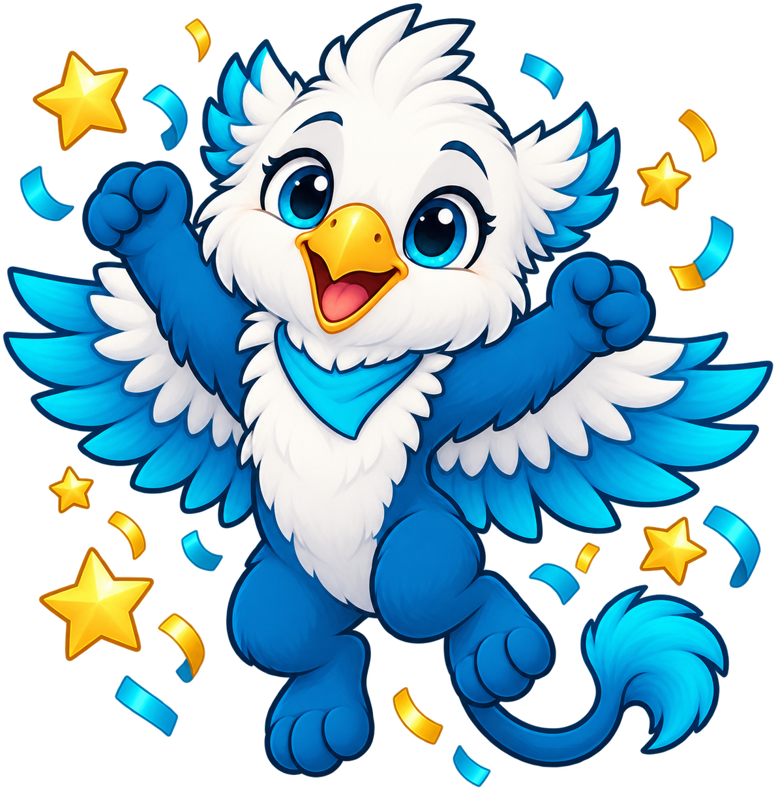

# Glo Coding Club

**Griffin** is the mascot for the [Groves Learning Organization Coding Club](https://dmccreary.github.io/glo-coding-club/), a school coding club program. A griffin — the mythical fusion of an eagle and a lion — was chosen mainly for its visual appeal and its fit with the Groves Learning Organization's blue-and-cyan color theme, rather than for a specific connection to programming or computational thinking. The character has no name beyond its species and carries no wordplay tied to coding concepts. Griffin was chosen to give the club a warm, approachable face for young students rather than to encode a particular disciplinary idea, which is a reasonable choice for a K-12 club-branding mascot with no single curriculum to anchor to. That puts Griffin toward the gallery's "good" tier — anthropomorphic and consistent, but decorative rather than subject-coupled — and worth revisiting if the club ever wants the mascot to teach something by existing, the way the strongest mascots in this collection do.

All poses for the **Glo Coding Club** mascot.

-   { width=300 }

    **Neutral**

-   { width=300 }

    **Welcome**

-   { width=300 }

    **Tip**

-   { width=300 }

    **Thinking**

-   { width=300 }

    **Encouraging**

-   { width=300 }

    **Warning**

-   { width=300 }

    **Celebration**

[← Back to gallery](../../list-mascots.md)
