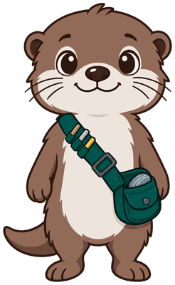
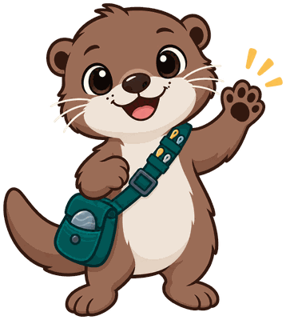
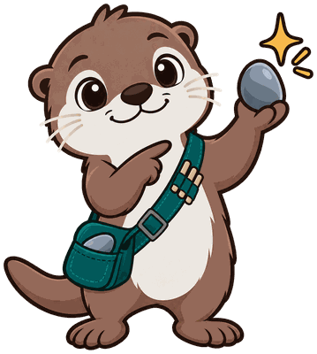
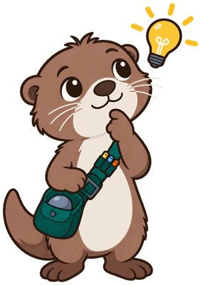
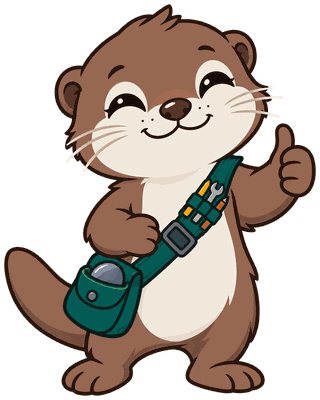
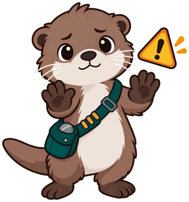
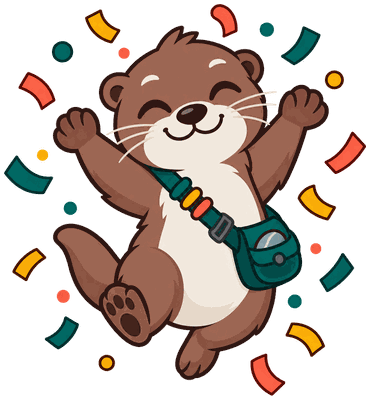

# Ibook Skills

**Kit the Otter** is the mascot for [Agent Skills for Intelligent Textbooks](https://dmccreary.github.io/ibook-skills/), a reference on building and using portable AI agent skills to construct intelligent textbooks. A kit is, literally, a young otter, and otters are known for using tools — carrying a favorite rock to crack open shellfish — which pairs naturally with a mascot who carries a satchel of tools across its chest. The name also doubles as the everyday word for a bundled set of tools, which is exactly what an agent skill is: a portable, reusable kit pulled out for the right task. Kit was chosen so the character embodies the book's central metaphor, "right tool, right task," at both the species level (a tool-using animal) and the word level (kit as toolkit) at once. That double layer of symbolism places Kit among the gallery's strongest mascots, alongside characters like Fermi the Ferret, where the name alone teaches something true about the subject.

All poses for the **Ibook Skills** mascot.

-   { width=300 }

    **Neutral**

-   { width=300 }

    **Welcome**

-   { width=300 }

    **Tip**

-   { width=300 }

    **Thinking**

-   { width=300 }

    **Encouraging**

-   { width=300 }

    **Warning**

-   { width=300 }

    **Celebration**

[← Back to gallery](../../list-mascots.md)
