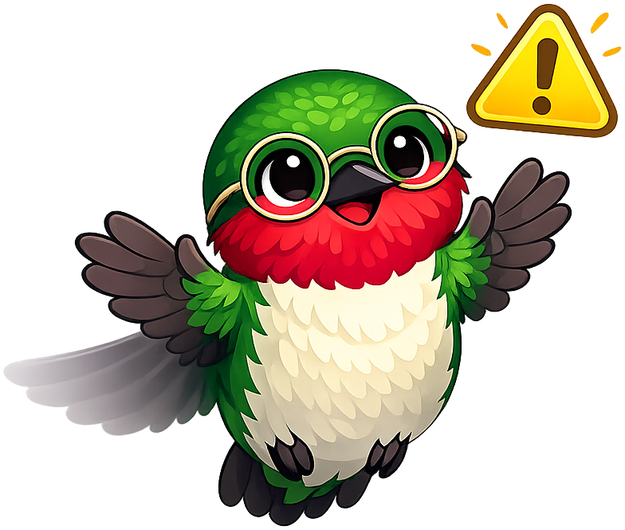

# Information Systems

**Iris the Hummingbird** is the mascot for the [Information Systems](https://dmccreary.github.io/information-systems/) textbook. Hummingbirds are nature's masters of agile precision — they hover stably in turbulent air, dart between flowers in fractions of a second, and beat their wings 50 to 80 times per second to extract energy from many small sources. Those traits map directly onto the qualities the IS profession most prizes: efficiency, agility, precision, and rapid iteration. The name *Iris* carries two productive layers — the Greek goddess of messengers and rainbows (a fitting patron for any discipline about moving information across boundaries) and the iris of an eye or camera lens (the surface where light first becomes data). The choice is exceptionally strong because the species behavior models the disciplinary virtue: an information system, like a foraging hummingbird, succeeds by visiting many small data sources quickly and precisely, then integrating their nectar into something useful for the colony.

All poses for the **Information Systems** mascot.

-   { width=300 }

    **Neutral**

-   { width=300 }

    **Welcome**

-   { width=300 }

    **Tip**

-   { width=300 }

    **Thinking**

-   { width=300 }

    **Encouraging**

-   { width=300 }

    **Warning**

-   { width=300 }

    **Celebration**

[← Back to gallery](../../list-mascots.md)
