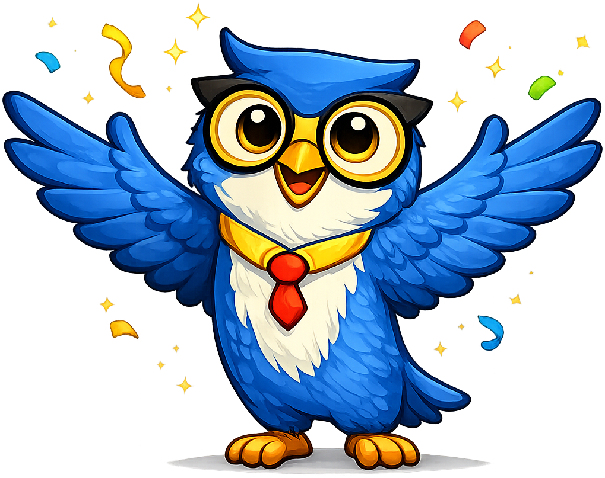
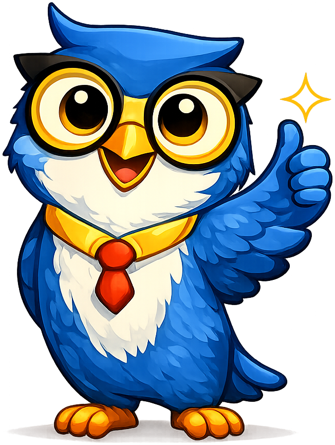
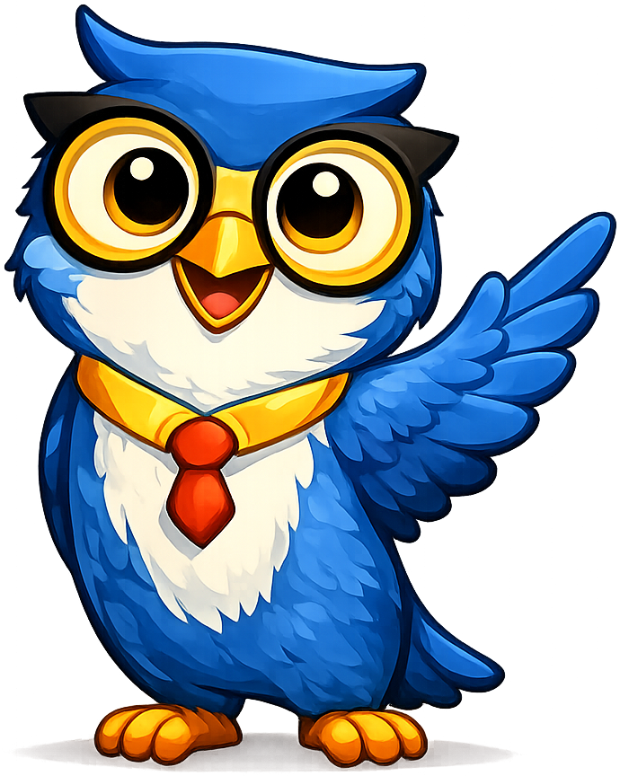
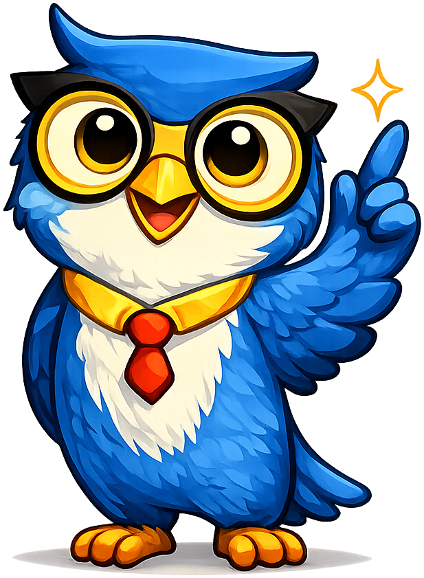

# Intelligent Textbooks

**Axiom the Owl** is the mascot for the [Building Intelligent Textbooks With AI](https://dmccreary.github.io/intelligent-textbooks/) textbook. The owl is the ancient cross-cultural symbol of wisdom — Athena's companion in Greek mythology, the patient watcher in countless folktales — and the name *Axiom* invokes the foundational, self-evident truths from which logical systems are built. Axiom was chosen because intelligent textbooks aspire to encode foundational, verifiable knowledge in machine-readable form, and the mascot's name is itself a thesis statement for the project. The choice is strong because two layers of meaning — wise watcher and foundational truth — combine in a single character, giving the brand exactly the gravitas a methodology-defining textbook needs.

All poses for the **Intelligent Textbooks** mascot.

-   { width=300 }

    **Celebrate**

-   { width=300 }

    **Encourage**

-   { width=300 }

    **Explain**

-   { width=300 }

    **Neutral**

-   { width=300 }

    **Thinking**

-   { width=300 }

    **Tip**

-   { width=300 }

    **Warning**

-   { width=300 }

    **Welcome**

[← Back to gallery](../../list-mascots.md)
