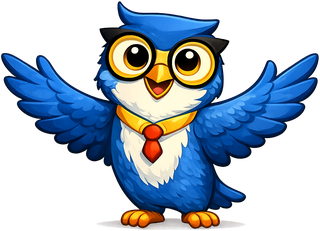
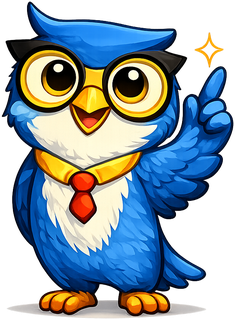
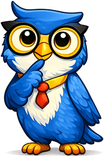
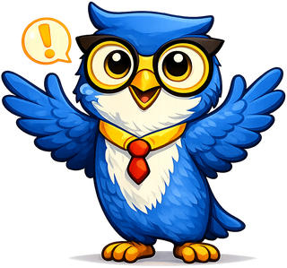
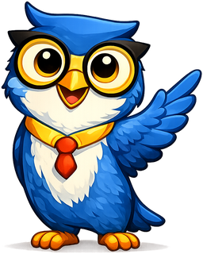

# Learning Graphs

**Axiom the Owl** is the mascot for [Learning Graphs](https://dmccreary.github.io/learning-graphs/). Owls conventionally represent knowledge, while their wide field of attention suits a subject concerned with seeing relationships among many concepts. An axiom is a foundational proposition from which other reasoning proceeds, mirroring the prerequisite concepts that support downstream learning. Axiom was chosen to encourage learners and designers to look beyond isolated topics toward dependency structure and conceptual foundations. Because the name encodes foundations and the species encodes knowledge, the mascot is strongly coupled to the discipline.

All poses for the **Learning Graphs** mascot.

-   { width=300 }

    **Neutral**

-   { width=300 }

    **Welcome**

-   { width=300 }

    **Tip**

-   { width=300 }

    **Thinking**

-   { width=300 }

    **Encouraging**

-   { width=300 }

    **Warning**

-   { width=300 }

    **Celebration**

-   { width=300 }

    **Explain**

[← Back to gallery](../../list-mascots.md)
