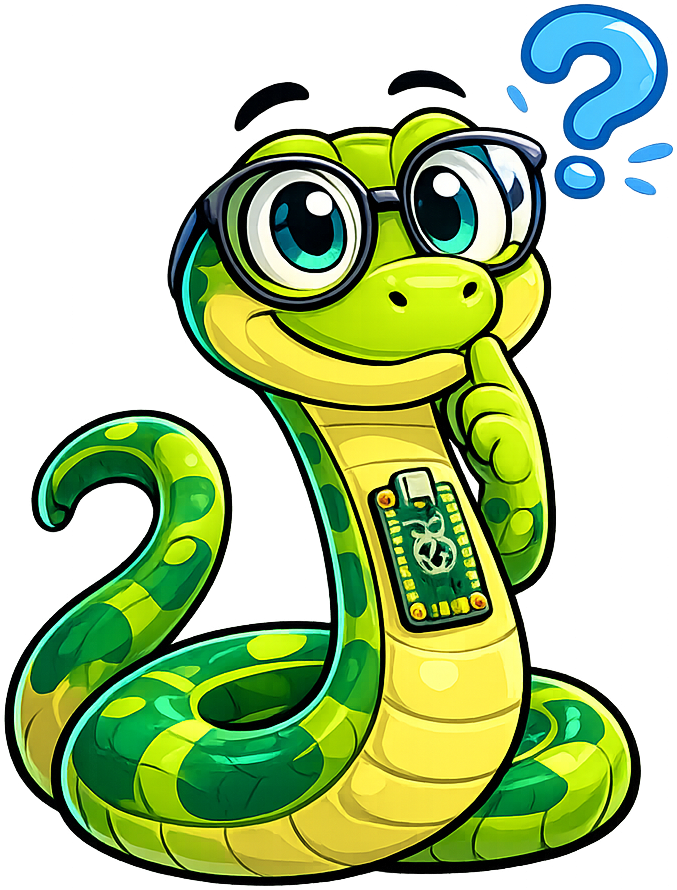

# Learning MicroPython

**Monty the MicroPython Snake** is the mascot for [Learning MicroPython](https://dmccreary.github.io/learning-micropython/). A python directly represents the programming language, while the compact character form suits MicroPython's focus on constrained microcontrollers and embedded hardware. Monty extends the language's well-known Monty Python wordplay into an approachable character name. Monty was chosen to connect code, electronics, sensing, and physical behavior through one recurring guide. The species, name, and platform all reinforce the same concept, making this an exceptionally coherent mascot.

All poses for the **Learning MicroPython** mascot.

-   { width=300 }

    **Neutral**

-   { width=300 }

    **Welcome**

-   { width=300 }

    **Tip**

-   { width=300 }

    **Thinking**

-   { width=300 }

    **Encouraging**

-   { width=300 }

    **Warning**

-   { width=300 }

    **Celebration**

[← Back to gallery](../../list-mascots.md)
