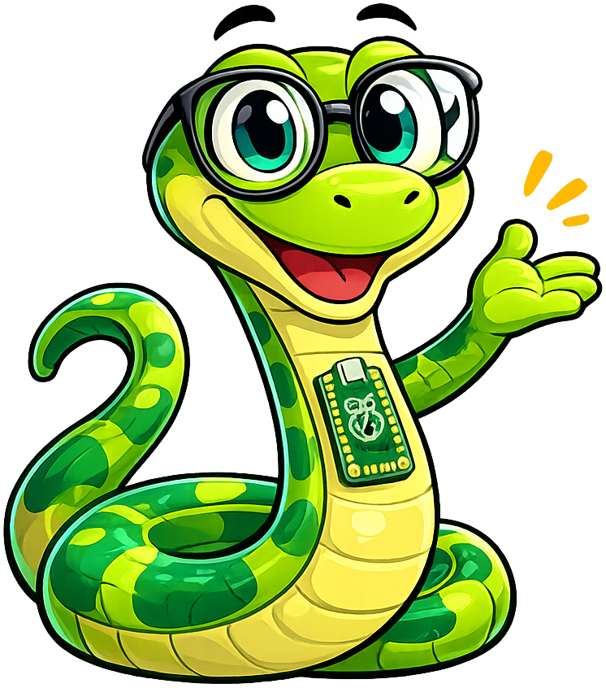

# Learning Python

**Monty the Python** is the mascot for [Learning Python](https://dmccreary.github.io/learning-python/). The python species gives learners an immediate visual anchor for the programming language and its snake-based identity. Monty's name preserves the Monty Python reference from which the language itself was named. Monty was chosen to make programming patterns feel continuous across chapters while modeling curiosity, iteration, and calm debugging. With both name and species tied directly to Python's identity, the mascot is unusually memorable and subject coupled.

All poses for the **Learning Python** mascot.

-   { width=300 }

    **Neutral**

-   { width=300 }

    **Welcome**

-   { width=300 }

    **Tip**

-   { width=300 }

    **Thinking**

-   { width=300 }

    **Encouraging**

-   { width=300 }

    **Warning**

-   { width=300 }

    **Celebration**

[← Back to gallery](../../list-mascots.md)
