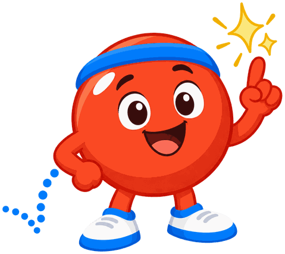
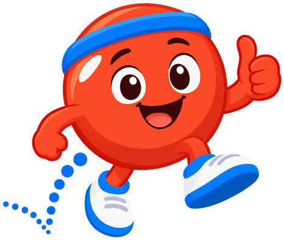

# MicroSims

**Bounce the Ball** is the mascot for [MicroSims 2.0: Generating, Instrumenting and Evaluating Interactive Learning Objects with AI](https://dmccreary.github.io/microsims/), a textbook on designing, generating, checking, and instrumenting small AI-generated simulations whose event streams provide evidence of learning. The bouncing ball is the traditional first exercise in both animation and creative coding: a single object whose whole behavior follows from a few adjustable quantities such as gravity, launch speed, and elasticity, which is exactly the anatomy of a MicroSim with its sliders and its drawing loop — and it was the opening example of the original MicroSims course. The name is the verb the object performs, and it carries two further everyday senses the book leans on: to "bounce back" from a failed attempt and to "bounce an idea around" until it improves. Bounce was chosen to install the mental model that a simulation is a simple thing governed by a small set of parameters a learner can change and observe, and that every run leaves a traceable path — the dotted arc drawn behind the character stands in for the recorded events a MicroSim emits. That makes Bounce one of the gallery's stronger mascots: the character is not a metaphor for the subject but the subject's own first example given a face, and the name adds a second layer by encoding the iterate-and-recover habit that building simulations with AI demands.

All poses for the **MicroSims** mascot.

-   { width=300 }

    **Neutral**

-   { width=300 }

    **Welcome**

-   { width=300 }

    **Tip**

-   { width=300 }

    **Thinking**

-   { width=300 }

    **Encouraging**

-   { width=300 }

    **Warning**

-   { width=300 }

    **Celebration**

[← Back to gallery](../../list-mascots.md)
