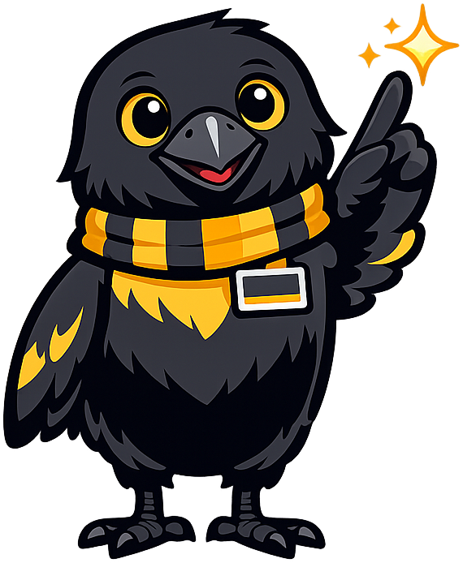
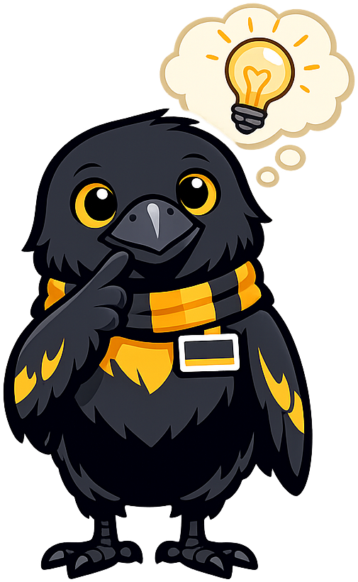
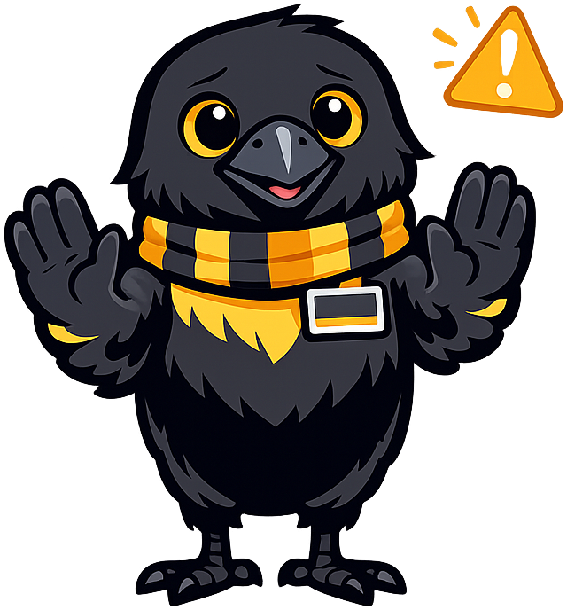
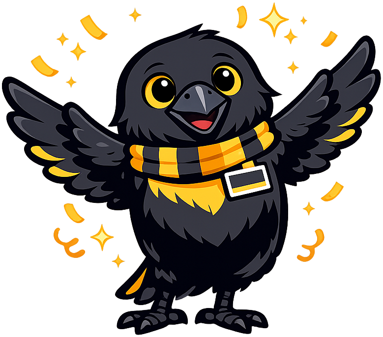

# Mini Mba For Startups

**Rune the Raven** is the mascot for the [Ole Cup Entrepreneurship guide](https://dmccreary.github.io/mini-mba-for-startups/), a liberal-arts companion to the St. Olaf College pitch competition. Ravens are among the most cognitively capable birds — they cache and remember thousands of food locations, plan for future use of tools, and read social signals well enough to deceive other ravens — a working biological analog for the patient observation, opportunistic planning, and theory-of-mind that distinguish good founders from busy ones. The name *Rune* invokes the Old Norse heritage of St. Olaf and its college, evoking the runic alphabets used to record knowledge, contracts, and origin stories — exactly the artifacts an entrepreneur must produce to turn an idea into a venture. Rune was chosen to model the disciplinary virtue that entrepreneurship is a knowledge-and-memory activity well before it is a capital activity: you remember what worked, you cache what others overlook, and you write your story down. The choice is strong because both species and name carry load-bearing meaning — corvid intelligence and the Norse recorded-knowledge tradition — and they are anchored to the specific institutional setting the book serves.

All poses for the **Mini Mba For Startups** mascot.

-   { width=300 }

    **Neutral**

-   { width=300 }

    **Welcome**

-   { width=300 }

    **Tip**

-   { width=300 }

    **Thinking**

-   { width=300 }

    **Encouraging**

-   { width=300 }

    **Warning**

-   { width=300 }

    **Celebration**

[← Back to gallery](../../list-mascots.md)
