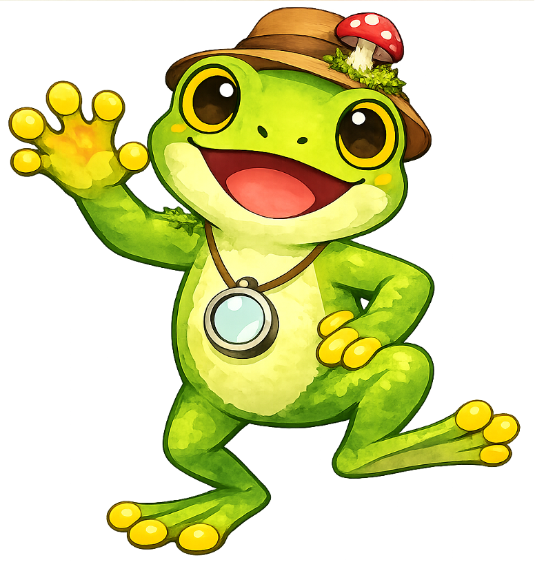
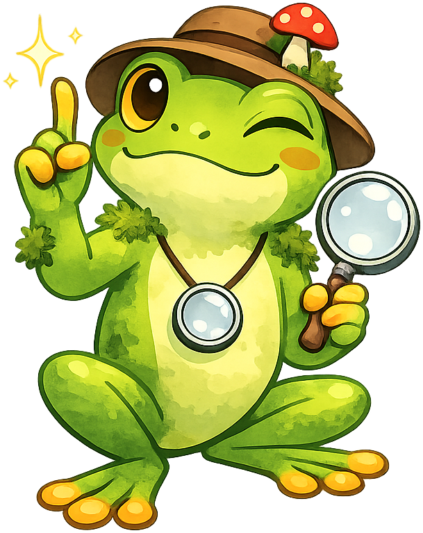
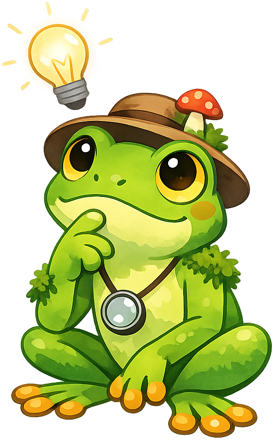
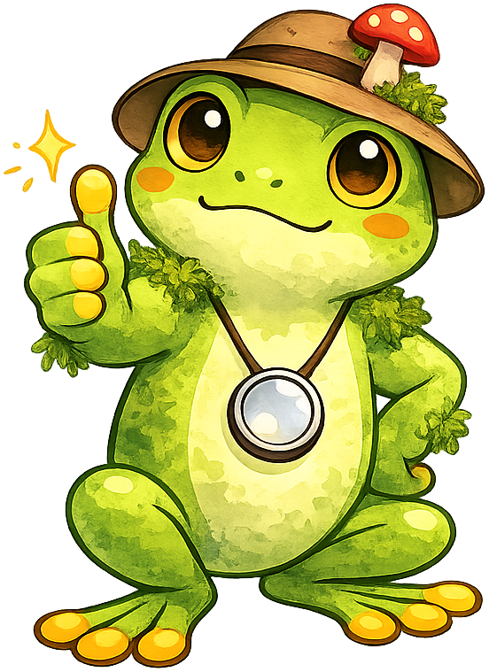
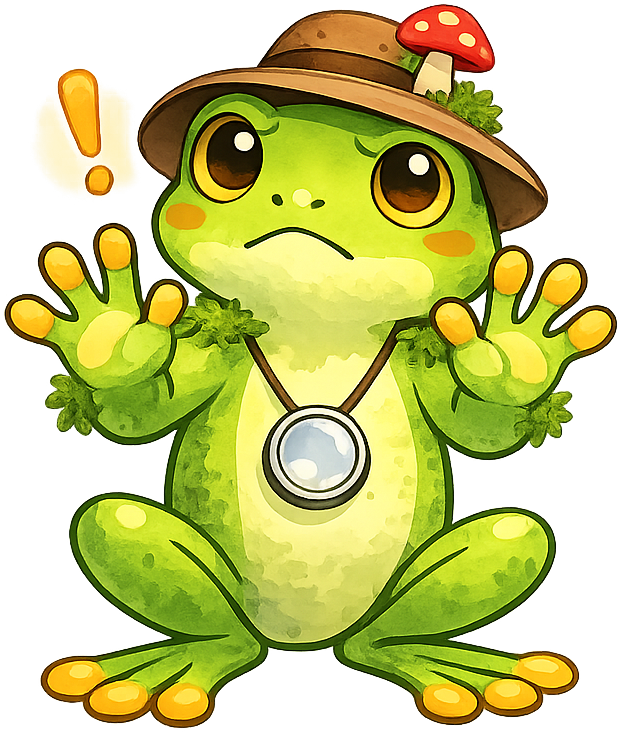
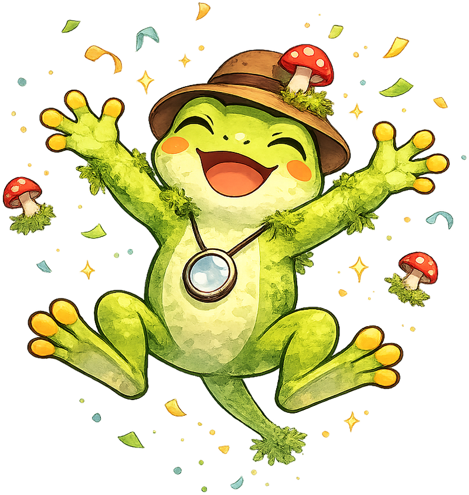

# Moss

**Mossby the Tree Frog** is the mascot for the [Moss](https://dmccreary.github.io/moss/) textbook. Mossby was chosen because tree frogs and mosses share habitat — both flourish in the cool, damp microclimates of forest floors, fallen logs, and stream banks — making the frog a natural ambassador for a textbook about bryophyte biology and ecology. The choice is good because the mascot embeds a small ecological fact (frogs and mosses co-occur, depend on similar moisture conditions, and respond similarly to habitat disturbance) right into the brand identity. The cousinship to Gregor (the biology mascot) also creates a soft visual link across the textbook collection: learners who recognize the tree-frog family see continuity between general biology and the specialty topic.

All poses for the **Moss** mascot.

-   { width=300 }

    **Neutral**

-   { width=300 }

    **Welcome**

-   { width=300 }

    **Tip**

-   { width=300 }

    **Thinking**

-   { width=300 }

    **Encouraging**

-   { width=300 }

    **Warning**

-   { width=300 }

    **Celebration**

[← Back to gallery](../../list-mascots.md)
