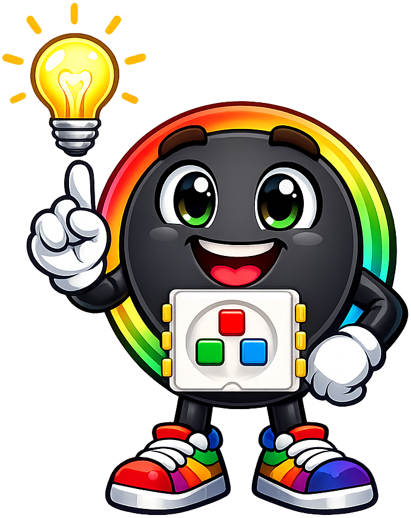
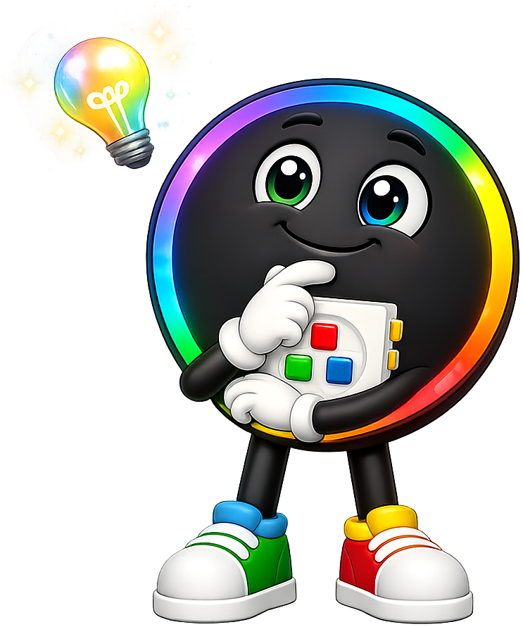
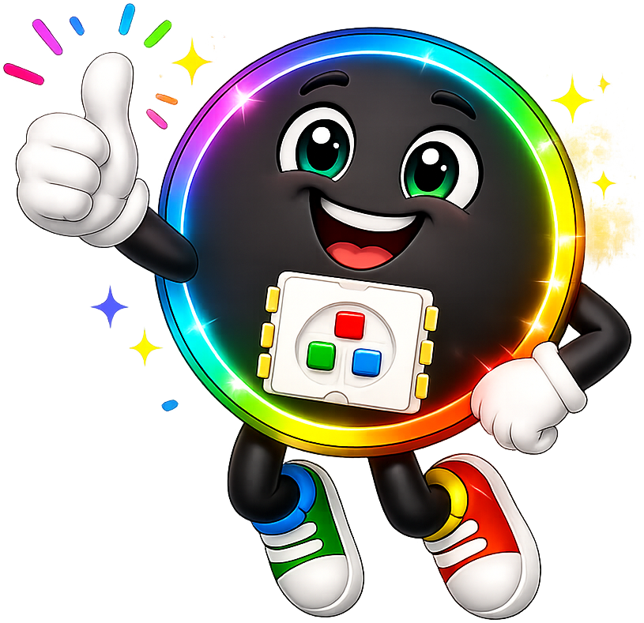
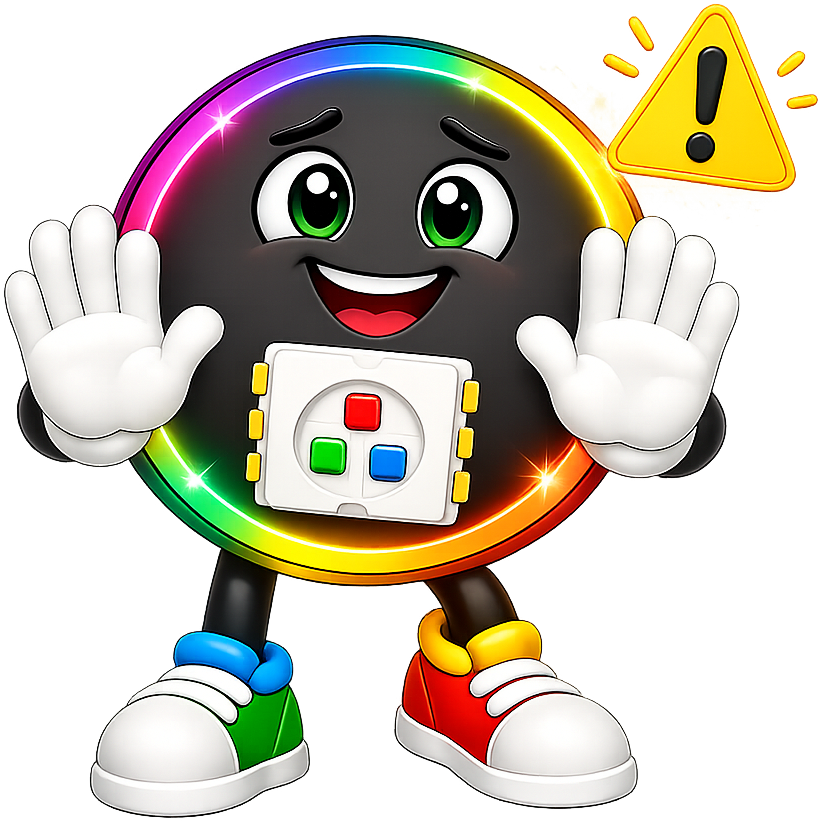
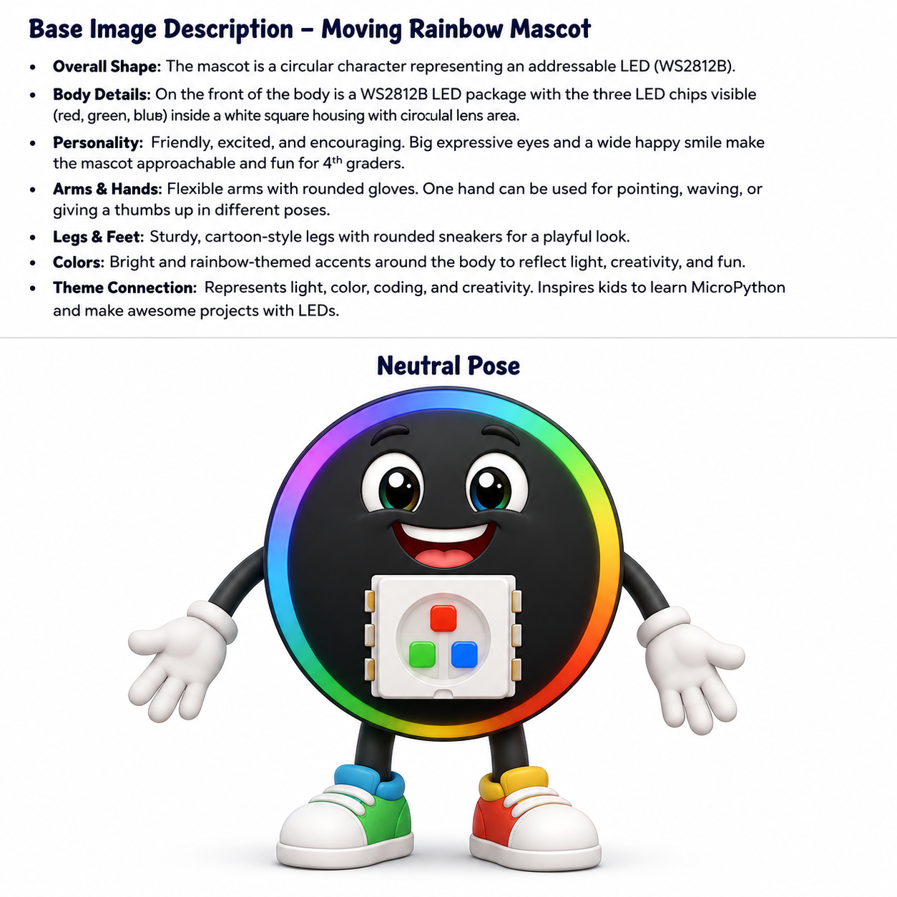

# Moving Rainbow

**Pixel the Addressable LED** is the mascot for [Moving Rainbow](https://dmccreary.github.io/moving-rainbow/). A WS2812B combines individually controlled red, green, and blue emitters, making it the physical basis of the animations students program in the book. Pixel names both one controllable point of light and the elemental unit from which larger visual patterns are assembled. Pixel was chosen to help learners connect code variables and timing loops to visible changes in real hardware. Because the character literally embodies the course's central component, the mascot is exceptionally well coupled to the curriculum.

All poses for the **Moving Rainbow** mascot.

-   { width=300 }

    **Neutral**

-   { width=300 }

    **Welcome**

-   { width=300 }

    **Tip**

-   { width=300 }

    **Thinking**

-   { width=300 }

    **Encouraging**

-   { width=300 }

    **Warning**

-   { width=300 }

    **Celebration**

-   { width=300 }

    **Description**

[← Back to gallery](../../list-mascots.md)
