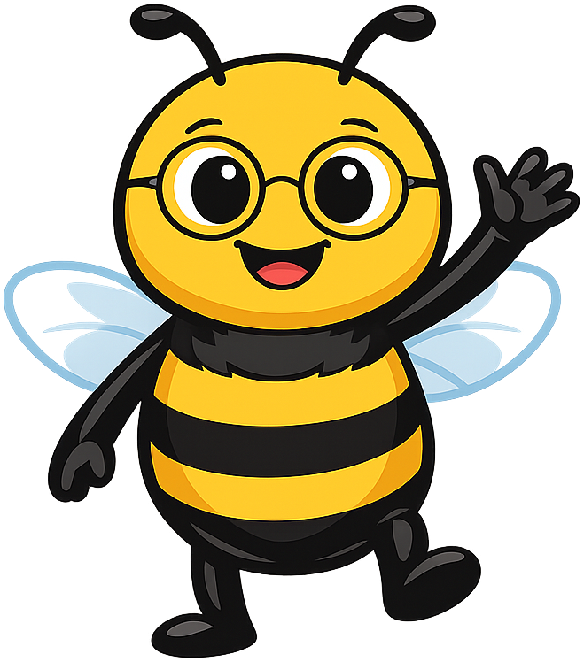
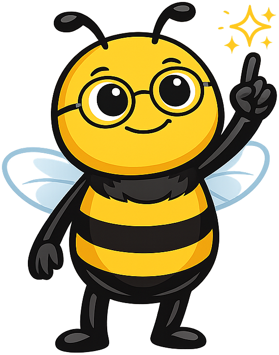
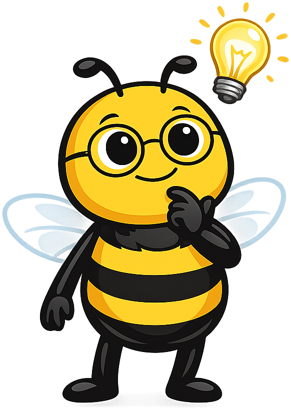
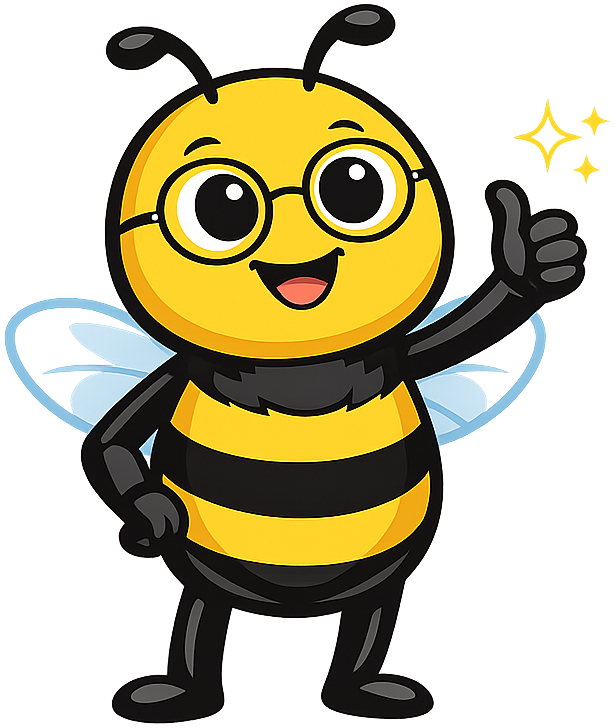
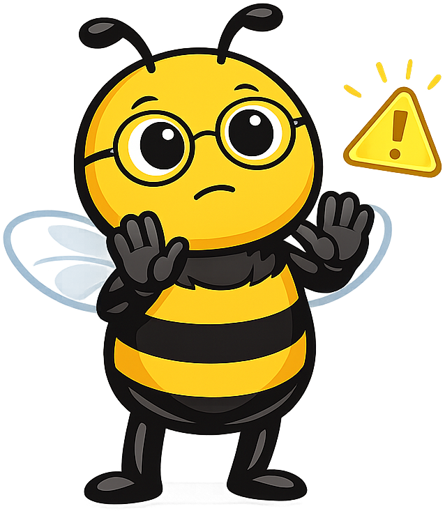
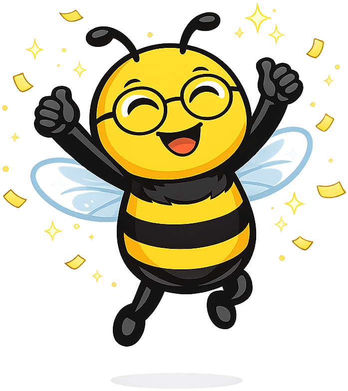

# Networking

**Buzz the Honey Bee** is the mascot for the [Networking and Communication](https://dmccreary.github.io/networking/) textbook. Honey bees are nature's premier communication engineers — a returning forager performs the *waggle dance* to encode the direction and distance of a food source for the rest of the hive, a behavior that is a near-perfect biological analog to network protocols (a packet that encodes routing information for downstream consumers). Buzz was chosen because the species itself encodes a load-bearing idea in the curriculum: that all networking is fundamentally a story about how independent agents agree on a shared encoding so information can flow through a noisy medium. The choice is exceptionally strong because the metaphor is rigorous, not decorative — students who internalize Buzz come away with a free intuition for protocol design, addressing, and broadcast vs. unicast distinctions, which are the conceptual cornerstones of the discipline.

All poses for the **Networking** mascot.

-   { width=300 }

    **Neutral**

-   { width=300 }

    **Welcome**

-   { width=300 }

    **Tip**

-   { width=300 }

    **Thinking**

-   { width=300 }

    **Encouraging**

-   { width=300 }

    **Warning**

-   { width=300 }

    **Celebration**

[← Back to gallery](../../list-mascots.md)
