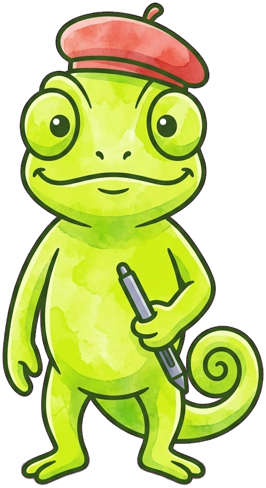
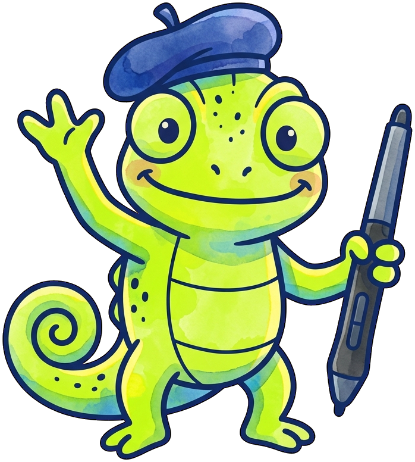
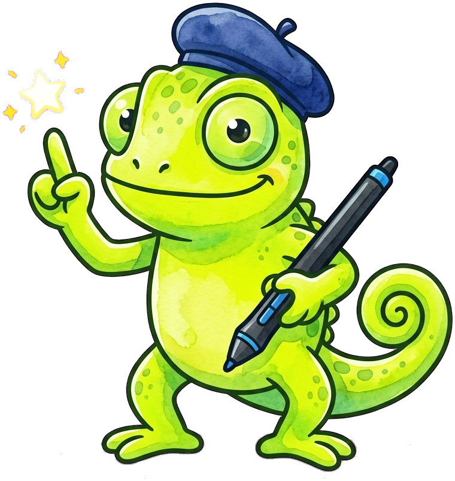
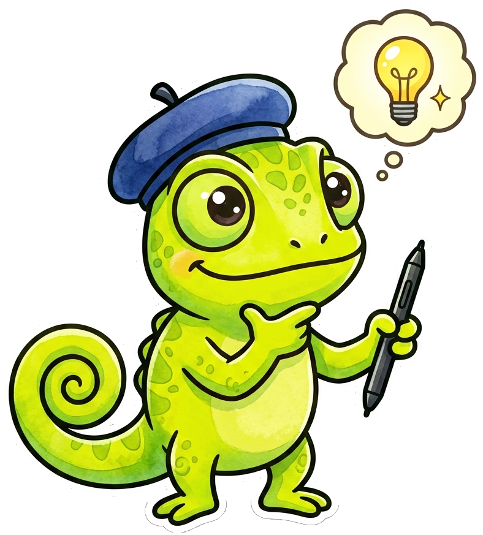
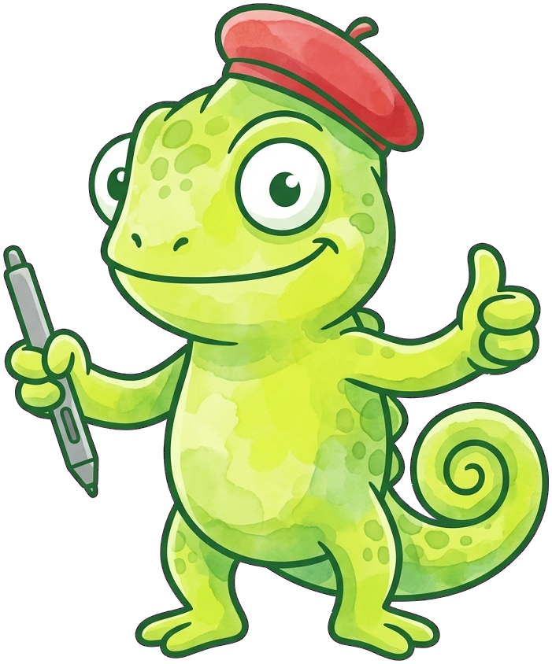

# P5 Textbook

**Palette the Chameleon** is the mascot for [The Art of Processing](https://dmccreary.github.io/p5-textbook/), a textbook on creative coding and generative art with p5.js. Chameleons are the canonical animal symbol of color change and adaptability, which maps directly onto a course about manipulating color, shape, and motion in code, and onto the improvisational way creative coders adapt a sketch as it develops. The name Palette is a direct citation of an artist's tool for mixing color, so the character's name and species both point at the same idea from different directions — one from biology, one from the studio. Palette was chosen to give students a visual shorthand for the course's central skill: treating color and form as something to be actively mixed and adjusted, not fixed in advance. That double coupling — an adaptive, color-changing animal named after an artist's color-mixing tool — puts Palette among the gallery's strongest mascots.

All poses for the **P5 Textbook** mascot.

-   { width=300 }

    **Neutral**

-   { width=300 }

    **Welcome**

-   { width=300 }

    **Tip**

-   { width=300 }

    **Thinking**

-   { width=300 }

    **Encouraging**

-   { width=300 }

    **Warning**

-   { width=300 }

    **Celebration**

[← Back to gallery](../../list-mascots.md)
