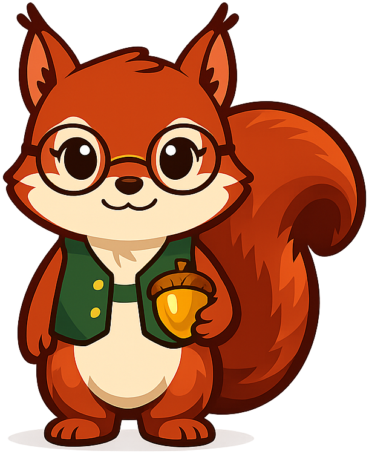
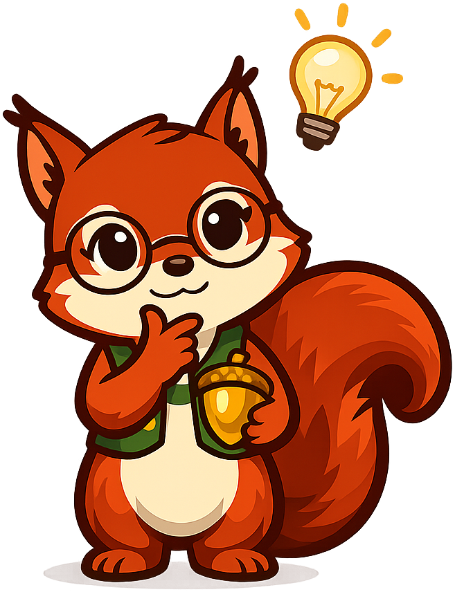
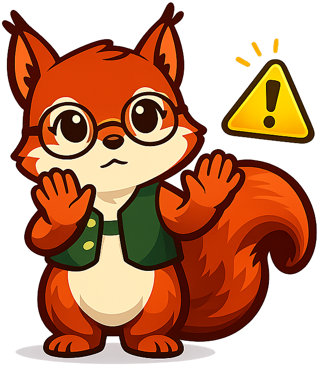

# Personal Finance

**Sylvia the Squirrel** — a russet squirrel in glasses and a forest-green vest, holding a golden acorn — is the mascot for the [Personal Finance with AI](https://dmccreary.github.io/personal-finance/) textbook. Squirrels are nature's canonical savers — they bury thousands of acorns each autumn, remember (most of) the cache locations, and live through winter on the surplus, which is exactly the behavior personal finance asks humans to develop. The mascot was chosen because squirrel-saving is the most accessible analogy for compound saving and delayed gratification, and the glasses and vest signal a thoughtful, planning-oriented temperament rather than frantic hoarding. The choice is strong because the species behavior maps directly onto the curriculum's central message: small, consistent saving, indexed across time, sustains you through scarcity.

All poses for the **Personal Finance** mascot.

-   { width=300 }

    **Celebration**

-   { width=300 }

    **Encouraging**

-   { width=300 }

    **Neutral**

-   { width=300 }

    **Thinking**

-   { width=300 }

    **Tip**

-   { width=300 }

    **Warning**

-   { width=300 }

    **Welcome**

[← Back to gallery](../../list-mascots.md)
