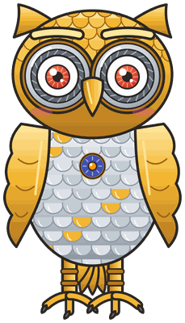
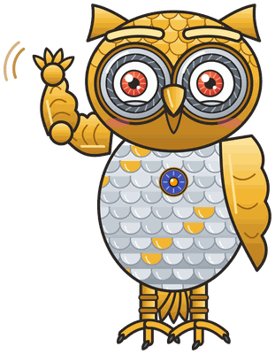
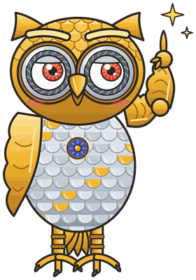
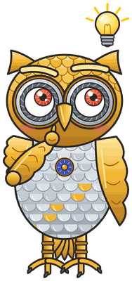
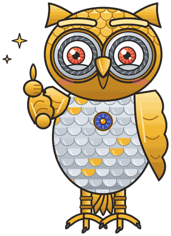
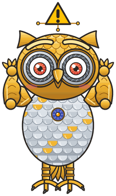
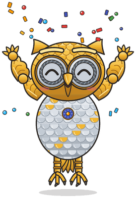

# Raspberry Pi Environmental Monitoring

**Mecha the Clockwork Owl** is the mascot for [Raspberry Pi Environmental Monitoring: Grades 6–12](https://iowerx.github.io/pi-env-monitor/), a hands-on textbook in which middle and high school students build a Raspberry Pi station that measures temperature, pressure, and humidity, logs the readings, and reports them from the field. Owls are sit-and-wait observers with oversized forward-facing eyes tuned for low light and hearing sharp enough to locate prey by sound alone, so the species already stands for patient, quantitative attention to an environment; drawing the owl as a brass-and-silver automaton pushes the idea one step further, turning the watcher into an instrument with lens eyes and a small indigo-and-orange sensor badge on its chest. The name Mecha is the clipped form of "mechanical," announcing that this owl was assembled from parts rather than hatched — the same thing a reader does with a Pi, a breadboard, and a handful of sensors. Mecha was chosen to install the book's core mental model, that observing the world carefully and building the device that does the observing are one activity, and to model the habits that make a reading trustworthy: units, timestamps, calibration, and checking a number twice. That gives Mecha strong subject-coupling on the species side, since both the animal and its clockwork construction map onto a field instrument, and places the mascot in the gallery's "better" tier rather than its "best": the name encodes how the character is made but not what it measures, so it carries less discipline-specific meaning than the strongest name-and-species pairings.

All poses for the **Raspberry Pi Environmental Monitoring** mascot.

-   { width=300 }

    **Neutral**

-   { width=300 }

    **Welcome**

-   { width=300 }

    **Tip**

-   { width=300 }

    **Thinking**

-   { width=300 }

    **Encouraging**

-   { width=300 }

    **Warning**

-   { width=300 }

    **Celebration**

[← Back to gallery](../../list-mascots.md)
