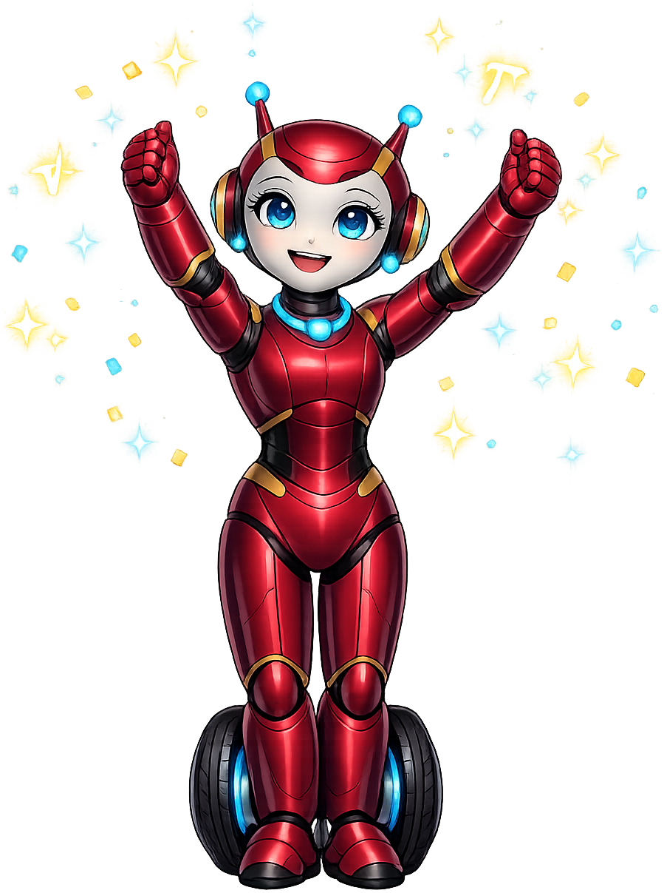
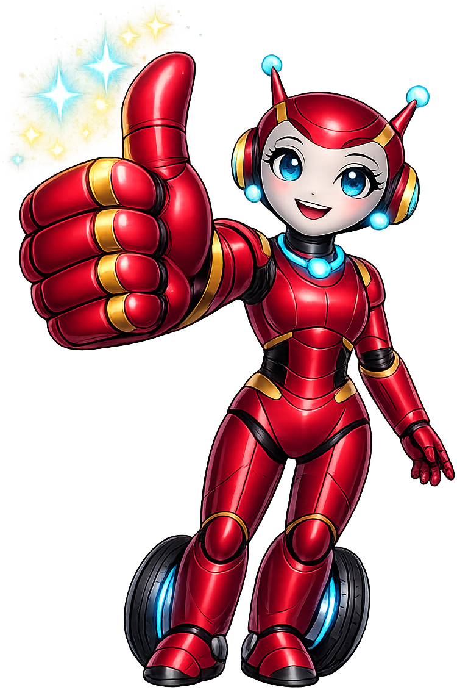
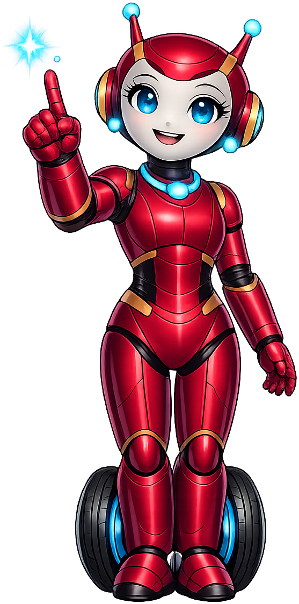
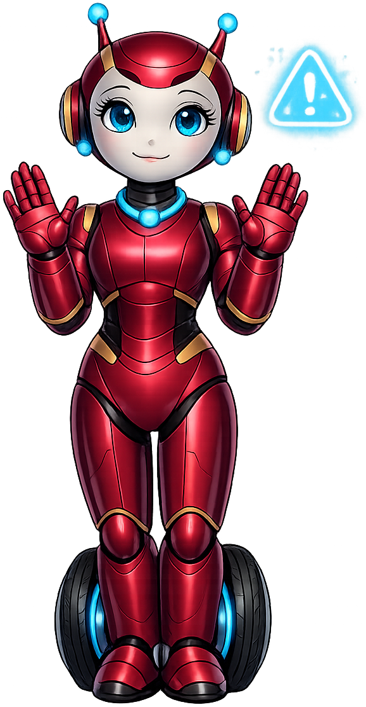
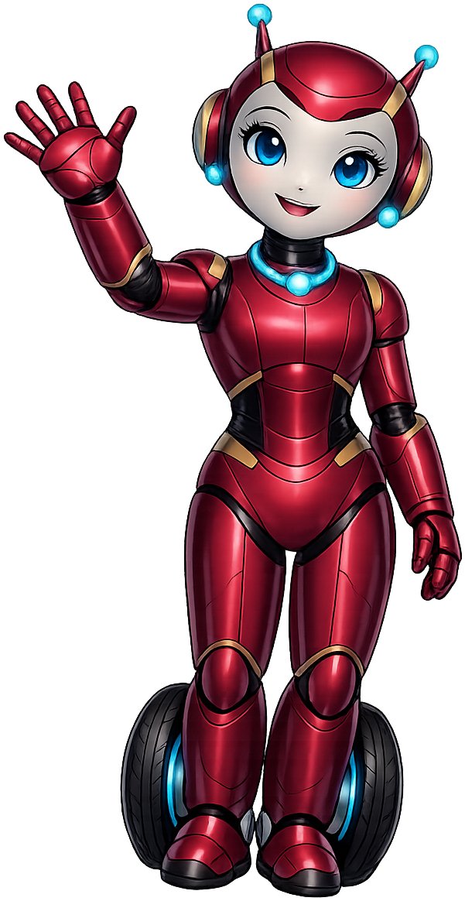

# Pre Calc

**Prema** is the mascot for the [Pre-Calculus](https://dmccreary.github.io/pre-calc/) textbook. Prema is depicted as a friendly red robot on rolling wheels, antennae raised — a deliberate departure from the animal mascots elsewhere in the gallery. The robot framing was chosen because pre-calculus is the bridge between the concrete arithmetic of earlier math and the abstract symbolic manipulation of calculus, and a robot signals "systematic, computational thinking" without anthropomorphic baggage. The choice is good for the pre-calc audience specifically — students who have outgrown elementary cuteness but are not yet ready for the austere notation of higher mathematics — because the robot reads as competent and modern while still being expressive enough to model encouragement, confusion, and celebration.

All poses for the **Pre Calc** mascot.

-   { width=300 }

    **Celebration**

-   { width=300 }

    **Encouraging**

-   { width=300 }

    **Neutral**

-   { width=300 }

    **Thinking**

-   { width=300 }

    **Tip**

-   { width=300 }

    **Warning**

-   { width=300 }

    **Welcome**

[← Back to gallery](../../list-mascots.md)
