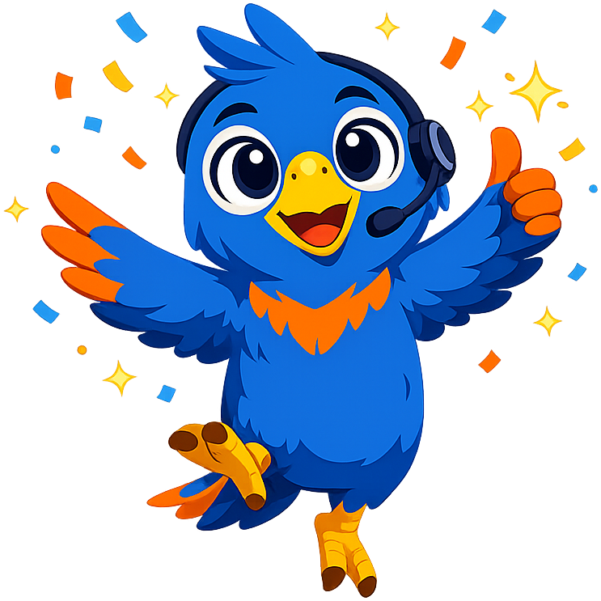
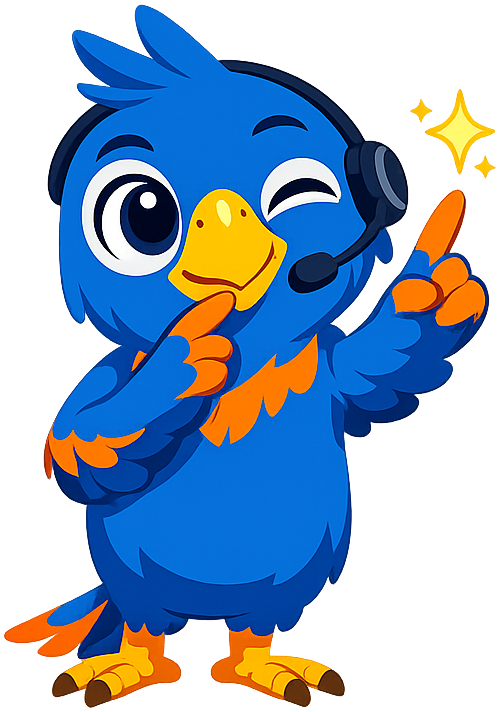
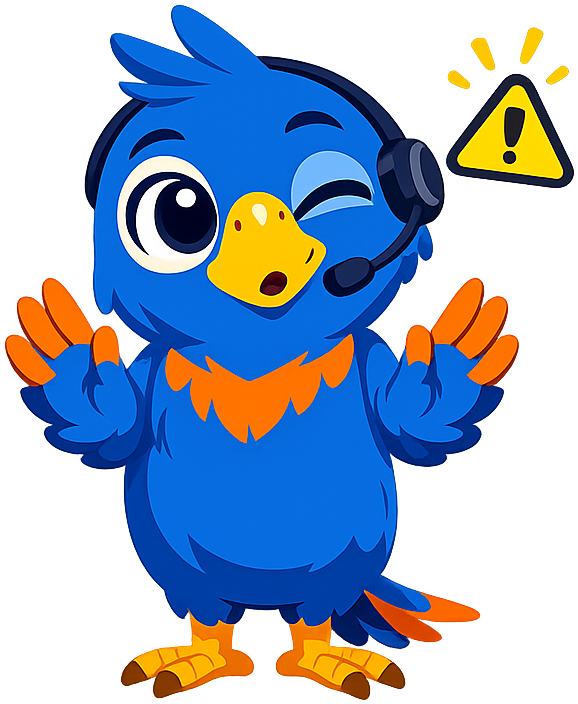

# Prompt Class

**Polly the Parrot** — a vivid blue parrot wearing a headset and microphone — is the mascot for the [Prompt Engineering Class](https://dmccreary.github.io/prompt-class) textbook. The name *Polly* is the canonical English-speaking parrot's name (from "Polly want a cracker?"), which reinforces the species symbolism the choice already leans on: parrots are the only animals widely recognized for repeating human language, and the entire discipline of prompt engineering is fundamentally about getting language back from a system in the form you want. Polly was chosen because the metaphor is direct: prompts go in, language comes out, and the quality of the output depends entirely on the quality of the input. The headset and microphone signal modern human-AI conversation. The choice is strong because the mascot is itself a working metaphor for the LLM — a deeply trained mimic whose outputs reward careful, deliberate input.

All poses for the **Prompt Class** mascot.

-   { width=300 }

    **Celebration**

-   { width=300 }

    **Encouraging**

-   { width=300 }

    **Neutral**

-   { width=300 }

    **Thinking**

-   { width=300 }

    **Tip**

-   { width=300 }

    **Warning**

-   { width=300 }

    **Welcome**

[← Back to gallery](../../list-mascots.md)
