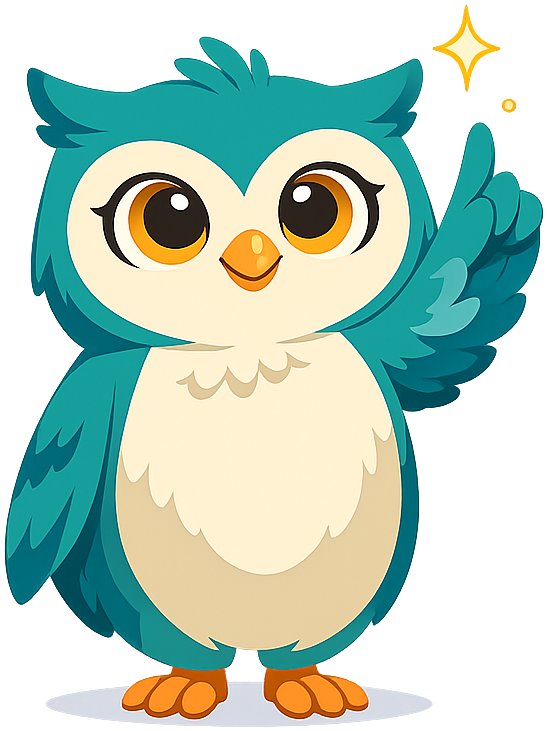
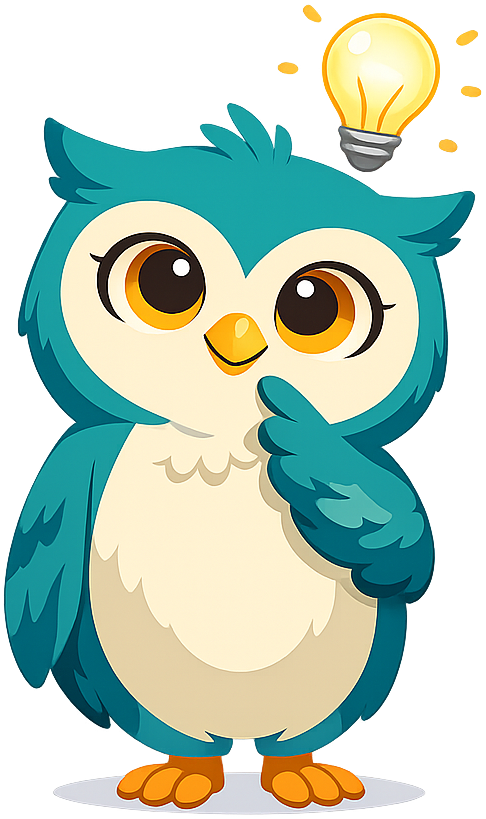
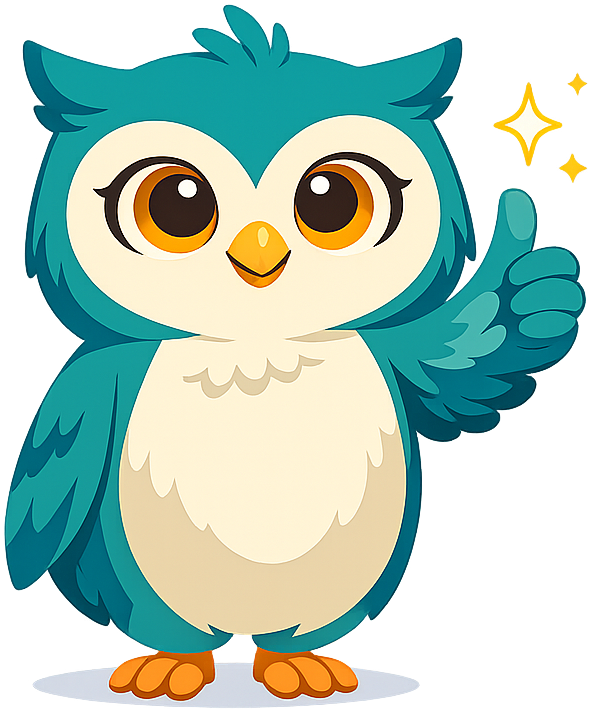

# Psychology

**Psy the Owl** is the mascot for [Psychology](https://dmccreary.github.io/psychology/). Owls' prominent eyes support a metaphor of careful observation, a foundational habit in the scientific study of behavior and mental processes. Psy is a compact form of psychology and also recalls the Greek root *psychē*, historically associated with mind or soul. Psy was chosen to model attentive inquiry while guiding students across biological, cognitive, developmental, and social explanations. The discipline-coded name gives the familiar owl symbol a specific purpose, producing a strong and easily recalled pairing.

All poses for the **Psychology** mascot.

-   { width=300 }

    **Neutral**

-   { width=300 }

    **Welcome**

-   { width=300 }

    **Tip**

-   { width=300 }

    **Thinking**

-   { width=300 }

    **Encouraging**

-   { width=300 }

    **Warning**

-   { width=300 }

    **Celebration**

[← Back to gallery](../../list-mascots.md)
