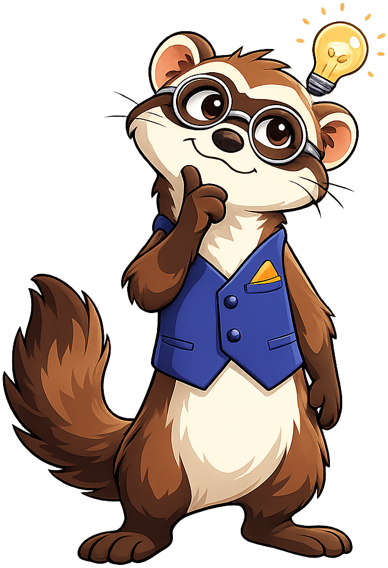

# Quantum Computing

**Fermi the Ferret** is the mascot for the [Quantum Computing](https://dmccreary.github.io/quantum-computing/) textbook. The name carries two layers of physics meaning: Enrico Fermi was a foundational figure in quantum theory and the namesake of *fermions* (electrons and other half-integer-spin particles whose behavior underlies most quantum-computing hardware), and "Fermi problems" are the order-of-magnitude estimation puzzles every physicist learns to love. Fermi was chosen because the species itself is a quiet pun — *ferret* and *fermion* sound alike — while the namesake encodes serious physics history. The choice is strong because quantum computing is a notoriously intimidating subject, and a playful, curious ferret softens the cognitive load while the name keeps the technical content honest.

All poses for the **Quantum Computing** mascot.

-   { width=300 }

    **Celebration**

-   { width=300 }

    **Encouraging**

-   { width=300 }

    **Neutral**

-   { width=300 }

    **Thinking**

-   { width=300 }

    **Tip**

-   { width=300 }

    **Warning**

-   { width=300 }

    **Welcome**

[← Back to gallery](../../list-mascots.md)
