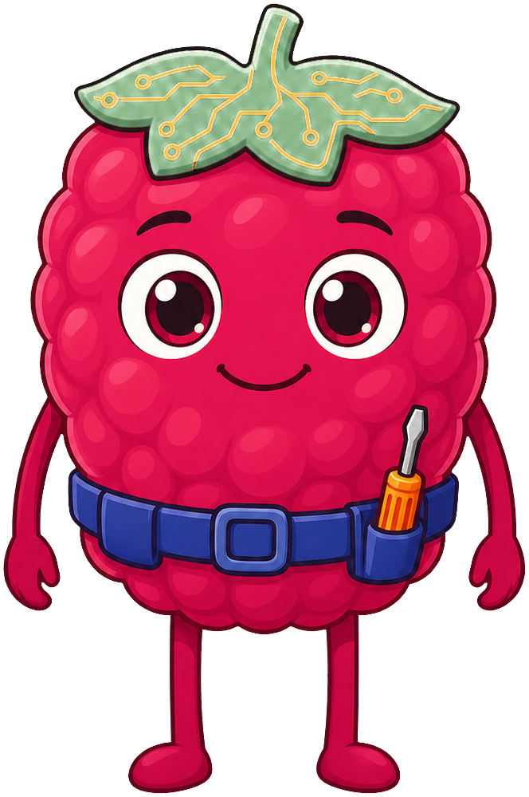
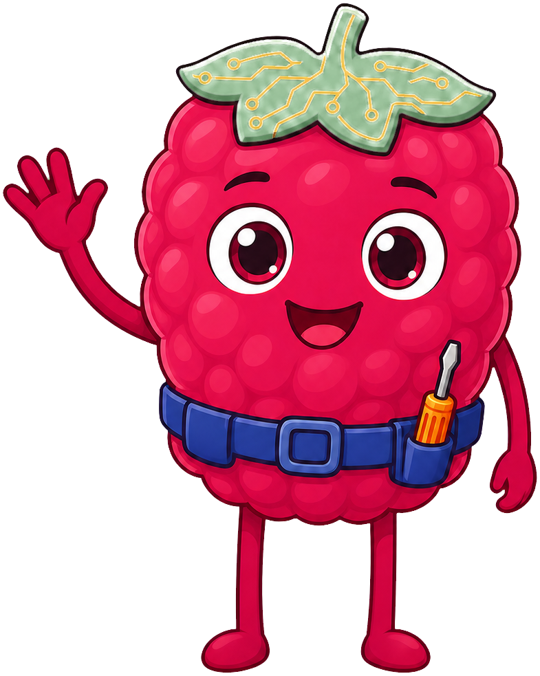
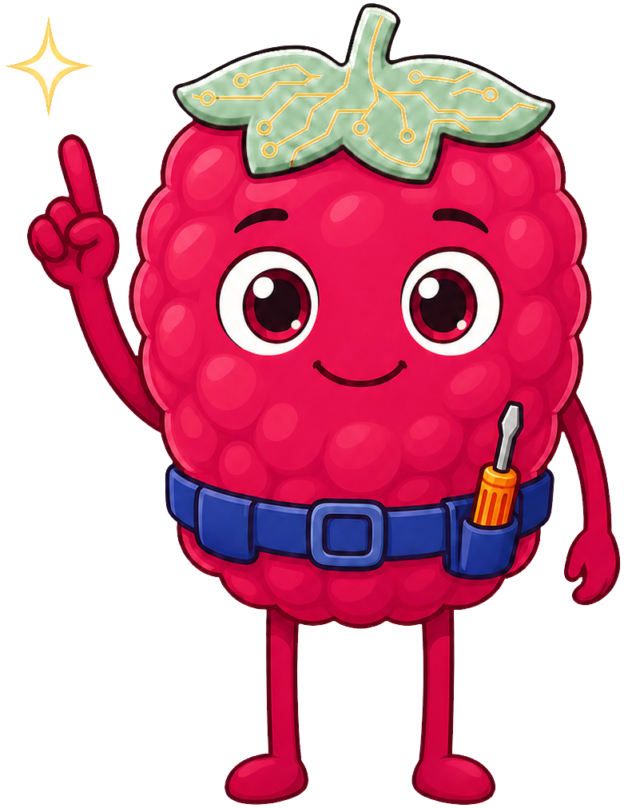
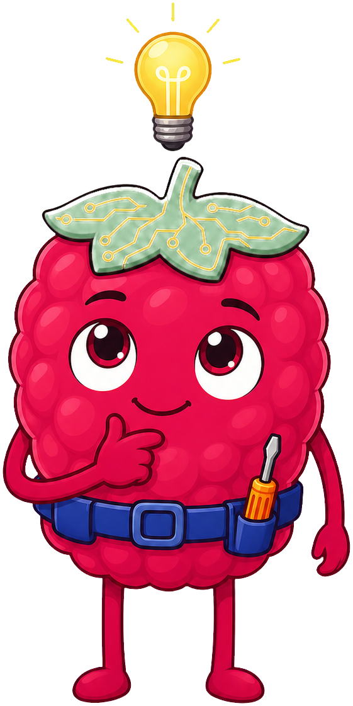
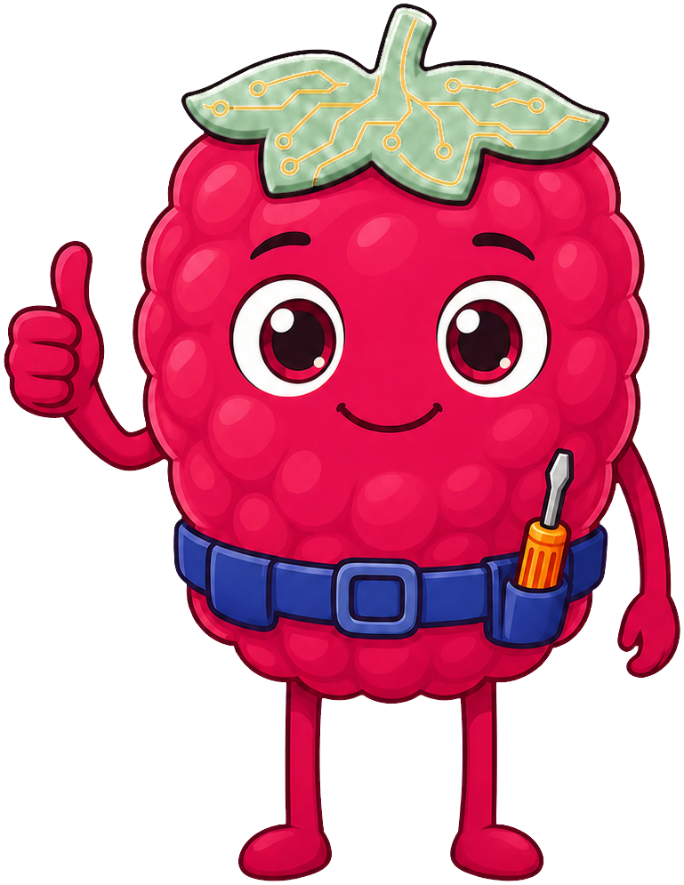
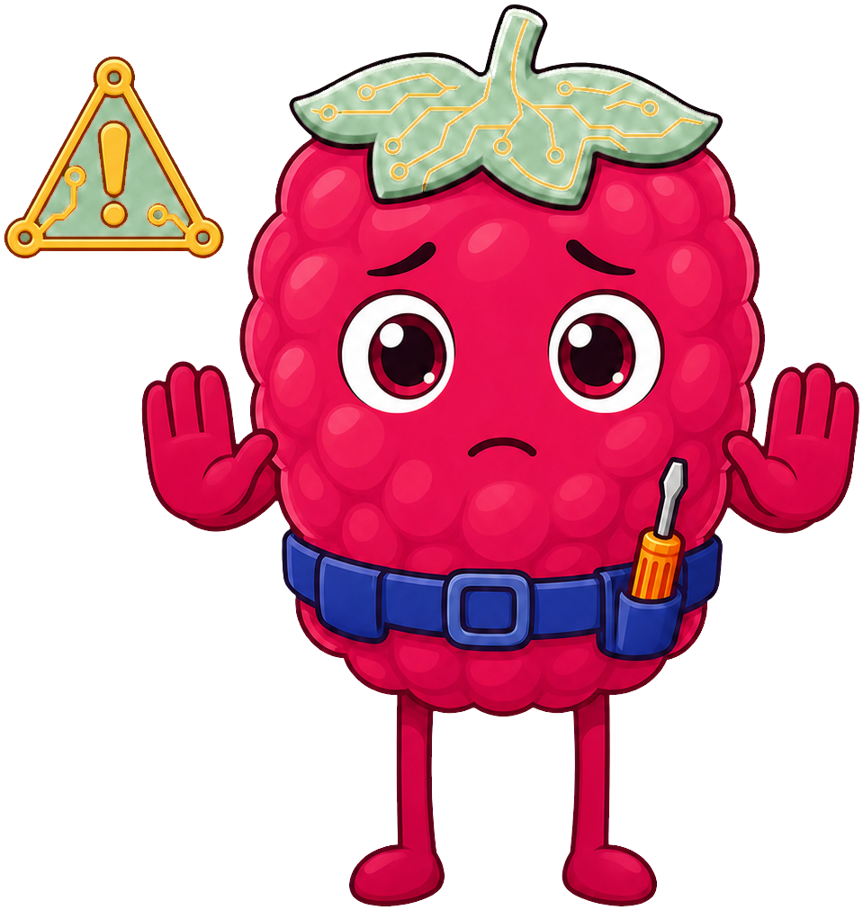
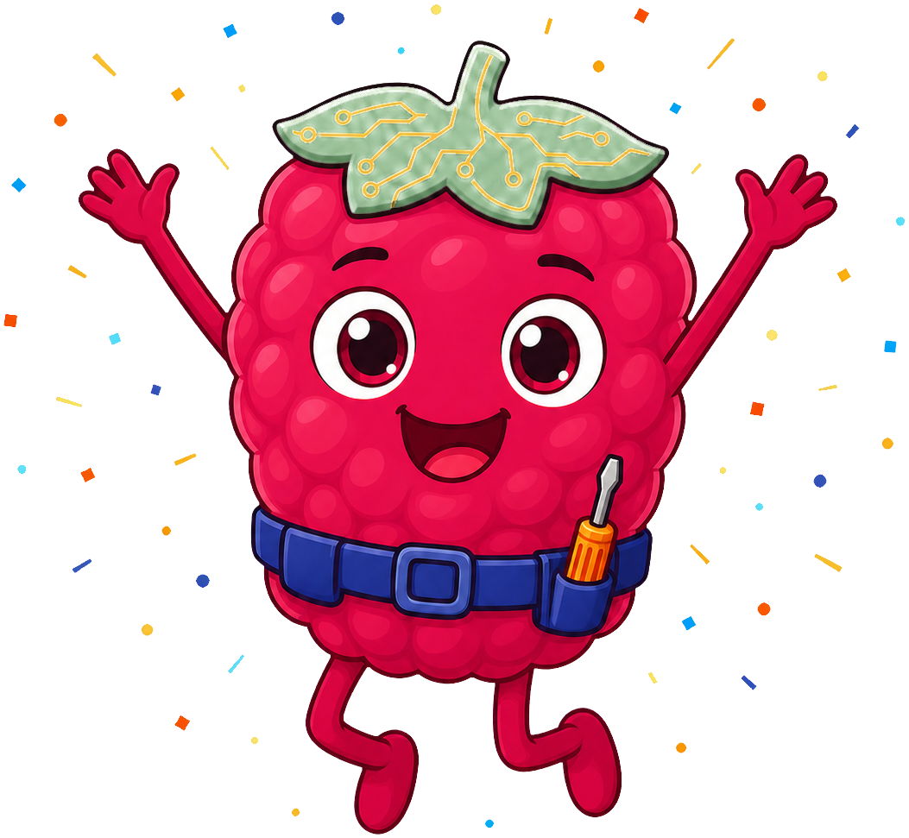

# Raspberry Pi Stem

**Berry the Raspberry** is the mascot for [Learning STEM with Raspberry Pi Hardware](https://dmccreary.github.io/raspberry-pi-stem/), a hands-on physical-computing course spanning Pico breadboards, NeoPixel LED art, sensors, and the Raspberry Pi 5. Berry is a raspberry, drawn with a small green circuit-board leaf cap etched in gold copper traces, which makes the character a literal, unmissable pun on the hardware platform the entire book is built around. The name is simply the fruit's short form, chosen because there is no more direct way to say "this mascot is for the Raspberry Pi" than to make the mascot a raspberry. Berry was chosen precisely for that directness — a student who has never heard of a Raspberry Pi before opening the book only needs to see the mascot's name and shape to guess what kind of computer the course is about. That makes Berry one of the gallery's strongest mascots: the species is not a metaphor for the platform, it is the platform's own name made into a character.

All poses for the **Raspberry Pi Stem** mascot.

-   { width=300 }

    **Neutral**

-   { width=300 }

    **Welcome**

-   { width=300 }

    **Tip**

-   { width=300 }

    **Thinking**

-   { width=300 }

    **Encouraging**

-   { width=300 }

    **Warning**

-   { width=300 }

    **Celebration**

[← Back to gallery](../../list-mascots.md)
