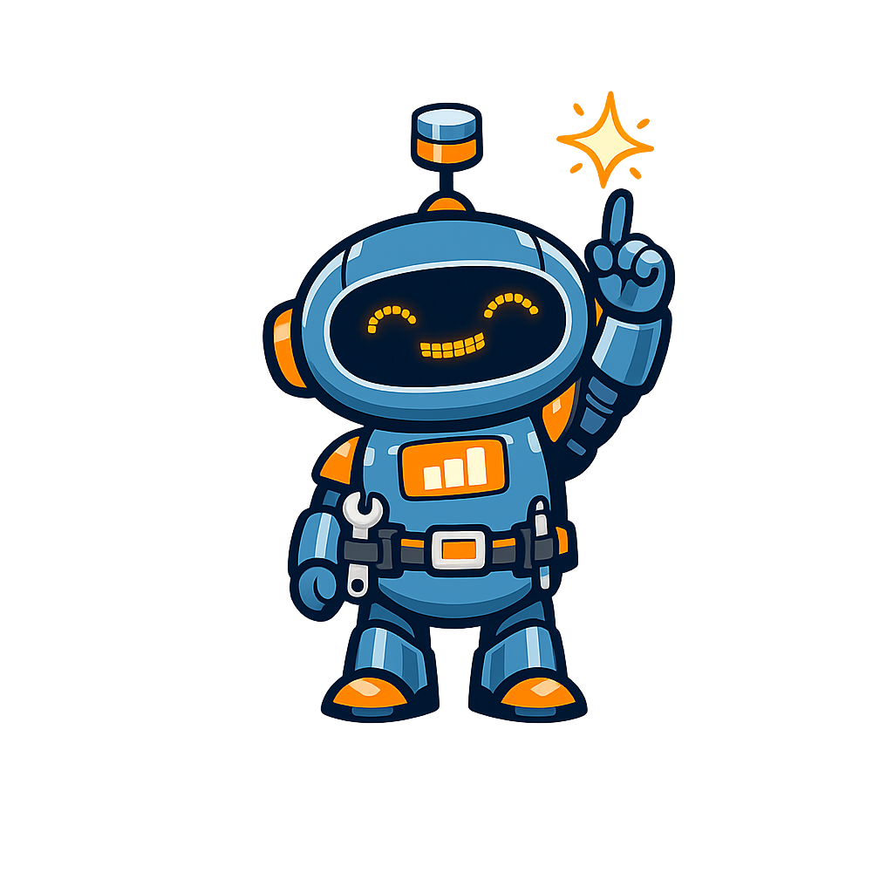
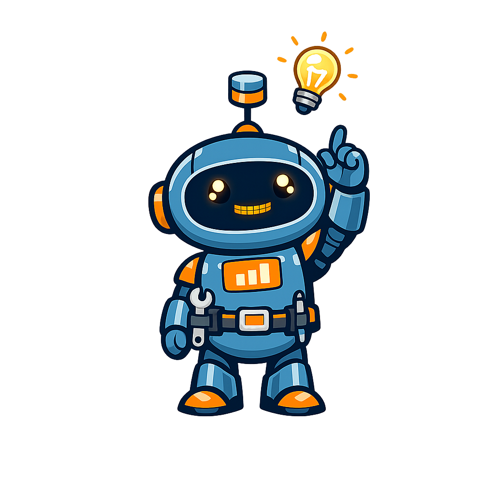

# Selecting the Right Database

**Dex the Robot** is the mascot for the [Selecting the Right Database](https://dmccreary.github.io/right-database) textbook, a guide to database architecture and the Architecture Tradeoff Analysis Method (ATAM). A robot is the natural form for this discipline: database selection is an engineering act, not a biological one, and Dex visibly carries the architect's kit — a tool belt with wrench and stylus, plus a small database cylinder perched on the antenna — so the role of the practitioner is shown rather than told. The name *Dex* comes from the Latin *dexter*, "right-handed" — the root that gives us *dexterous*, *ambidextrous*, and the *dexter* side of a heraldic shield — and is a quiet pun on the textbook's central question: which is the *right* database for the workload at hand? Dex was chosen to embody the disciplinary virtue of considered tradeoff analysis: a robot deliberating between options is exactly what ATAM is about, and a learner who internalizes Dex carries the "stop and weigh the choice" instinct into every architecture decision. The choice is strong because both the form (an engineer-robot draped in database iconography) and the name (a Latin pun on *right*) carry complementary load-bearing meaning — neither does decorative-only work.

All poses for the **Selecting the Right Database** mascot.

-   { width=300 }

    **Neutral**

-   { width=300 }

    **Welcome**

-   { width=300 }

    **Tip**

-   { width=300 }

    **Thinking**

-   { width=300 }

    **Encouraging**

-   { width=300 }

    **Warning**

-   { width=300 }

    **Celebration**

[← Back to gallery](../../list-mascots.md)
