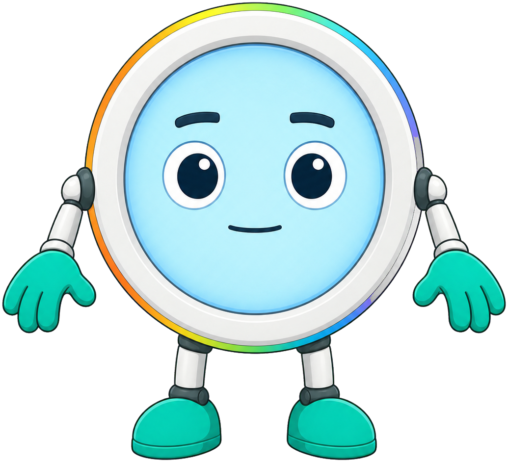
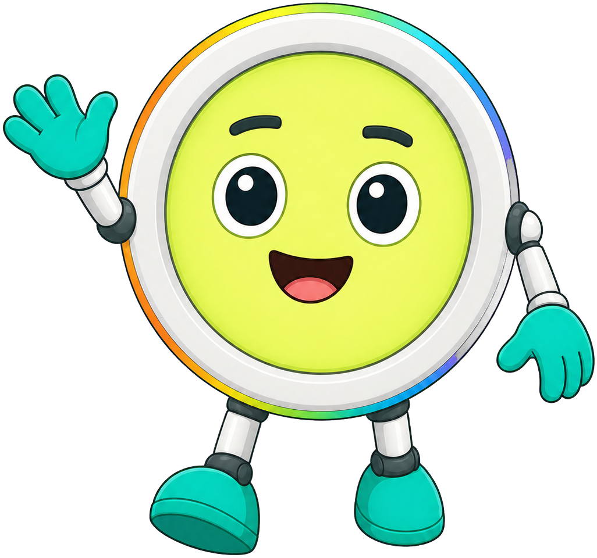
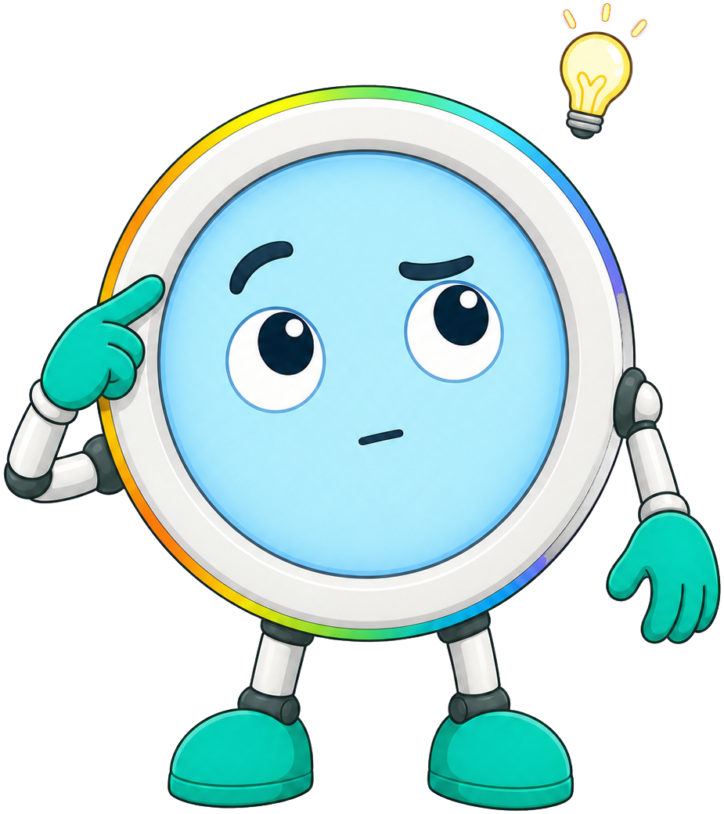

# Robot Faces

**Pixel the Round-Face Robot** is the mascot for [Robot Faces](https://dmccreary.github.io/robot-faces/), a course on drawing expressive displays for STEM robots. Pixel has no separate body — its entire form is a circular color display set inside a rounded bezel, which directly models the 240×240 round GC9A01 display the course teaches students to program expressions onto. The name Pixel names the fundamental unit of every image the course covers: every expression Pixel makes, and every expression a student's robot will make, is built out of individually addressable pixels on a round screen. Pixel was chosen so the mascot doesn't just illustrate the subject, it physically is the subject — a robot whose face is the exact hardware the book teaches you to draw on. That makes Pixel one of the strongest mascots in the gallery: name, species, and body all encode the same idea.

All poses for the **Robot Faces** mascot.

-   { width=300 }

    **Neutral**

-   { width=300 }

    **Welcome**

-   { width=300 }

    **Tip**

-   { width=300 }

    **Thinking**

-   { width=300 }

    **Encouraging**

-   { width=300 }

    **Warning**

-   { width=300 }

    **Celebration**

[← Back to gallery](../../list-mascots.md)
