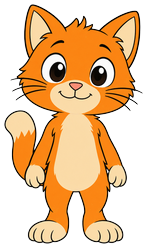
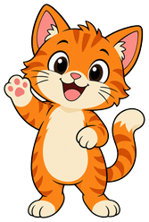
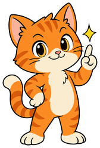
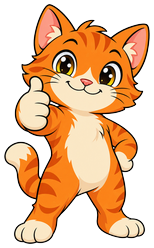
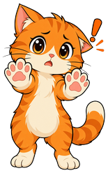
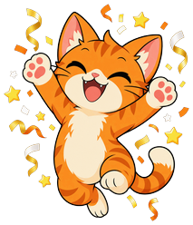

# Scratch Textbook

**Scratch the Cat** is the mascot for [Scratch Programming](https://dmccreary.github.io/scratch-textbook/), a textbook on programming with MIT's Scratch visual language. The character shares its name and species with Scratch's own official default sprite — the orange cat every new Scratch project starts with — so this mascot is not a metaphor for the platform, it is the platform's own icon, reused as a teaching companion. That makes the name unusually direct: there is no etymology to unpack because the mascot and the software are already the same character in the source material the book teaches. Scratch the Cat was chosen so a student who has ever opened the Scratch editor recognizes the mascot on sight, collapsing the distance between "the book's guide" and "the tool I'm about to use." Because the mascot and the subject are literally the same brand asset, this is as tight a subject-coupling as the gallery contains.

All poses for the **Scratch Textbook** mascot.

-   { width=300 }

    **Neutral**

-   { width=300 }

    **Welcome**

-   { width=300 }

    **Tip**

-   { width=300 }

    **Thinking**

-   { width=300 }

    **Encouraging**

-   { width=300 }

    **Warning**

-   { width=300 }

    **Celebration**

[← Back to gallery](../../list-mascots.md)
