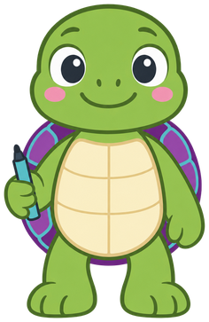
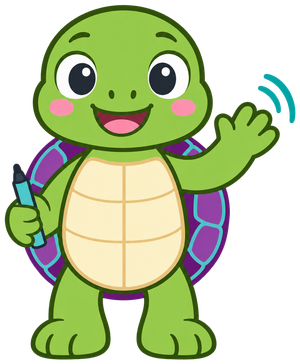
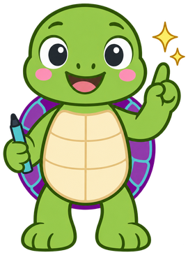
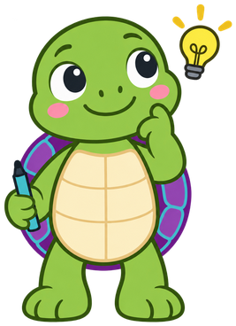
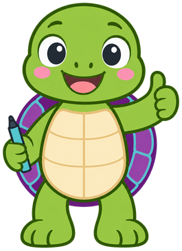
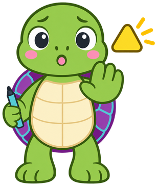
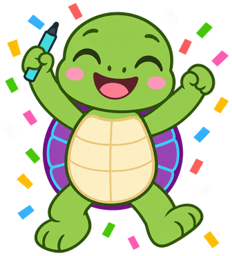

# Scratch

**Cody the CoderDojo Turtle** is the mascot for [Scratch](https://dmccreary.github.io/scratch/), a course on computational thinking through Scratch's turtle graphics, loops, variables, and custom blocks. Turtle graphics is the specific, decades-old lineage this course teaches from — a small turtle that draws a line as it moves forward and turns, tracing back to Logo — so a turtle mascot is a citation of the exact pedagogical tradition the book sits in, not a decorative choice. The name Cody is a direct pun on "code," and the catchphrase "One step at a time!" deliberately overloads the word *step* to mean both a turtle's forward movement and the decomposition of a hard problem into smaller ones. Cody was chosen so a single character carries three linked ideas at once — turtle graphics, coding, and stepwise problem decomposition — every time it appears on the page. That triple layering makes Cody one of the strongest mascots in the entire gallery.

All poses for the **Scratch** mascot.

-   { width=300 }

    **Neutral**

-   { width=300 }

    **Welcome**

-   { width=300 }

    **Tip**

-   { width=300 }

    **Thinking**

-   { width=300 }

    **Encouraging**

-   { width=300 }

    **Warning**

-   { width=300 }

    **Celebration**

[← Back to gallery](../../list-mascots.md)
