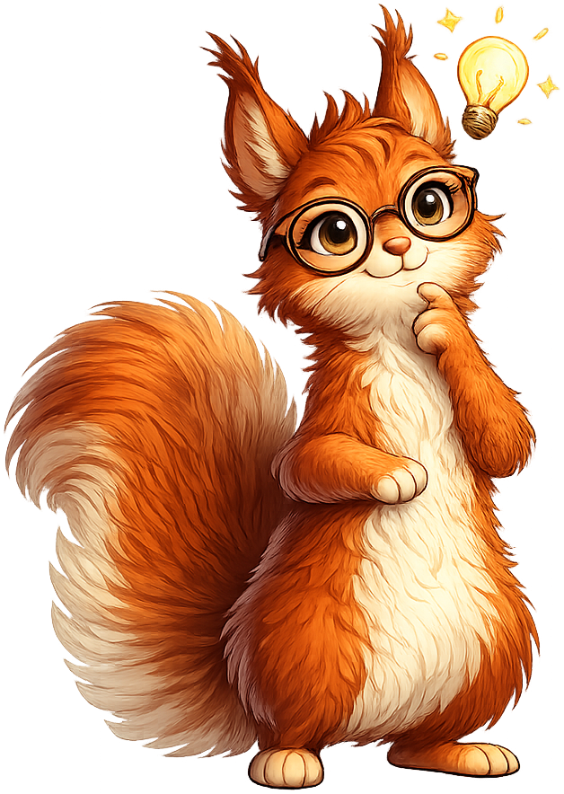
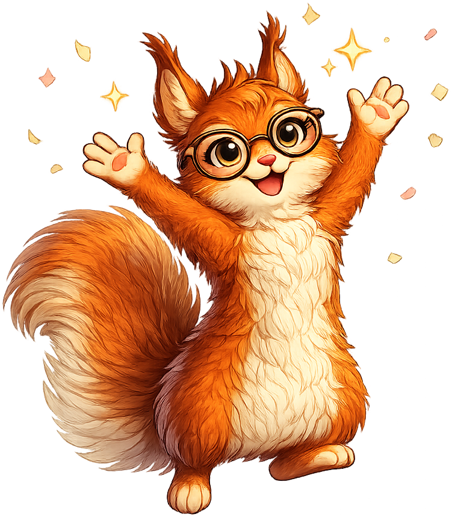

# Statistics Course

**Sylvia the Statistical Squirrel** is the mascot for the [AP Statistics](https://dmccreary.github.io/statistics-course/) textbook. Squirrels are model statisticians: they cache hundreds of acorns each season, sample from their own caches with imperfect memory, and live or die by how well they manage uncertainty over time. Sylvia was chosen because that survival behavior is a direct analog to statistical reasoning — sampling, estimation, decision-making under uncertainty — and the alliterative name (*Sylvia... Statistical... Squirrel*) makes the mascot easy to remember and reference in classroom discussion. The choice is strong because the species's natural behavior models the discipline's core skill set, and the playful name makes a subject many students fear feel approachable.

All poses for the **Statistics Course** mascot.

-   { width=300 }

    **Neutral**

-   { width=300 }

    **Welcome**

-   { width=300 }

    **Tip**

-   { width=300 }

    **Thinking**

-   { width=300 }

    **Encouraging**

-   { width=300 }

    **Warning**

-   { width=300 }

    **Celebration**

[← Back to gallery](../../list-mascots.md)
