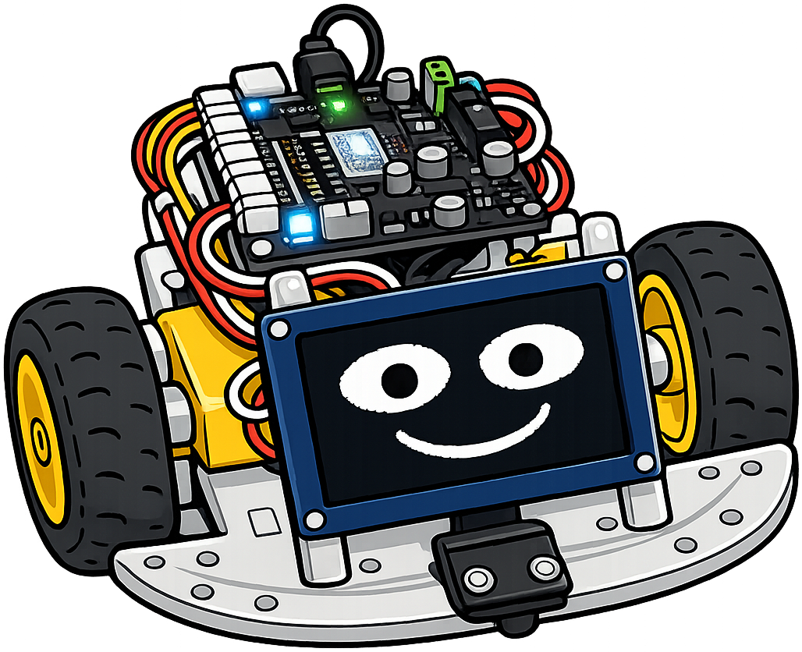
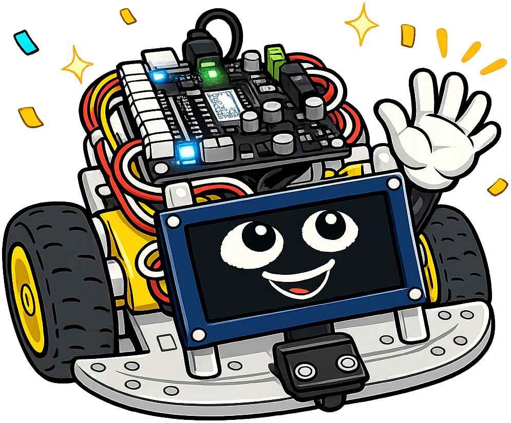
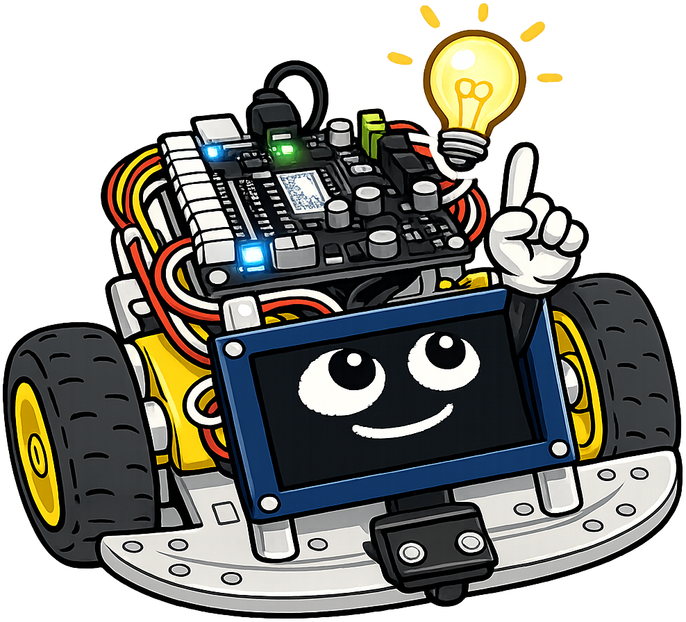
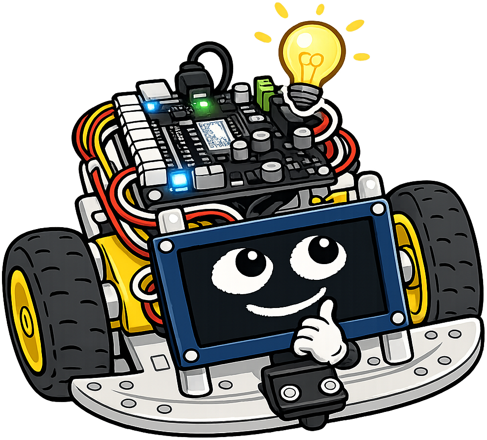
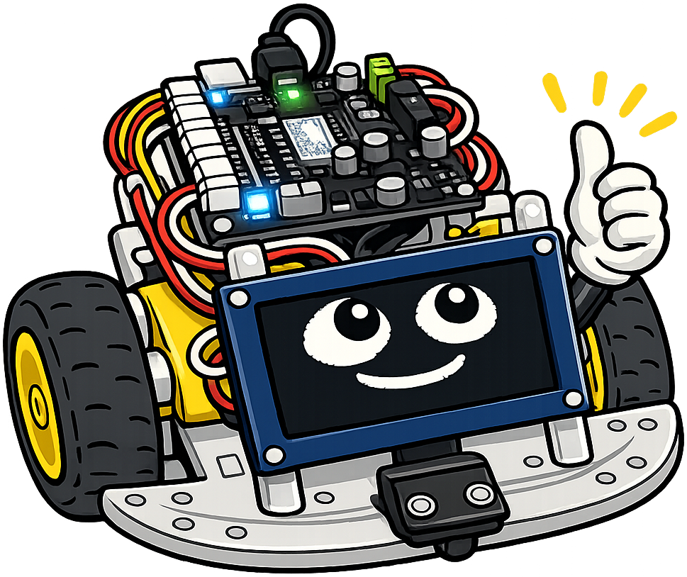
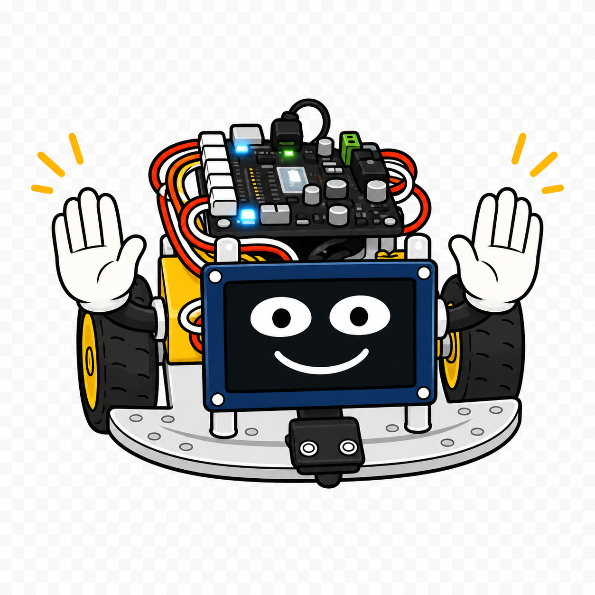
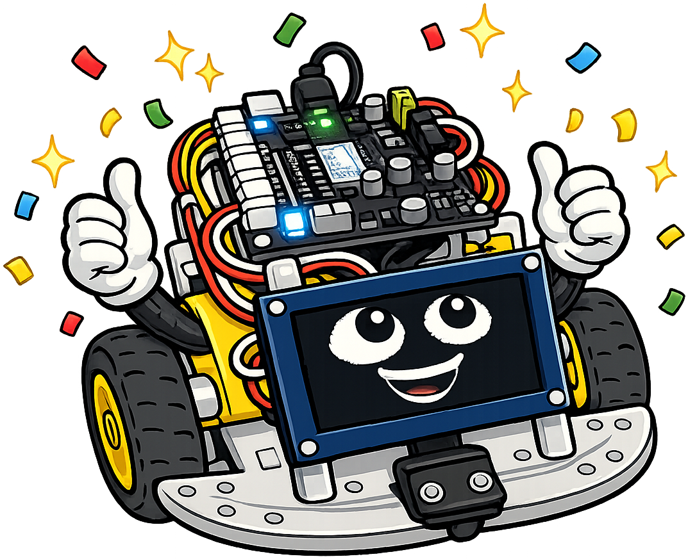

# STEM Robots

**Sparky the Robot** is the mascot for [STEM Robots](https://dmccreary.github.io/stem-robots). As a compact two-wheeled robot, Sparky directly represents the motors, sensors, controller, and feedback behaviors students assemble and program. The name Sparky evokes both electronics and the moment a physical system comes to life under software control. Sparky was chosen to give computational thinking a concrete body whose behavior can be decomposed, tested, observed, and improved. Because the mascot is a model of the course artifact itself, it creates an immediate and exceptionally strong connection to the curriculum.

All poses for the **STEM Robots** mascot.

-   { width=300 }

    **Neutral**

-   { width=300 }

    **Welcome**

-   { width=300 }

    **Tip**

-   { width=300 }

    **Thinking**

-   { width=300 }

    **Encouraging**

-   { width=300 }

    **Warning**

-   { width=300 }

    **Celebration**

[← Back to gallery](../../list-mascots.md)
